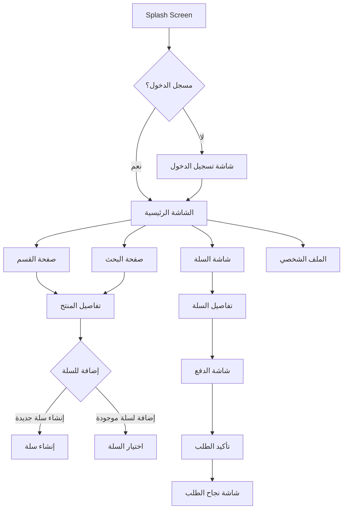
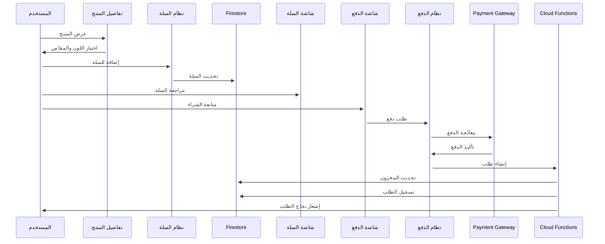

# Genius Store - توصيف تطبيق متجر إلكتروني

تطبيق متجر إلكتروني متكامل مبني باستخدام **Flutter** لواجهة المستخدم و**Firebase** للخدمات الخلفية.

## 🏗️ الهيكل العام للتطبيق (Application Architecture)

### نمط التصميم المعماري

نعتمد على **Clean Architecture** مع نمط **MVVM (Model-View-ViewModel)** لفصل المسؤوليات وتسهيل الاختبار والصيانة.

### إدارة الحالة (State Management)

سنستخدم **Riverpod** لإدارة حالة التطبيق نظراً لما يوفره من:

- إدارة التبعيات (Dependency Injection)
- استقرار ومرونة في إدارة الحالة
- إمكانية إنشاء providers محدودة النطاق
- تكامل جيد مع الـ Hooks و async programming

### تنظيم الملفات والمجلدات

```
lib/
├── core/                  # المكونات الأساسية المشتركة
│   ├── config/            # ملفات التكوين العامة
│   ├── constants/         # الثوابت المستخدمة بالتطبيق
│   ├── errors/            # معالجة الأخطاء
│   ├── localization/      # التعريب والترجمة
│   ├── routes/            # إدارة المسارات
│   ├── services/          # خدمات مختلفة (analytics, connectivity)
│   ├── theme/             # مكونات التصميم المرئي
│   └── utils/             # أدوات مساعدة
├── data/                  # طبقة البيانات
│   ├── datasources/       # مصادر البيانات (remote/local)
│   ├── models/            # نماذج البيانات
│   └── repositories/      # تنفيذ واجهات المستودعات
├── domain/                # طبقة الأعمال المنطقية
│   ├── entities/          # كيانات المجال
│   ├── repositories/      # واجهات المستودعات
│   └── usecases/          # حالات الاستخدام
├── presentation/          # طبقة واجهة المستخدم
│   ├── common_widgets/    # مكونات مشتركة للواجهة
│   ├── screens/           # الشاشات المختلفة
│   │   ├── auth/          # شاشات المصادقة
│   │   ├── cart/          # شاشات سلة التسوق
│   │   ├── checkout/      # شاشات الدفع
│   │   ├── home/          # الشاشة الرئيسية
│   │   ├── product/       # شاشات المنتج
│   │   └── profile/       # شاشات الملف الشخصي
│   └── providers/         # مزودي Riverpod
├── app.dart               # نقطة تكوين التطبيق
└── main.dart              # نقطة بداية التطبيق
```

### خدمات Firebase المستخدمة

- **Firebase Authentication**: للتسجيل وإدارة المستخدمين
- **Cloud Firestore**: لتخزين البيانات (المنتجات، الطلبات، إلخ)
- **Firebase Storage**: لتخزين صور المنتجات وملفات الوسائط
- **Cloud Functions**: للعمليات المعقدة (تحديث المخزون، معالجة الدفع)
- **Firebase Analytics**: لتتبع استخدام التطبيق
- **Firebase Messaging**: للإشعارات

## 📱 وصف شاشات واجهة المستخدم (UI Screens)

### شاشات المصادقة (Authentication)

- **تسجيل الدخول**: واجهة دخول المستخدم بالبريد أو حسابات التواصل الاجتماعي
- **إنشاء حساب**: تسجيل مستخدم جديد مع التحقق من البريد
- **نسيان كلمة المرور**: إعادة تعيين كلمة المرور

### الشاشة الرئيسية (Home)

- **العروض المميزة**: عروض دائرية للمنتجات المميزة
- **الأقسام**: عرض التصنيفات الرئيسية للمنتجات
- **المنتجات الشائعة**: قائمة أفقية بالمنتجات الأكثر مبيعاً
- **المنتجات الجديدة**: أحدث الإضافات للمتجر
- **شريط البحث**: للبحث عن المنتجات

### شاشة القسم (Category)

- **قائمة منتجات القسم**: عرض شبكي للمنتجات
- **تصفية ومرشحات**: فلترة حسب السعر، المقاس، اللون، إلخ
- **خيارات الترتيب**: ترتيب حسب الأحدث، الأعلى تقييماً، السعر

### شاشة تفاصيل المنتج (Product Details)

- **صور المنتج**: معرض صور متعدد
- **معلومات المنتج**: الاسم، الوصف، التقييم
- **اختيار المتغيرات**: اختيار اللون والمقاس
- **مؤشر المخزون**: توفر المنتج
- **أزرار العمليات**: إضافة للسلة، إضافة للمفضلة

### شاشة سلال التسوق (Carts)

- **قائمة السلال**: عرض السلال المتعددة للمستخدم
- **إنشاء/تعديل سلة**: تسمية وإدارة السلال
- **تفاصيل السلة**: المنتجات داخل السلة المحددة
- **تغيير الكمية**: زيادة/نقصان كمية المنتجات
- **ملخص السلة**: المجموع، الخصم، الإجمالي

### شاشة الدفع (Checkout)

- **اختيار عنوان التوصيل**: عناوين المستخدم المحفوظة
- **طريقة الشحن**: خيارات التوصيل المتاحة
- **وسيلة الدفع**: بطاقات ائتمان، دفع إلكتروني
- **الكوبونات**: إدخال رمز الخصم
- **تأكيد الطلب**: مراجعة نهائية قبل الدفع

### الملف الشخصي (Profile)

- **المعلومات الشخصية**: تحديث البيانات الشخصية
- **العناوين**: إدارة عناوين التوصيل
- **طرق الدفع**: إدارة وسائل الدفع المحفوظة
- **طلباتي**: سجل الطلبات السابقة والحالية
- **المفضلة**: المنتجات المحفوظة

## 🔄 مخططات تدفق العمليات (Workflows)

### تدفق التنقل (Navigation Flow)



### سير عملية الشراء (Purchase Process)



## 🗃️ مخطط قاعدة البيانات (Database Schema)


## 📊 نماذج البيانات (Data Models)

### نموذج المستخدم (User Model)

```dart
class User {
  final String uid;
  final String email;
  final String name;
  final String? phone;
  final DateTime createdAt;
  final DateTime lastLogin;
  final String? profileImage;

  User({
    required this.uid,
    required this.email,
    required this.name,
    this.phone,
    required this.createdAt,
    required this.lastLogin,
    this.profileImage,
  });

  factory User.fromJson(Map<String, dynamic> json) {
    return User(
      uid: json['uid'],
      email: json['email'],
      name: json['name'],
      phone: json['phone'],
      createdAt: (json['created_at'] as Timestamp).toDate(),
      lastLogin: (json['last_login'] as Timestamp).toDate(),
      profileImage: json['profile_image'],
    );
  }

  Map<String, dynamic> toJson() {
    return {
      'uid': uid,
      'email': email,
      'name': name,
      'phone': phone,
      'created_at': Timestamp.fromDate(createdAt),
      'last_login': Timestamp.fromDate(lastLogin),
      'profile_image': profileImage,
    };
  }
}
```

### نموذج المنتج (Product Model)

```dart
class Product {
  final String id;
  final Map<String, String> nameLocalized;
  final Map<String, String> descriptionLocalized;
  final double basePrice;
  final String brand;
  final String categoryId;
  final bool isFeatured;
  final bool isActive;
  final DateTime createdAt;
  final List<String> tags;
  final double averageRating;
  final List<ProductVariant>? variants;
  final List<ProductImage>? images;

  Product({
    required this.id,
    required this.nameLocalized,
    required this.descriptionLocalized,
    required this.basePrice,
    required this.brand,
    required this.categoryId,
    required this.isFeatured,
    required this.isActive,
    required this.createdAt,
    required this.tags,
    required this.averageRating,
    this.variants,
    this.images,
  });

  String getName(String languageCode) {
    return nameLocalized[languageCode] ?? nameLocalized['en'] ?? '';
  }

  String getDescription(String languageCode) {
    return descriptionLocalized[languageCode] ?? descriptionLocalized['en'] ?? '';
  }

  factory Product.fromJson(Map<String, dynamic> json) {
    return Product(
      id: json['id'],
      nameLocalized: Map<String, String>.from(json['name_localized']),
      descriptionLocalized: Map<String, String>.from(json['description_localized']),
      basePrice: json['base_price'].toDouble(),
      brand: json['brand'],
      categoryId: json['category_id'],
      isFeatured: json['is_featured'],
      isActive: json['is_active'],
      createdAt: (json['created_at'] as Timestamp).toDate(),
      tags: List<String>.from(json['tags']),
      averageRating: json['average_rating'].toDouble(),
    );
  }

  Map<String, dynamic> toJson() {
    return {
      'id': id,
      'name_localized': nameLocalized,
      'description_localized': descriptionLocalized,
      'base_price': basePrice,
      'brand': brand,
      'category_id': categoryId,
      'is_featured': isFeatured,
      'is_active': isActive,
      'created_at': Timestamp.fromDate(createdAt),
      'tags': tags,
      'average_rating': averageRating,
    };
  }
}
```

### نموذج متغيرات المنتج (Product Variant Model)

```dart
class ProductVariant {
  final String id;
  final String productId;
  final String colorId;
  final String sizeId;
  final double price;
  final int stockQuantity;
  final String sku;
  
  // للوصول أسهل في واجهة المستخدم
  final Color? color;
  final Size? size;

  ProductVariant({
    required this.id,
    required this.productId,
    required this.colorId,
    required this.sizeId,
    required this.price,
    required this.stockQuantity,
    required this.sku,
    this.color,
    this.size,
  });

  bool get isInStock => stockQuantity > 0;

  factory ProductVariant.fromJson(Map<String, dynamic> json) {
    return ProductVariant(
      id: json['id'],
      productId: json['product_id'],
      colorId: json['color_id'],
      sizeId: json['size_id'],
      price: json['price'].toDouble(),
      stockQuantity: json['stock_quantity'],
      sku: json['sku'],
    );
  }

  Map<String, dynamic> toJson() {
    return {
      'id': id,
      'product_id': productId,
      'color_id': colorId,
      'size_id': sizeId,
      'price': price,
      'stock_quantity': stockQuantity,
      'sku': sku,
    };
  }
}
```

### نموذج سلة التسوق (Cart Model)

```dart
class Cart {
  final String id;
  final String userId;
  final String name;
  final DateTime createdAt;
  final DateTime updatedAt;
  final bool isActive;
  final List<CartItem>? items;

  Cart({
    required this.id,
    required this.userId,
    required this.name,
    required this.createdAt,
    required this.updatedAt,
    required this.isActive,
    this.items,
  });

  double get subtotal {
    if (items == null || items!.isEmpty) return 0;
    return items!.fold(0, (sum, item) => sum + (item.price * item.quantity));
  }

  factory Cart.fromJson(Map<String, dynamic> json) {
    return Cart(
      id: json['id'],
      userId: json['user_id'],
      name: json['name'],
      createdAt: (json['created_at'] as Timestamp).toDate(),
      updatedAt: (json['updated_at'] as Timestamp).toDate(),
      isActive: json['is_active'],
    );
  }

  Map<String, dynamic> toJson() {
    return {
      'id': id,
      'user_id': userId,
      'name': name,
      'created_at': Timestamp.fromDate(createdAt),
      'updated_at': Timestamp.fromDate(updatedAt),
      'is_active': isActive,
    };
  }
}
```

### نموذج عنصر السلة (Cart Item Model)

```dart
class CartItem {
  final String id;
  final String cartId;
  final String productId;
  final String variantId;
  final int quantity;
  final double price;
  
  // للوصول السهل في واجهة المستخدم
  final Product? product;
  final ProductVariant? variant;

  CartItem({
    required this.id,
    required this.cartId,
    required this.productId,
    required this.variantId,
    required this.quantity,
    required this.price,
    this.product,
    this.variant,
  });

  double get total => price * quantity;

  factory CartItem.fromJson(Map<String, dynamic> json) {
    return CartItem(
      id: json['id'],
      cartId: json['cart_id'],
      productId: json['product_id'],
      variantId: json['variant_id'],
      quantity: json['quantity'],
      price: json['price'].toDouble(),
    );
  }

  Map<String, dynamic> toJson() {
    return {
      'id': id,
      'cart_id': cartId,
      'product_id': productId,
      'variant_id': variantId,
      'quantity': quantity,
      'price': price,
    };
  }
}
```

### نموذج الطلب (Order Model)

```dart
class Order {
  final String id;
  final String userId;
  final String addressId;
  final String? paymentMethodId;
  final String status;
  final double subtotal;
  final double shippingFee;
  final double discount;
  final double total;
  final DateTime createdAt;
  final DateTime updatedAt;
  final String? couponCode;
  final List<OrderItem>? items;

  Order({
    required this.id,
    required this.userId,
    required this.addressId,
    this.paymentMethodId,
    required this.status,
    required this.subtotal,
    required this.shippingFee,
    required this.discount,
    required this.total,
    required this.createdAt,
    required this.updatedAt,
    this.couponCode,
    this.items,
  });

  factory Order.fromJson(Map<String, dynamic> json) {
    return Order(
      id: json['id'],
      userId: json['user_id'],
      addressId: json['address_id'],
      paymentMethodId: json['payment_method_id'],
      status: json['status'],
      subtotal: json['subtotal'].toDouble(),
      shippingFee: json['shipping_fee'].toDouble(),
      discount: json['discount'].toDouble(),
      total: json['total'].toDouble(),
      createdAt: (json['created_at'] as Timestamp).toDate(),
      updatedAt: (json['updated_at'] as Timestamp).toDate(),
      couponCode: json['coupon_code'],
    );
  }

  Map<String, dynamic> toJson() {
    return {
      'id': id,
      'user_id': userId,
      'address_id': addressId,
      'payment_method_id': paymentMethodId,
      'status': status,
      'subtotal': subtotal,
      'shipping_fee': shippingFee,
      'discount': discount,
      'total': total,
      'created_at': Timestamp.fromDate(createdAt),
      'updated_at': Timestamp.fromDate(updatedAt),
      'coupon_code': couponCode,
    };
  }
}
```
