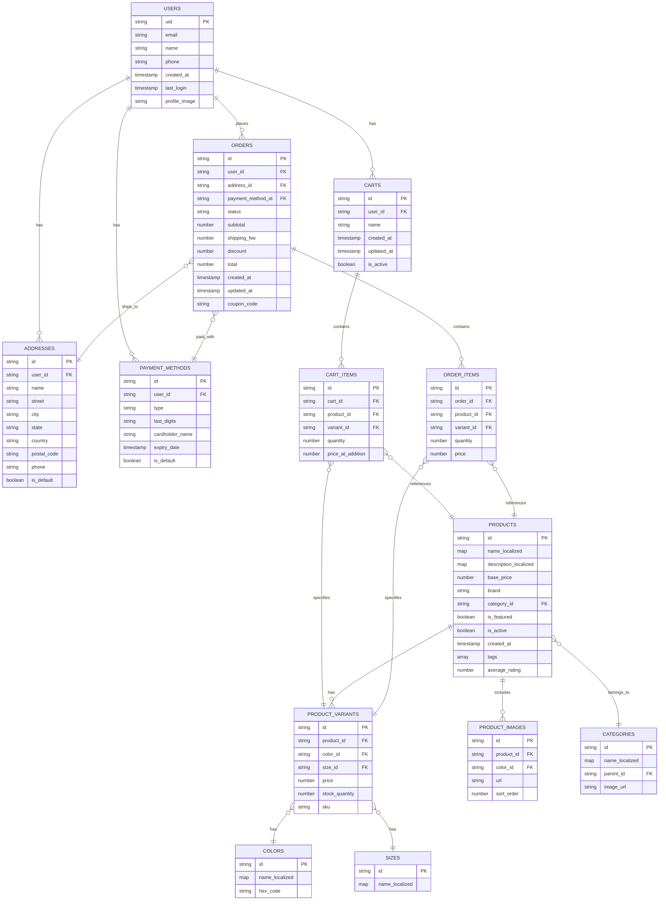

# Genius Store - E-commerce Application Specification

[](README-ar.md)

A complete e-commerce application built using **Flutter** for the user interface and **Firebase** for backend services.

## 🏗️ Application Architecture

### Architectural Design Pattern

We rely on **Clean Architecture** with the **MVVM (Model-View-ViewModel)** pattern to separate responsibilities and facilitate testing and maintenance.

### State Management

We will use **Riverpod** for application state management due to the following benefits:

- Dependency Injection
- Stability and flexibility in state management
- Ability to create scoped providers
- Good integration with Hooks and async programming

### File and Folder Organization

```text
lib/
├── core/                  # Shared core components
│   ├── config/            # General configuration files
│   ├── constants/         # Application constants
│   ├── errors/            # Error handling
│   ├── localization/      # Localization and translation
│   ├── routes/            # Route management
│   ├── services/          # Various services (analytics, connectivity)
│   ├── theme/             # Visual design components
│   └── utils/             # Utility tools
├── data/                  # Data layer
│   ├── datasources/       # Data sources (remote/local)
│   ├── models/            # Data models
│   └── repositories/      # Repository interface implementations
├── domain/                # Business logic layer
│   ├── entities/          # Domain entities
│   ├── repositories/      # Repository interfaces
│   └── usecases/          # Use cases
├── presentation/          # User interface layer
│   ├── common_widgets/    # Shared UI components
│   ├── screens/           # Different screens
│   │   ├── auth/          # Authentication screens
│   │   ├── cart/          # Shopping cart screens
│   │   ├── checkout/      # Checkout screens
│   │   ├── home/          # Home screen
│   │   ├── product/       # Product screens
│   │   └── profile/       # Profile screens
│   └── providers/         # Riverpod providers
├── app.dart               # Application configuration point
└── main.dart              # Application entry point
```

### Firebase Services Used

- **Firebase Authentication**: For user registration and management
- **Cloud Firestore**: For data storage (products, orders, etc.)
- **Firebase Storage**: For storing product images and media files
- **Cloud Functions**: For complex operations (inventory updates, payment processing)
- **Firebase Analytics**: For tracking application usage
- **Firebase Messaging**: For notifications

## 📱 UI Screens Description

### Authentication Screens

- **Login**: User login interface with email or social media accounts
- **Create Account**: New user registration with email verification
- **Forgot Password**: Password reset

### Home Screen

- **Featured Products**: Carousel displays of featured products
- **Categories**: Display of main product categories
- **Popular Products**: Horizontal list of best-selling products
- **New Products**: Latest additions to the store
- **Search Bar**: For product search

### Category Screen

- **Category Product List**: Grid display of products
- **Filters**: Filter by price, size, color, etc.
- **Sorting Options**: Sort by newest, highest rated, price

### Product Details Screen

- **Product Images**: Multiple image gallery
- **Product Information**: Name, description, rating
- **Variant Selection**: Color and size selection
- **Inventory Indicator**: Product availability
- **Action Buttons**: Add to cart, add to favorites

### Shopping Carts Screen

- **Cart List**: Display of user's multiple carts
- **Create/Edit Cart**: Name and manage carts
- **Cart Details**: Products inside the selected cart
- **Quantity Change**: Increase/decrease product quantities
- **Cart Summary**: Subtotal, discount, total

### Checkout Screen

- **Delivery Address Selection**: User's saved addresses
- **Shipping Method**: Available delivery options
- **Payment Method**: Credit cards, electronic payment
- **Coupons**: Enter discount code
- **Order Confirmation**: Final review before payment

### Profile

- **Personal Information**: Update personal data
- **Addresses**: Manage delivery addresses
- **Payment Methods**: Manage saved payment methods
- **My Orders**: History of previous and current orders
- **Favorites**: Saved products

## 🔄 Workflow Diagrams

### Navigation Flow


### Purchase Process


## 🗃️ Database Schema



## 📊 Data Models

### User Model

```dart
class User {
  final String uid;
  final String email;
  final String name;
  final String? phone;
  final DateTime createdAt;
  final DateTime lastLogin;
  final String? profileImage;

  User({
    required this.uid,
    required this.email,
    required this.name,
    this.phone,
    required this.createdAt,
    required this.lastLogin,
    this.profileImage,
  });

  factory User.fromJson(Map<String, dynamic> json) {
    return User(
      uid: json['uid'],
      email: json['email'],
      name: json['name'],
      phone: json['phone'],
      createdAt: (json['created_at'] as Timestamp).toDate(),
      lastLogin: (json['last_login'] as Timestamp).toDate(),
      profileImage: json['profile_image'],
    );
  }

  Map<String, dynamic> toJson() {
    return {
      'uid': uid,
      'email': email,
      'name': name,
      'phone': phone,
      'created_at': Timestamp.fromDate(createdAt),
      'last_login': Timestamp.fromDate(lastLogin),
      'profile_image': profileImage,
    };
  }
}
```

### Product Model

```dart
class Product {
  final String id;
  final Map<String, String> nameLocalized;
  final Map<String, String> descriptionLocalized;
  final double basePrice;
  final String brand;
  final String categoryId;
  final bool isFeatured;
  final bool isActive;
  final DateTime createdAt;
  final List<String> tags;
  final double averageRating;
  final List<ProductVariant>? variants;
  final List<ProductImage>? images;

  Product({
    required this.id,
    required this.nameLocalized,
    required this.descriptionLocalized,
    required this.basePrice,
    required this.brand,
    required this.categoryId,
    required this.isFeatured,
    required this.isActive,
    required this.createdAt,
    required this.tags,
    required this.averageRating,
    this.variants,
    this.images,
  });

  String getName(String languageCode) {
    return nameLocalized[languageCode] ?? nameLocalized['en'] ?? '';
  }

  String getDescription(String languageCode) {
    return descriptionLocalized[languageCode] ?? descriptionLocalized['en'] ?? '';
  }

  factory Product.fromJson(Map<String, dynamic> json) {
    return Product(
      id: json['id'],
      nameLocalized: Map<String, String>.from(json['name_localized']),
      descriptionLocalized: Map<String, String>.from(json['description_localized']),
      basePrice: json['base_price'].toDouble(),
      brand: json['brand'],
      categoryId: json['category_id'],
      isFeatured: json['is_featured'],
      isActive: json['is_active'],
      createdAt: (json['created_at'] as Timestamp).toDate(),
      tags: List<String>.from(json['tags']),
      averageRating: json['average_rating'].toDouble(),
    );
  }

  Map<String, dynamic> toJson() {
    return {
      'id': id,
      'name_localized': nameLocalized,
      'description_localized': descriptionLocalized,
      'base_price': basePrice,
      'brand': brand,
      'category_id': categoryId,
      'is_featured': isFeatured,
      'is_active': isActive,
      'created_at': Timestamp.fromDate(createdAt),
      'tags': tags,
      'average_rating': averageRating,
    };
  }
}
```

### Product Variant Model

```dart
class ProductVariant {
  final String id;
  final String productId;
  final String colorId;
  final String sizeId;
  final double price;
  final int stockQuantity;
  final String sku;
  
  // For easier access in the user interface
  final Color? color;
  final Size? size;

  ProductVariant({
    required this.id,
    required this.productId,
    required this.colorId,
    required this.sizeId,
    required this.price,
    required this.stockQuantity,
    required this.sku,
    this.color,
    this.size,
  });

  bool get isInStock => stockQuantity > 0;

  factory ProductVariant.fromJson(Map<String, dynamic> json) {
    return ProductVariant(
      id: json['id'],
      productId: json['product_id'],
      colorId: json['color_id'],
      sizeId: json['size_id'],
      price: json['price'].toDouble(),
      stockQuantity: json['stock_quantity'],
      sku: json['sku'],
    );
  }

  Map<String, dynamic> toJson() {
    return {
      'id': id,
      'product_id': productId,
      'color_id': colorId,
      'size_id': sizeId,
      'price': price,
      'stock_quantity': stockQuantity,
      'sku': sku,
    };
  }
}
```

### Cart Model

```dart
class Cart {
  final String id;
  final String userId;
  final String name;
  final DateTime createdAt;
  final DateTime updatedAt;
  final bool isActive;
  final List<CartItem>? items;

  Cart({
    required this.id,
    required this.userId,
    required this.name,
    required this.createdAt,
    required this.updatedAt,
    required this.isActive,
    this.items,
  });

  double get subtotal {
    if (items == null || items!.isEmpty) return 0;
    return items!.fold(0, (sum, item) => sum + (item.price * item.quantity));
  }

  factory Cart.fromJson(Map<String, dynamic> json) {
    return Cart(
      id: json['id'],
      userId: json['user_id'],
      name: json['name'],
      createdAt: (json['created_at'] as Timestamp).toDate(),
      updatedAt: (json['updated_at'] as Timestamp).toDate(),
      isActive: json['is_active'],
    );
  }

  Map<String, dynamic> toJson() {
    return {
      'id': id,
      'user_id': userId,
      'name': name,
      'created_at': Timestamp.fromDate(createdAt),
      'updated_at': Timestamp.fromDate(updatedAt),
      'is_active': isActive,
    };
  }
}
```

### Cart Item Model

```dart
class CartItem {
  final String id;
  final String cartId;
  final String productId;
  final String variantId;
  final int quantity;
  final double price;
  
  // For easy access in the user interface
  final Product? product;
  final ProductVariant? variant;

  CartItem({
    required this.id,
    required this.cartId,
    required this.productId,
    required this.variantId,
    required this.quantity,
    required this.price,
    this.product,
    this.variant,
  });

  double get total => price * quantity;

  factory CartItem.fromJson(Map<String, dynamic> json) {
    return CartItem(
      id: json['id'],
      cartId: json['cart_id'],
      productId: json['product_id'],
      variantId: json['variant_id'],
      quantity: json['quantity'],
      price: json['price'].toDouble(),
    );
  }

  Map<String, dynamic> toJson() {
    return {
      'id': id,
      'cart_id': cartId,
      'product_id': productId,
      'variant_id': variantId,
      'quantity': quantity,
      'price': price,
    };
  }
}
```

### Order Model

```dart
class Order {
  final String id;
  final String userId;
  final String addressId;
  final String? paymentMethodId;
  final String status;
  final double subtotal;
  final double shippingFee;
  final double discount;
  final double total;
  final DateTime createdAt;
  final DateTime updatedAt;
  final String? couponCode;
  final List<OrderItem>? items;

  Order({
    required this.id,
    required this.userId,
    required this.addressId,
    this.paymentMethodId,
    required this.status,
    required this.subtotal,
    required this.shippingFee,
    required this.discount,
    required this.total,
    required this.createdAt,
    required this.updatedAt,
    this.couponCode,
    this.items,
  });

  factory Order.fromJson(Map<String, dynamic> json) {
    return Order(
      id: json['id'],
      userId: json['user_id'],
      addressId: json['address_id'],
      paymentMethodId: json['payment_method_id'],
      status: json['status'],
      subtotal: json['subtotal'].toDouble(),
      shippingFee: json['shipping_fee'].toDouble(),
      discount: json['discount'].toDouble(),
      total: json['total'].toDouble(),
      createdAt: (json['created_at'] as Timestamp).toDate(),
      updatedAt: (json['updated_at'] as Timestamp).toDate(),
      couponCode: json['coupon_code'],
    );
  }

  Map<String, dynamic> toJson() {
    return {
      'id': id,
      'user_id': userId,
      'address_id': addressId,
      'payment_method_id': paymentMethodId,
      'status': status,
      'subtotal': subtotal,
      'shipping_fee': shippingFee,
      'discount': discount,
      'total': total,
      'created_at': Timestamp.fromDate(createdAt),
      'updated_at': Timestamp.fromDate(updatedAt),
      'coupon_code': couponCode,
    };
  }
}
```
