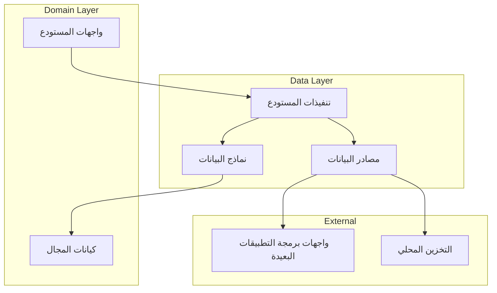
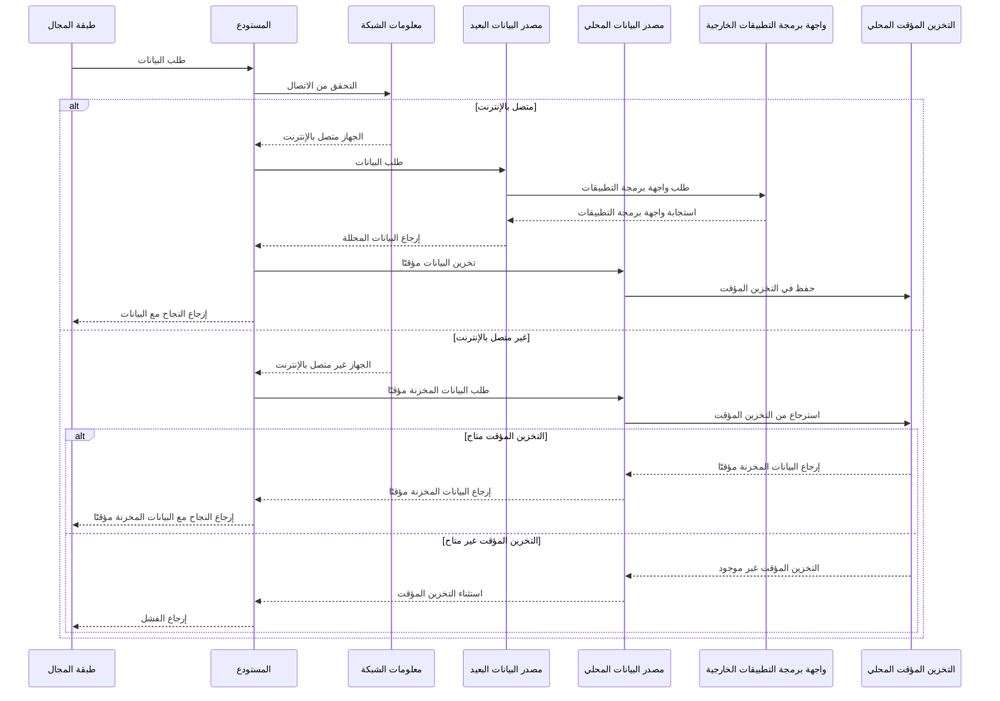

# طبقة البيانات

[](README.md)

طبقة البيانات مسؤولة عن إدارة البيانات في تطبيق متجر جينيوس. تقوم بتنفيذ واجهات المستودعات المحددة في طبقة المجال وتوفر التنفيذ الفعلي لعمليات البيانات.

## الغرض

طبقة البيانات:

- تنفذ واجهات المستودعات من طبقة المجال
- تدير مصادر البيانات (البعيدة، المحلية، إلخ)
- تعالج تسلسل البيانات وإلغاء تسلسلها
- تنفذ استراتيجيات تخزين البيانات المؤقت
- توفر معالجة الأخطاء لعمليات البيانات
- تجرد تفاصيل مصدر البيانات الأساسية من طبقة المجال

## هيكل الدليل

```text
data/
├── datasources/       # تنفيذات مصادر البيانات
│   ├── local/         # تنفيذات التخزين المحلي
│   └── remote/        # تنفيذات واجهة برمجة التطبيقات البعيدة
├── models/            # نماذج البيانات (DTOs)
│   ├── request/       # نماذج الطلبات لواجهات البرمجة
│   └── response/      # نماذج الاستجابة من واجهات البرمجة
└── repositories/      # تنفيذات المستودعات
```

## نظرة عامة على البنية

تتبع طبقة البيانات نمط المستودع وتنفذ تجريد مصدر البيانات:



## المكونات الرئيسية

### نماذج البيانات

نماذج البيانات في دليل `models/` تمثل الإصدارات القابلة للتسلسل من كيانات المجال:

```dart
class ProductModel extends Product {
  final String id;
  final Map<String, String> nameLocalized;
  final Map<String, String> descriptionLocalized;
  final double basePrice;
  final String brand;
  final String categoryId;
  final bool isFeatured;
  final bool isActive;
  final DateTime createdAt;
  final List<String> tags;
  final double averageRating;

  ProductModel({
    required this.id,
    required this.nameLocalized,
    required this.descriptionLocalized,
    required this.basePrice,
    required this.brand,
    required this.categoryId,
    required this.isFeatured,
    required this.isActive,
    required this.createdAt,
    required this.tags,
    required this.averageRating,
  }) : super(
          id: id,
          nameLocalized: nameLocalized,
          descriptionLocalized: descriptionLocalized,
          basePrice: basePrice,
          brand: brand,
          categoryId: categoryId,
          isFeatured: isFeatured,
          isActive: isActive,
          createdAt: createdAt,
          tags: tags,
          averageRating: averageRating,
        );

  factory ProductModel.fromJson(Map<String, dynamic> json) {
    return ProductModel(
      id: json['id'],
      nameLocalized: Map<String, String>.from(json['name_localized']),
      descriptionLocalized: Map<String, String>.from(json['description_localized']),
      basePrice: json['base_price'].toDouble(),
      brand: json['brand'],
      categoryId: json['category_id'],
      isFeatured: json['is_featured'],
      isActive: json['is_active'],
      createdAt: (json['created_at'] as Timestamp).toDate(),
      tags: List<String>.from(json['tags']),
      averageRating: json['average_rating'].toDouble(),
    );
  }

  Map<String, dynamic> toJson() {
    return {
      'id': id,
      'name_localized': nameLocalized,
      'description_localized': descriptionLocalized,
      'base_price': basePrice,
      'brand': brand,
      'category_id': categoryId,
      'is_featured': isFeatured,
      'is_active': isActive,
      'created_at': Timestamp.fromDate(createdAt),
      'tags': tags,
      'average_rating': averageRating,
    };
  }

  factory ProductModel.fromEntity(Product product) {
    return ProductModel(
      id: product.id,
      nameLocalized: product.nameLocalized,
      descriptionLocalized: product.descriptionLocalized,
      basePrice: product.basePrice,
      brand: product.brand,
      categoryId: product.categoryId,
      isFeatured: product.isFeatured,
      isActive: product.isActive,
      createdAt: product.createdAt,
      tags: product.tags,
      averageRating: product.averageRating,
    );
  }
}
```

### مصادر البيانات

مصادر البيانات في دليل `datasources/` تتعامل مع التفاعلات مع موفري البيانات المحددين:

#### مصادر البيانات البعيدة

مصادر البيانات البعيدة تتواصل مع واجهات برمجة التطبيقات الخارجية:

```dart
abstract class ProductRemoteDataSource {
  Future<List<ProductModel>> getProducts({
    String? categoryId,
    Map<String, dynamic>? filters,
    int page = 1,
    int pageSize = 20,
  });
  
  Future<ProductModel> getProductById(String id);
  
  Future<List<ProductModel>> searchProducts(String query);
  
  Future<List<ReviewModel>> getProductReviews(String productId);
}

class ProductRemoteDataSourceImpl implements ProductRemoteDataSource {
  final HttpClient client;
  
  ProductRemoteDataSourceImpl({required this.client});
  
  @override
  Future<List<ProductModel>> getProducts({
    String? categoryId,
    Map<String, dynamic>? filters,
    int page = 1,
    int pageSize = 20,
  }) async {
    try {
      final queryParams = {
        'page': page.toString(),
        'page_size': pageSize.toString(),
        if (categoryId != null) 'category_id': categoryId,
        if (filters != null) ...filters,
      };
      
      final response = await client.get(
        '${ApiConstants.baseUrl}/products',
        queryParameters: queryParams,
      );
      
      if (response.statusCode == 200) {
        final List<dynamic> productsJson = response.data['data'];
        return productsJson
            .map((json) => ProductModel.fromJson(json))
            .toList();
      } else {
        throw ServerException(
          code: response.statusCode,
          message: response.data['message'] ?? 'Failed to fetch products',
        );
      }
    } catch (e) {
      if (e is DioError) {
        throw ServerException(
          code: e.response?.statusCode,
          message: e.message,
        );
      }
      throw const ServerException(
        message: 'An unexpected error occurred',
      );
    }
  }
  
  // تنفيذات الطرق الأخرى...
}
```

#### مصادر البيانات المحلية

مصادر البيانات المحلية تدير البيانات المخزنة محليًا:

```dart
abstract class ProductLocalDataSource {
  Future<List<ProductModel>> getCachedProducts();
  
  Future<ProductModel?> getCachedProductById(String id);
  
  Future<void> cacheProducts(List<ProductModel> products);
  
  Future<void> cacheProduct(ProductModel product);
  
  Future<void> clearCache();
}

class ProductLocalDataSourceImpl implements ProductLocalDataSource {
  final SharedPreferences sharedPreferences;
  
  ProductLocalDataSourceImpl({required this.sharedPreferences});
  
  @override
  Future<List<ProductModel>> getCachedProducts() async {
    final jsonString = sharedPreferences.getString(CacheConstants.cachedProducts);
    
    if (jsonString != null) {
      try {
        final List<dynamic> jsonList = json.decode(jsonString);
        return jsonList
            .map((json) => ProductModel.fromJson(json))
            .toList();
      } catch (e) {
        throw CacheException(message: 'Failed to parse cached products');
      }
    } else {
      throw CacheException(message: 'No cached products found');
    }
  }
  
  @override
  Future<void> cacheProducts(List<ProductModel> products) async {
    final List<Map<String, dynamic>> jsonList = 
        products.map((product) => product.toJson()).toList();
    
    await sharedPreferences.setString(
      CacheConstants.cachedProducts,
      json.encode(jsonList),
    );
  }
  
  // تنفيذات الطرق الأخرى...
}
```

### المستودعات

تنفيذات المستودع في دليل `repositories/` تنسق بين مصادر البيانات:

```dart
class ProductRepositoryImpl implements ProductRepository {
  final ProductRemoteDataSource remoteDataSource;
  final ProductLocalDataSource localDataSource;
  final NetworkInfo networkInfo;
  
  ProductRepositoryImpl({
    required this.remoteDataSource,
    required this.localDataSource,
    required this.networkInfo,
  });
  
  @override
  Future<Either<Failure, List<Product>>> getProducts({
    String? categoryId,
    Map<String, dynamic>? filters,
    int page = 1,
    int pageSize = 20,
  }) async {
    if (await networkInfo.isConnected) {
      try {
        final remoteProducts = await remoteDataSource.getProducts(
          categoryId: categoryId,
          filters: filters,
          page: page,
          pageSize: pageSize,
        );
        
        // تخزين المنتجات مؤقتًا إذا كانت الصفحة الأولى
        if (page == 1) {
          await localDataSource.cacheProducts(remoteProducts);
        }
        
        return Right(remoteProducts);
      } on ServerException catch (e) {
        return Left(ServerFailure(message: e.message));
      }
    } else {
      try {
        // إرجاع البيانات المخزنة مؤقتًا للصفحة الأولى فقط عندما يكون في وضع عدم الاتصال
        if (page == 1) {
          final localProducts = await localDataSource.getCachedProducts();
          return Right(localProducts);
        } else {
          return Left(NetworkFailure(
            message: 'Cannot load more products while offline',
          ));
        }
      } on CacheException catch (e) {
        return Left(CacheFailure(message: e.message));
      }
    }
  }
  
  // تنفيذات الطرق الأخرى...
}
```

## تدفق البيانات

يتبع تدفق البيانات في طبقة البيانات هذا النمط:



## استراتيجية التخزين المؤقت

تنفذ طبقة البيانات استراتيجية التخزين المؤقت ثم الشبكة:

1. أولاً، محاولة استرداد البيانات من التخزين المؤقت المحلي
2. إذا كانت البيانات المخزنة مؤقتًا موجودة، إرجاعها على الفور
3. ثم، جلب البيانات المحدثة من الشبكة في الخلفية
4. تحديث واجهة المستخدم بأحدث البيانات بمجرد توفرها
5. تخزين أحدث البيانات في التخزين المؤقت للاستخدام المستقبلي

توفر هذه الاستراتيجية:

- تحميل أولي سريع من التخزين المؤقت
- بيانات محدثة دائمًا عند الاتصال
- وظائف في وضع عدم الاتصال باستخدام البيانات المخزنة مؤقتًا

## معالجة الأخطاء

معالجة الأخطاء في طبقة البيانات:

1. التقاط الاستثناءات من مصادر البيانات
2. تعيينها إلى إخفاقات خاصة بالمجال
3. إرجاع الإخفاقات باستخدام نمط Either
4. توفير معلومات مفصلة عن الخطأ للطبقات العليا

تشمل أنواع الأخطاء:

- `ServerFailure`: أخطاء واجهة برمجة التطبيقات البعيدة
- `CacheFailure`: أخطاء التخزين المحلي
- `NetworkFailure`: مشاكل الاتصال
- `ValidationFailure`: تنسيق بيانات غير صالح
- `AuthenticationFailure`: أخطاء المصادقة

## التبعيات

تعتمد طبقة البيانات على:

- طبقة `Domain` لواجهات المستودع والكيانات
- طبقة `Core` للأدوات المساعدة والثوابت والمكونات المشتركة
- حزم خارجية للاتصال بواجهة برمجة التطبيقات (`dio`)
- حزم التخزين المحلي (`shared_preferences`, `hive`)
- خدمات Firebase (`firebase_auth`, `cloud_firestore`)

## الاختبار

يتم اختبار طبقة البيانات باستخدام:

1. اختبارات الوحدة للنماذج ومصادر البيانات والمستودعات
2. اختبارات المحاكاة للتبعيات الخارجية (واجهات برمجة التطبيقات، قواعد البيانات)
3. اختبارات التكامل لتنفيذات المستودع
4. اختبارات سلوك التخزين المؤقت

مثال اختبار لمستودع:

```dart
void main() {
  late ProductRepositoryImpl repository;
  late MockProductRemoteDataSource mockRemoteDataSource;
  late MockProductLocalDataSource mockLocalDataSource;
  late MockNetworkInfo mockNetworkInfo;

  setUp(() {
    mockRemoteDataSource = MockProductRemoteDataSource();
    mockLocalDataSource = MockProductLocalDataSource();
    mockNetworkInfo = MockNetworkInfo();
    repository = ProductRepositoryImpl(
      remoteDataSource: mockRemoteDataSource,
      localDataSource: mockLocalDataSource,
      networkInfo: mockNetworkInfo,
    );
  });

  group('getProducts', () {
    final tProducts = [
      ProductModel(
        id: '1',
        nameLocalized: {'en': 'Test Product'},
        // حقول أخرى...
      ),
    ];

    test('should check if the device is online', () async {
      // ترتيب
      when(mockNetworkInfo.isConnected).thenAnswer((_) async => true);
      when(mockRemoteDataSource.getProducts())
          .thenAnswer((_) async => tProducts);
      // تنفيذ
      await repository.getProducts();
      // تأكيد
      verify(mockNetworkInfo.isConnected);
    });

    group('device is online', () {
      setUp(() {
        when(mockNetworkInfo.isConnected).thenAnswer((_) async => true);
      });

      test('should return remote data when call to remote data source is successful', () async {
        // ترتيب
        when(mockRemoteDataSource.getProducts())
            .thenAnswer((_) async => tProducts);
        // تنفيذ
        final result = await repository.getProducts();
        // تأكيد
        verify(mockRemoteDataSource.getProducts());
        expect(result, equals(Right(tProducts)));
      });

      test('should cache the data locally when call to remote data source is successful', () async {
        // ترتيب
        when(mockRemoteDataSource.getProducts())
            .thenAnswer((_) async => tProducts);
        // تنفيذ
        await repository.getProducts();
        // تأكيد
        verify(mockRemoteDataSource.getProducts());
        verify(mockLocalDataSource.cacheProducts(tProducts));
      });

      test('should return server failure when call to remote data source is unsuccessful', () async {
        // ترتيب
        when(mockRemoteDataSource.getProducts())
            .thenThrow(ServerException(message: 'Server error'));
        // تنفيذ
        final result = await repository.getProducts();
        // تأكيد
        verify(mockRemoteDataSource.getProducts());
        verifyZeroInteractions(mockLocalDataSource);
        expect(result, equals(Left(ServerFailure(message: 'Server error'))));
      });
    });

    group('device is offline', () {
      setUp(() {
        when(mockNetworkInfo.isConnected).thenAnswer((_) async => false);
      });

      test('should return cached data when cached data is present', () async {
        // ترتيب
        when(mockLocalDataSource.getCachedProducts())
            .thenAnswer((_) async => tProducts);
        // تنفيذ
        final result = await repository.getProducts();
        // تأكيد
        verifyZeroInteractions(mockRemoteDataSource);
        verify(mockLocalDataSource.getCachedProducts());
        expect(result, equals(Right(tProducts)));
      });

      test('should return CacheFailure when there is no cached data', () async {
        // ترتيب
        when(mockLocalDataSource.getCachedProducts())
            .thenThrow(CacheException(message: 'No cached data'));
        // تنفيذ
        final result = await repository.getProducts();
        // تأكيد
        verifyZeroInteractions(mockRemoteDataSource);
        verify(mockLocalDataSource.getCachedProducts());
        expect(result, equals(Left(CacheFailure(message: 'No cached data'))));
      });
    });
  });
}
```
