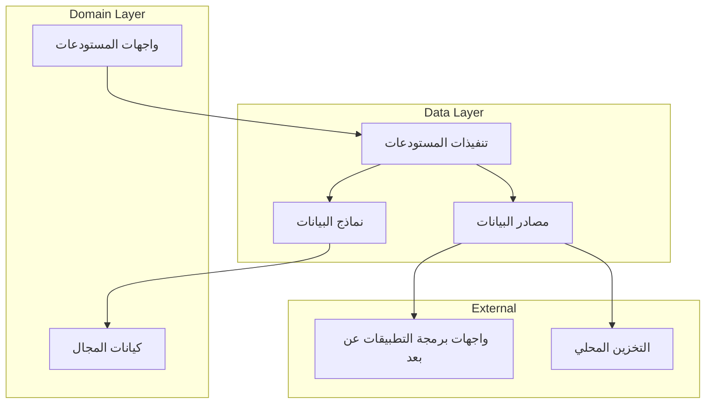

# طبقة البيانات (Data Layer)

[](README.md)

طبقة البيانات مسؤولة عن إدارة البيانات في تطبيق متجر Genius. تنفذ واجهات المستودعات المحددة في طبقة المجال وتوفر التنفيذ الملموس لعمليات البيانات.

## الغرض

طبقة البيانات:

- تنفذ واجهات المستودعات من طبقة المجال
- تدير مصادر البيانات (عن بعد، محلية، إلخ)
- تتعامل مع تسلسل البيانات وإلغاء تسلسلها
- تنفذ استراتيجيات تخزين مؤقت للبيانات
- توفر معالجة الأخطاء لعمليات البيانات
- تجرد تفاصيل مصدر البيانات الأساسية من طبقة المجال

## هيكل الدليل

```text
data/
├── datasources/       # تنفيذات مصدر البيانات
│   ├── local/         # تنفيذات التخزين المحلي
│   └── remote/        # تنفيذات واجهة برمجة التطبيقات عن بعد
├── models/            # نماذج البيانات (DTOs)
│   ├── request/       # نماذج الطلب لواجهات برمجة التطبيقات
│   └── response/      # نماذج الاستجابة من واجهات برمجة التطبيقات
└── repositories/      # تنفيذات المستودعات
```

## نظرة عامة على البنية

تتبع طبقة البيانات نمط المستودع وتنفذ تجريد مصدر البيانات:



## المكونات الرئيسية

### نماذج البيانات (Data Models)

نماذج البيانات في الدليل `models/` تمثل إصدارات قابلة للتسلسل من كيانات المجال:

```dart
class ProductModel extends Product {
  final String id;
  final Map<String, String> nameLocalized;
  final Map<String, String> descriptionLocalized;
  final double basePrice;
  final String brand;
  final String categoryId;
  final bool isFeatured;
  final bool isActive;
  final DateTime createdAt;
  final List<String> tags;
  final double averageRating;

  ProductModel({
    required this.id,
    required this.nameLocalized,
    required this.descriptionLocalized,
    required this.basePrice,
    required this.brand,
    required this.categoryId,
    required this.isFeatured,
    required this.isActive,
    required this.createdAt,
    required this.tags,
    required this.averageRating,
  }) : super(
          id: id,
          nameLocalized: nameLocalized,
          descriptionLocalized: descriptionLocalized,
          basePrice: basePrice,
          brand: brand,
          categoryId: categoryId,
          isFeatured: isFeatured,
          isActive: isActive,
          createdAt: createdAt,
          tags: tags,
          averageRating: averageRating,
        );

  factory ProductModel.fromJson(Map<String, dynamic> json) {
    return ProductModel(
      id: json['id'],
      nameLocalized: Map<String, String>.from(json['name_localized']),
      descriptionLocalized: Map<String, String>.from(json['description_localized']),
      basePrice: json['base_price'].toDouble(),
      brand: json['brand'],
      categoryId: json['category_id'],
      isFeatured: json['is_featured'],
      isActive: json['is_active'],
      createdAt: (json['created_at'] as Timestamp).toDate(),
      tags: List<String>.from(json['tags']),
      averageRating: json['average_rating'].toDouble(),
    );
  }

  Map<String, dynamic> toJson() {
    return {
      'id': id,
      'name_localized': nameLocalized,
      'description_localized': descriptionLocalized,
      'base_price': basePrice,
      'brand': brand,
      'category_id': categoryId,
      'is_featured': isFeatured,
      'is_active': isActive,
      'created_at': Timestamp.fromDate(createdAt),
      'tags': tags,
      'average_rating': averageRating,
    };
  }

  factory ProductModel.fromEntity(Product product) {
    return ProductModel(
      id: product.id,
      nameLocalized: product.nameLocalized,
      descriptionLocalized: product.descriptionLocalized,
      basePrice: product.basePrice,
      brand: product.brand,
      categoryId: product.categoryId,
      isFeatured: product.isFeatured,
      isActive: product.isActive,
      createdAt: product.createdAt,
      tags: product.tags,
      averageRating: product.averageRating,
    );
  }
}
```

### مصادر البيانات (Data Sources)

مصادر البيانات في الدليل `datasources/` تتعامل مع التفاعلات مع مزودي البيانات المحددين:

#### مصادر البيانات عن بعد (Remote Data Sources)

مصادر البيانات عن بعد تتواصل مع واجهات برمجة التطبيقات الخارجية:

```dart
abstract class ProductRemoteDataSource {
  Future<List<ProductModel>> getProducts({
    String? categoryId,
    Map<String, dynamic>? filters,
    int page = 1,
    int pageSize = 20,
  });
  
  Future<ProductModel> getProductById(String id);
  
  Future<List<ProductModel>> searchProducts(String query);
  
  Future<List<ReviewModel>> getProductReviews(String productId);
}

class ProductRemoteDataSourceImpl implements ProductRemoteDataSource {
  final HttpClient client;
  
  ProductRemoteDataSourceImpl({required this.client});
  
  @override
  Future<List<ProductModel>> getProducts({
    String? categoryId,
    Map<String, dynamic>? filters,
    int page = 1,
    int pageSize = 20,
  }) async {
    try {
      final queryParams = {
        'page': page.toString(),
        'page_size': pageSize.toString(),
        if (categoryId != null) 'category_id': categoryId,
        if (filters != null) ...filters,
      };
      
      final response = await client.get(
        '${ApiConstants.baseUrl}/products',
        queryParameters: queryParams,
      );
      
      if (response.statusCode == 200) {
        final List<dynamic> productsJson = response.data['data'];
        return productsJson
            .map((json) => ProductModel.fromJson(json))
            .toList();
      } else {
        throw ServerException(
          code: response.statusCode,
          message: response.data['message'] ?? 'فشل في جلب المنتجات',
        );
      }
    } catch (e) {
      if (e is DioError) {
        throw ServerException(
          code: e.response?.statusCode,
          message: e.message,
        );
      }
      throw const ServerException(
        message: 'حدث خطأ غير متوقع',
      );
    }
  }
  
  // تنفيذات الطرق الأخرى...
}
```

#### مصادر البيانات المحلية (Local Data Sources)

مصادر البيانات المحلية تدير البيانات المخزنة محليًا:

```dart
abstract class ProductLocalDataSource {
  Future<List<ProductModel>> getCachedProducts();
  
  Future<ProductModel?> getCachedProductById(String id);
  
  Future<void> cacheProducts(List<ProductModel> products);
  
  Future<void> cacheProduct(ProductModel product);
  
  Future<void> clearCache();
}

class ProductLocalDataSourceImpl implements ProductLocalDataSource {
  final SharedPreferences sharedPreferences;
  
  // تنفيذ مصدر البيانات المحلية...
}
```
