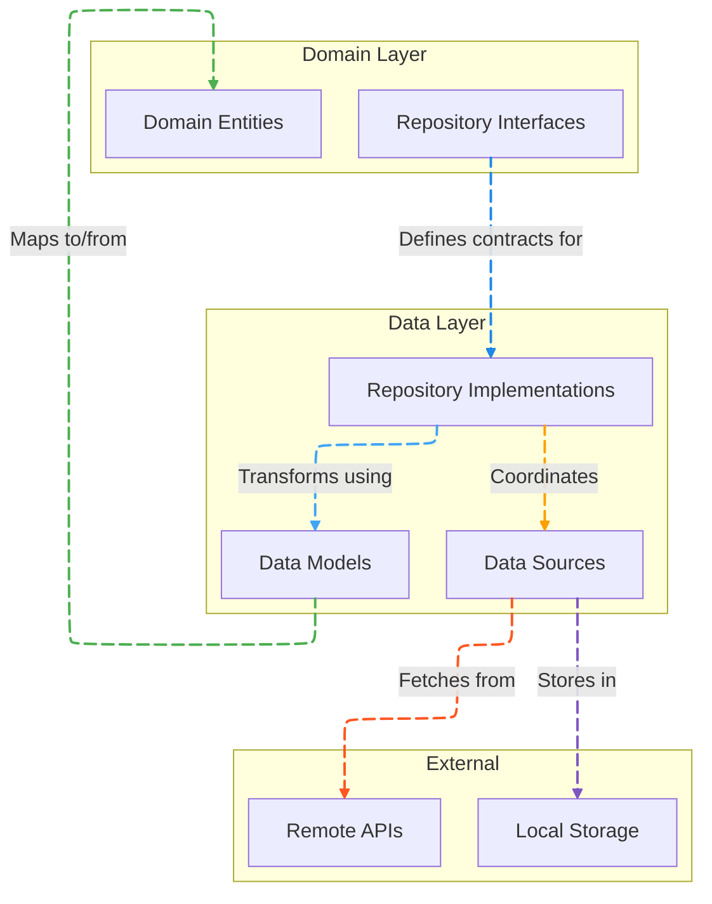
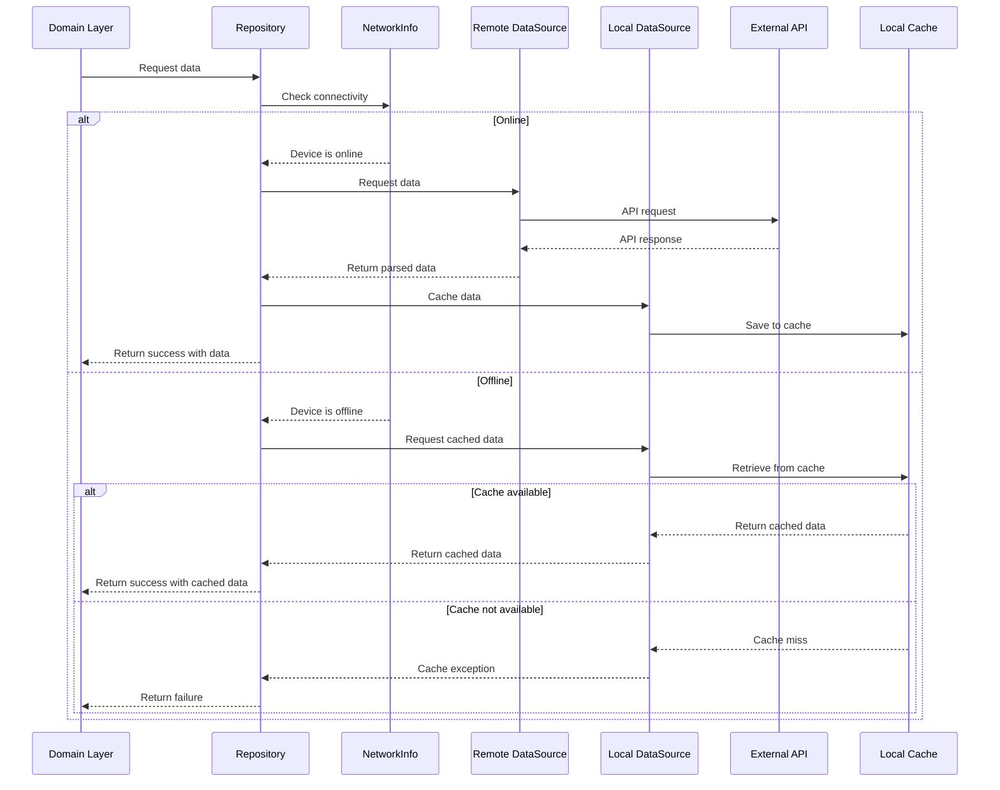

# Data Layer

[](README-ar.md)

The Data layer is responsible for data management in the Genius Store application. It implements the repository interfaces defined in the Domain layer and provides the concrete implementation for data operations.

## Purpose

The Data layer:

- Implements repository interfaces from the Domain layer
- Manages data sources (remote, local, etc.)
- Handles data serialization and deserialization
- Implements data caching strategies
- Provides error handling for data operations
- Abstracts underlying data source details from the Domain layer

## Directory Structure

```text
data/
├── datasources/       # Data source implementations
│   ├── local/         # Local storage implementations
│   └── remote/        # Remote API implementations
├── models/            # Data models (DTOs)
│   ├── request/       # Request models for APIs
│   └── response/      # Response models from APIs
└── repositories/      # Repository implementations
```

## Architecture Overview

The Data layer follows the Repository pattern and implements a Data Source abstraction:



## Key Components

### Data Models

Data models in the `models/` directory represent the serializable versions of domain entities:

```dart
class ProductModel extends Product {
  final String id;
  final Map<String, String> nameLocalized;
  final Map<String, String> descriptionLocalized;
  final double basePrice;
  final String brand;
  final String categoryId;
  final bool isFeatured;
  final bool isActive;
  final DateTime createdAt;
  final List<String> tags;
  final double averageRating;

  ProductModel({
    required this.id,
    required this.nameLocalized,
    required this.descriptionLocalized,
    required this.basePrice,
    required this.brand,
    required this.categoryId,
    required this.isFeatured,
    required this.isActive,
    required this.createdAt,
    required this.tags,
    required this.averageRating,
  }) : super(
          id: id,
          nameLocalized: nameLocalized,
          descriptionLocalized: descriptionLocalized,
          basePrice: basePrice,
          brand: brand,
          categoryId: categoryId,
          isFeatured: isFeatured,
          isActive: isActive,
          createdAt: createdAt,
          tags: tags,
          averageRating: averageRating,
        );

  factory ProductModel.fromJson(Map<String, dynamic> json) {
    return ProductModel(
      id: json['id'],
      nameLocalized: Map<String, String>.from(json['name_localized']),
      descriptionLocalized: Map<String, String>.from(json['description_localized']),
      basePrice: json['base_price'].toDouble(),
      brand: json['brand'],
      categoryId: json['category_id'],
      isFeatured: json['is_featured'],
      isActive: json['is_active'],
      createdAt: (json['created_at'] as Timestamp).toDate(),
      tags: List<String>.from(json['tags']),
      averageRating: json['average_rating'].toDouble(),
    );
  }

  Map<String, dynamic> toJson() {
    return {
      'id': id,
      'name_localized': nameLocalized,
      'description_localized': descriptionLocalized,
      'base_price': basePrice,
      'brand': brand,
      'category_id': categoryId,
      'is_featured': isFeatured,
      'is_active': isActive,
      'created_at': Timestamp.fromDate(createdAt),
      'tags': tags,
      'average_rating': averageRating,
    };
  }

  factory ProductModel.fromEntity(Product product) {
    return ProductModel(
      id: product.id,
      nameLocalized: product.nameLocalized,
      descriptionLocalized: product.descriptionLocalized,
      basePrice: product.basePrice,
      brand: product.brand,
      categoryId: product.categoryId,
      isFeatured: product.isFeatured,
      isActive: product.isActive,
      createdAt: product.createdAt,
      tags: product.tags,
      averageRating: product.averageRating,
    );
  }
}
```

### Data Sources

Data sources in the `datasources/` directory handle interactions with specific data providers:

#### Remote Data Sources

Remote data sources communicate with external APIs:

```dart
abstract class ProductRemoteDataSource {
  Future<List<ProductModel>> getProducts({
    String? categoryId,
    Map<String, dynamic>? filters,
    int page = 1,
    int pageSize = 20,
  });
  
  Future<ProductModel> getProductById(String id);
  
  Future<List<ProductModel>> searchProducts(String query);
  
  Future<List<ReviewModel>> getProductReviews(String productId);
}

class ProductRemoteDataSourceImpl implements ProductRemoteDataSource {
  final HttpClient client;
  
  ProductRemoteDataSourceImpl({required this.client});
  
  @override
  Future<List<ProductModel>> getProducts({
    String? categoryId,
    Map<String, dynamic>? filters,
    int page = 1,
    int pageSize = 20,
  }) async {
    try {
      final queryParams = {
        'page': page.toString(),
        'page_size': pageSize.toString(),
        if (categoryId != null) 'category_id': categoryId,
        if (filters != null) ...filters,
      };
      
      final response = await client.get(
        '${ApiConstants.baseUrl}/products',
        queryParameters: queryParams,
      );
      
      if (response.statusCode == 200) {
        final List<dynamic> productsJson = response.data['data'];
        return productsJson
            .map((json) => ProductModel.fromJson(json))
            .toList();
      } else {
        throw ServerException(
          code: response.statusCode,
          message: response.data['message'] ?? 'Failed to fetch products',
        );
      }
    } catch (e) {
      if (e is DioError) {
        throw ServerException(
          code: e.response?.statusCode,
          message: e.message,
        );
      }
      throw const ServerException(
        message: 'An unexpected error occurred',
      );
    }
  }
  
  // Other method implementations...
}
```

#### Local Data Sources

Local data sources manage locally stored data:

```dart
abstract class ProductLocalDataSource {
  Future<List<ProductModel>> getCachedProducts();
  
  Future<ProductModel?> getCachedProductById(String id);
  
  Future<void> cacheProducts(List<ProductModel> products);
  
  Future<void> cacheProduct(ProductModel product);
  
  Future<void> clearCache();
}

class ProductLocalDataSourceImpl implements ProductLocalDataSource {
  final SharedPreferences sharedPreferences;
  
  ProductLocalDataSourceImpl({required this.sharedPreferences});
  
  @override
  Future<List<ProductModel>> getCachedProducts() async {
    final jsonString = sharedPreferences.getString(CacheConstants.cachedProducts);
    
    if (jsonString != null) {
      try {
        final List<dynamic> jsonList = json.decode(jsonString);
        return jsonList
            .map((json) => ProductModel.fromJson(json))
            .toList();
      } catch (e) {
        throw CacheException(message: 'Failed to parse cached products');
      }
    } else {
      throw CacheException(message: 'No cached products found');
    }
  }
  
  @override
  Future<void> cacheProducts(List<ProductModel> products) async {
    final List<Map<String, dynamic>> jsonList = 
        products.map((product) => product.toJson()).toList();
    
    await sharedPreferences.setString(
      CacheConstants.cachedProducts,
      json.encode(jsonList),
    );
  }
  
  // Other method implementations...
}
```

### Repositories

Repository implementations in the `repositories/` directory coordinate between data sources:

```dart
class ProductRepositoryImpl implements ProductRepository {
  final ProductRemoteDataSource remoteDataSource;
  final ProductLocalDataSource localDataSource;
  final NetworkInfo networkInfo;
  
  ProductRepositoryImpl({
    required this.remoteDataSource,
    required this.localDataSource,
    required this.networkInfo,
  });
  
  @override
  Future<Either<Failure, List<Product>>> getProducts({
    String? categoryId,
    Map<String, dynamic>? filters,
    int page = 1,
    int pageSize = 20,
  }) async {
    if (await networkInfo.isConnected) {
      try {
        final remoteProducts = await remoteDataSource.getProducts(
          categoryId: categoryId,
          filters: filters,
          page: page,
          pageSize: pageSize,
        );
        
        // Cache products if first page
        if (page == 1) {
          await localDataSource.cacheProducts(remoteProducts);
        }
        
        return Right(remoteProducts);
      } on ServerException catch (e) {
        return Left(ServerFailure(message: e.message));
      }
    } else {
      try {
        // Only return cached data for first page when offline
        if (page == 1) {
          final localProducts = await localDataSource.getCachedProducts();
          return Right(localProducts);
        } else {
          return Left(NetworkFailure(
            message: 'Cannot load more products while offline',
          ));
        }
      } on CacheException catch (e) {
        return Left(CacheFailure(message: e.message));
      }
    }
  }
  
  // Other method implementations...
}
```

## Data Flow

The data flow in the Data layer follows this pattern:



## Caching Strategy

The Data layer implements a cache-then-network strategy:

1. First, attempt to retrieve data from the local cache
2. If cached data exists, return it immediately
3. Then, fetch updated data from the network in the background
4. Update the UI with the latest data once available
5. Store the latest data in the cache for future use

This strategy provides:

- Fast initial loading from cache
- Always up-to-date data when online
- Offline functionality using cached data

## Error Handling

Error handling in the Data layer:

1. Catches exceptions from data sources
2. Maps them to domain-specific failures
3. Returns failures using the Either pattern
4. Provides detailed error information to higher layers

Error types include:

- `ServerFailure`: Remote API errors
- `CacheFailure`: Local storage errors
- `NetworkFailure`: Connectivity issues
- `ValidationFailure`: Invalid data format
- `AuthenticationFailure`: Authentication errors

## Dependencies

The Data layer depends on:

- `Domain` layer for repository interfaces and entities
- `Core` layer for utilities, constants, and common components
- External packages for API communication (`dio`)
- Local storage packages (`shared_preferences`, `hive`)
- Firebase services (`firebase_auth`, `cloud_firestore`)

## Testing

The Data layer is tested with:

1. Unit tests for models, data sources, and repositories
2. Mock tests for external dependencies (APIs, databases)
3. Integration tests for repository implementations
4. Cache behavior tests

Example test for a repository:

```dart
void main() {
  late ProductRepositoryImpl repository;
  late MockProductRemoteDataSource mockRemoteDataSource;
  late MockProductLocalDataSource mockLocalDataSource;
  late MockNetworkInfo mockNetworkInfo;

  setUp(() {
    mockRemoteDataSource = MockProductRemoteDataSource();
    mockLocalDataSource = MockProductLocalDataSource();
    mockNetworkInfo = MockNetworkInfo();
    repository = ProductRepositoryImpl(
      remoteDataSource: mockRemoteDataSource,
      localDataSource: mockLocalDataSource,
      networkInfo: mockNetworkInfo,
    );
  });

  group('getProducts', () {
    final tProducts = [
      ProductModel(
        id: '1',
        nameLocalized: {'en': 'Test Product'},
        // Other fields...
      ),
    ];

    test('should check if the device is online', () async {
      // arrange
      when(mockNetworkInfo.isConnected).thenAnswer((_) async => true);
      when(mockRemoteDataSource.getProducts())
          .thenAnswer((_) async => tProducts);
      // act
      await repository.getProducts();
      // assert
      verify(mockNetworkInfo.isConnected);
    });

    group('device is online', () {
      setUp(() {
        when(mockNetworkInfo.isConnected).thenAnswer((_) async => true);
      });

      test('should return remote data when call to remote data source is successful', () async {
        // arrange
        when(mockRemoteDataSource.getProducts())
            .thenAnswer((_) async => tProducts);
        // act
        final result = await repository.getProducts();
        // assert
        verify(mockRemoteDataSource.getProducts());
        expect(result, equals(Right(tProducts)));
      });

      test('should cache the data locally when call to remote data source is successful', () async {
        // arrange
        when(mockRemoteDataSource.getProducts())
            .thenAnswer((_) async => tProducts);
        // act
        await repository.getProducts();
        // assert
        verify(mockRemoteDataSource.getProducts());
        verify(mockLocalDataSource.cacheProducts(tProducts));
      });

      test('should return server failure when call to remote data source is unsuccessful', () async {
        // arrange
        when(mockRemoteDataSource.getProducts())
            .thenThrow(ServerException(message: 'Server error'));
        // act
        final result = await repository.getProducts();
        // assert
        verify(mockRemoteDataSource.getProducts());
        verifyZeroInteractions(mockLocalDataSource);
        expect(result, equals(Left(ServerFailure(message: 'Server error'))));
      });
    });

    group('device is offline', () {
      setUp(() {
        when(mockNetworkInfo.isConnected).thenAnswer((_) async => false);
      });

      test('should return cached data when cached data is present', () async {
        // arrange
        when(mockLocalDataSource.getCachedProducts())
            .thenAnswer((_) async => tProducts);
        // act
        final result = await repository.getProducts();
        // assert
        verifyZeroInteractions(mockRemoteDataSource);
        verify(mockLocalDataSource.getCachedProducts());
        expect(result, equals(Right(tProducts)));
      });

      test('should return CacheFailure when there is no cached data', () async {
        // arrange
        when(mockLocalDataSource.getCachedProducts())
            .thenThrow(CacheException(message: 'No cached data'));
        // act
        final result = await repository.getProducts();
        // assert
        verifyZeroInteractions(mockRemoteDataSource);
        verify(mockLocalDataSource.getCachedProducts());
        expect(result, equals(Left(CacheFailure(message: 'No cached data'))));
      });
    });
  });
}
```
