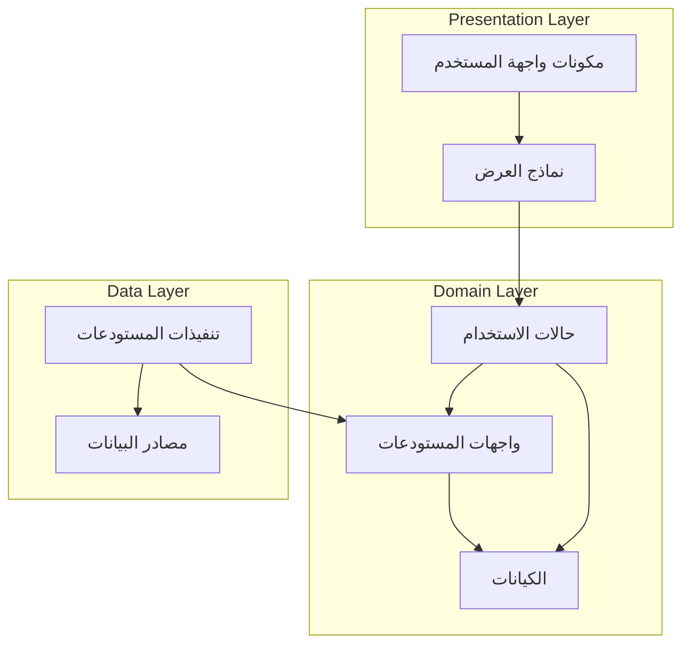

# طبقة المجال (Domain Layer)

[](README.md)

تحتوي طبقة المجال على منطق الأعمال الأساسي وقواعد تطبيق متجر Genius. وهي مستقلة عن الطبقات والأطر الأخرى، مما يجعلها الجزء الأكثر استقرارًا وقابلية للاختبار في التطبيق.

## الغرض

طبقة المجال:

- تحدد منطق وقواعد الأعمال الأساسية
- تحتوي على كيانات الأعمال وكائنات القيمة
- تحدد واجهات المستودعات للوصول إلى البيانات
- تنفذ حالات الاستخدام التي تنظم عمليات الأعمال
- تبقى مستقلة عن واجهة المستخدم وتنفيذات مصدر البيانات
- تؤسس لغة مشتركة لمجال التطبيق

## هيكل الدليل

```text
domain/
├── entities/         # نماذج كائنات الأعمال
├── repositories/     # واجهات المستودعات
└── usecases/         # عمليات الأعمال
```

## نظرة عامة على البنية

تتبع طبقة المجال نمط البنية النظيفة وتنفذ نمط حالة الاستخدام:



## المكونات الرئيسية

### الكيانات (Entities)

الكيانات في الدليل `entities/` هي كائنات الأعمال الأساسية للتطبيق:

```dart
class Product {
  final String id;
  final Map<String, String> nameLocalized;
  final Map<String, String> descriptionLocalized;
  final double basePrice;
  final String brand;
  final String categoryId;
  final bool isFeatured;
  final bool isActive;
  final DateTime createdAt;
  final List<String> tags;
  final double averageRating;
  
  const Product({
    required this.id,
    required this.nameLocalized,
    required this.descriptionLocalized,
    required this.basePrice,
    required this.brand,
    required this.categoryId,
    required this.isFeatured,
    required this.isActive,
    required this.createdAt,
    required this.tags,
    required this.averageRating,
  });
  
  // طرق منطق الأعمال الخالصة
  String getName(String languageCode) {
    return nameLocalized[languageCode] ?? nameLocalized['en'] ?? '';
  }
  
  String getDescription(String languageCode) {
    return descriptionLocalized[languageCode] ?? descriptionLocalized['en'] ?? '';
  }
  
  bool isOnSale(List<Promotion> activePromotions) {
    return activePromotions.any((promo) => 
      promo.appliesTo.contains(id) && promo.isActive);
  }
  
  double getSalePrice(List<Promotion> activePromotions) {
    if (!isOnSale(activePromotions)) return basePrice;
    
    final applicablePromotion = activePromotions.firstWhere(
      (promo) => promo.appliesTo.contains(id) && promo.isActive,
      orElse: () => Promotion.empty(),
    );
    
    return basePrice * (1 - applicablePromotion.discountPercentage / 100);
  }
}
```

### المستودعات (Repositories)

واجهات المستودعات في الدليل `repositories/` تحدد كيفية وصول طبقة المجال إلى البيانات:

```dart
abstract class ProductRepository {
  Future<Either<Failure, List<Product>>> getProducts({
    String? categoryId,
    Map<String, dynamic>? filters,
    int page = 1,
    int pageSize = 20,
  });
  
  Future<Either<Failure, Product>> getProductById(String id);
  
  Future<Either<Failure, List<Product>>> searchProducts(String query);
  
  Future<Either<Failure, List<Review>>> getProductReviews(String productId);
  
  Future<Either<Failure, List<Product>>> getRelatedProducts(String productId);
  
  Future<Either<Failure, void>> submitProductReview(Review review);
}
```

### حالات الاستخدام (Use Cases)

حالات الاستخدام في الدليل `usecases/` تغلف عمليات الأعمال المحددة:

```dart
class GetProducts {
  final ProductRepository repository;
  
  GetProducts(this.repository);
  
  Future<Either<Failure, List<Product>>> call({
    String? categoryId,
    Map<String, dynamic>? filters,
    int page = 1,
    int pageSize = 20,
  }) async {
    return await repository.getProducts(
      categoryId: categoryId,
      filters: filters,
      page: page,
      pageSize: pageSize,
    );
  }
}

class AddToCart {
  final CartRepository cartRepository;
  final ProductRepository productRepository;
  
  AddToCart({
    required this.cartRepository,
    required this.productRepository,
  });
  
  Future<Either<Failure, Cart>> call({
    required String cartId,
    required String productId,
    required String variantId,
    required int quantity,
  }) async {
    // التحقق من توفر المنتج أولاً
    final productResult = await productRepository.getProductById(productId);
    
    return productResult.fold(
      (failure) => Left(failure),
      (product) async {
        // التحقق مما إذا كان المنتج نشطًا
        if (!product.isActive) {
          return Left(BusinessFailure(
            message: 'هذا المنتج لم يعد متاحًا.'
          ));
        }
        
        // البحث عن المتغير المحدد
        final variant = product.variants?.firstWhere(
          (v) => v.id == variantId,
          orElse: () => null,
        );
        
        // التحقق مما إذا كان المتغير موجودًا وفي المخزون
        if (variant == null) {
          return Left(BusinessFailure(
            message: 'متغير المنتج المحدد غير متاح.'
          ));
        }
        
        if (variant.stockQuantity < quantity) {
          return Left(BusinessFailure(
            message: 'لا توجد عناصر كافية في المخزون. متاح فقط ${variant.stockQuantity}.'
          ));
        }
        
        // إذا اجتازت جميع الفحوصات، أضف إلى السلة
        return await cartRepository.addItemToCart(
          cartId: cartId,
          productId: productId,
          variantId: variantId,
          quantity: quantity,
          price: variant.price,
        );
      },
    );
  }
}
```

## معالجة الأخطاء

تستخدم طبقة المجال النوع `Either` من حزمة dartz لمعالجة الأخطاء:

```dart
// واجهة المستودع مع نوع إرجاع Either
abstract class AuthRepository {
  Future<Either<Failure, User>> signIn(String email, String password);
  Future<Either<Failure, User>> signUp(String email, String password, String name);
  Future<Either<Failure, void>> forgotPassword(String email);
  Future<Either<Failure, void>> signOut();
  Future<Either<Failure, User>> getCurrentUser();
}

// تنفيذ حالة الاستخدام مع Either
class SignIn {
  final AuthRepository repository;
  
  SignIn(this.repository);
  
  Future<Either<Failure, User>> call(String email, String password) async {
    if (email.isEmpty) {
      return Left(ValidationFailure(message: 'لا يمكن أن يكون البريد الإلكتروني فارغًا'));
    }
    // المزيد من التحقق من الصحة والمنطق الأعمال...
    return await repository.signIn(email, password);
  }
}
```
