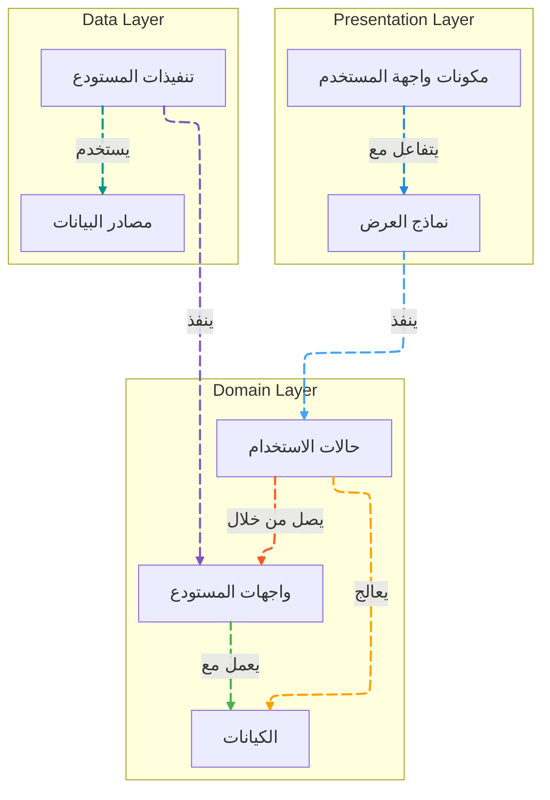

# طبقة المجال (Domain Layer)

[](README.md)

تحتوي طبقة المجال على منطق الأعمال الأساسي وقواعد تطبيق Genius Store. وهي مستقلة عن الطبقات والأطر الأخرى، مما يجعلها الجزء الأكثر استقرارًا وقابلية للاختبار في التطبيق.

## الغرض

طبقة المجال:

- تحدد منطق الأعمال الأساسي والقواعد
- تحتوي على كيانات الأعمال وكائنات القيمة
- تحدد واجهات المستودع للوصول إلى البيانات
- تنفذ حالات الاستخدام التي تنظم عمليات الأعمال
- تظل مستقلة عن واجهة المستخدم وتنفيذات مصدر البيانات
- تؤسس لغة مشتركة لمجال التطبيق

## هيكل الدليل

```text
domain/
├── entities/         # نماذج كائنات الأعمال
├── repositories/     # واجهات المستودع
└── usecases/         # عمليات الأعمال
```

## نظرة عامة على البنية

تتبع طبقة المجال نمط العمارة النظيفة (Clean Architecture) وتنفذ نمط حالة الاستخدام:



## المكونات الرئيسية

### الكيانات

الكيانات في دليل `entities/` هي كائنات الأعمال الأساسية للتطبيق:

```dart
class Product {
  final String id;
  final Map<String, String> nameLocalized;
  final Map<String, String> descriptionLocalized;
  final double basePrice;
  final String brand;
  final String categoryId;
  final bool isFeatured;
  final bool isActive;
  final DateTime createdAt;
  final List<String> tags;
  final double averageRating;
  
  const Product({
    required this.id,
    required this.nameLocalized,
    required this.descriptionLocalized,
    required this.basePrice,
    required this.brand,
    required this.categoryId,
    required this.isFeatured,
    required this.isActive,
    required this.createdAt,
    required this.tags,
    required this.averageRating,
  });
  
  // طرق منطق الأعمال النقية
  String getName(String languageCode) {
    return nameLocalized[languageCode] ?? nameLocalized['en'] ?? '';
  }
  
  String getDescription(String languageCode) {
    return descriptionLocalized[languageCode] ?? descriptionLocalized['en'] ?? '';
  }
  
  bool isOnSale(List<Promotion> activePromotions) {
    return activePromotions.any((promo) => 
      promo.appliesTo.contains(id) && promo.isActive);
  }
  
  double getSalePrice(List<Promotion> activePromotions) {
    if (!isOnSale(activePromotions)) return basePrice;
    
    final applicablePromotion = activePromotions.firstWhere(
      (promo) => promo.appliesTo.contains(id) && promo.isActive,
      orElse: () => Promotion.empty(),
    );
    
    return basePrice * (1 - applicablePromotion.discountPercentage / 100);
  }
}
```

### المستودعات

واجهات المستودع في دليل `repositories/` تحدد كيفية وصول طبقة المجال إلى البيانات:

```dart
abstract class ProductRepository {
  Future<Either<Failure, List<Product>>> getProducts({
    String? categoryId,
    Map<String, dynamic>? filters,
    int page = 1,
    int pageSize = 20,
  });
  
  Future<Either<Failure, Product>> getProductById(String id);
  
  Future<Either<Failure, List<Product>>> searchProducts(String query);
  
  Future<Either<Failure, List<Review>>> getProductReviews(String productId);
  
  Future<Either<Failure, List<Product>>> getRelatedProducts(String productId);
  
  Future<Either<Failure, void>> submitProductReview(Review review);
}
```

### حالات الاستخدام

حالات الاستخدام في دليل `usecases/` تغلف عمليات الأعمال المحددة:

```dart
class GetProducts {
  final ProductRepository repository;
  
  GetProducts(this.repository);
  
  Future<Either<Failure, List<Product>>> call({
    String? categoryId,
    Map<String, dynamic>? filters,
    int page = 1,
    int pageSize = 20,
  }) async {
    return await repository.getProducts(
      categoryId: categoryId,
      filters: filters,
      page: page,
      pageSize: pageSize,
    );
  }
}

class AddToCart {
  final CartRepository cartRepository;
  final ProductRepository productRepository;
  
  AddToCart({
    required this.cartRepository,
    required this.productRepository,
  });
  
  Future<Either<Failure, Cart>> call({
    required String cartId,
    required String productId,
    required String variantId,
    required int quantity,
  }) async {
    // التحقق من توفر المنتج أولاً
    final productResult = await productRepository.getProductById(productId);
    
    return productResult.fold(
      (failure) => Left(failure),
      (product) async {
        // التحقق مما إذا كان المنتج نشطًا
        if (!product.isActive) {
          return Left(BusinessFailure(
            message: 'هذا المنتج لم يعد متاحًا.'
          ));
        }
        
        // العثور على المتغير المحدد
        final variant = product.variants?.firstWhere(
          (v) => v.id == variantId,
          orElse: () => null,
        );
        
        // التحقق مما إذا كان المتغير موجودًا وفي المخزون
        if (variant == null) {
          return Left(BusinessFailure(
            message: 'متغير المنتج المحدد غير متاح.'
          ));
        }
        
        if (variant.stockQuantity < quantity) {
          return Left(BusinessFailure(
            message: 'لا توجد كمية كافية في المخزون. متاح فقط ${variant.stockQuantity}.'
          ));
        }
        
        // إذا نجحت جميع الفحوصات، أضف إلى السلة
        return await cartRepository.addItemToCart(
          cartId: cartId,
          productId: productId,
          variantId: variantId,
          quantity: quantity,
          price: variant.price,
        );
      },
    );
  }
}
```

## معالجة الأخطاء

تستخدم طبقة المجال نوع `Either` من حزمة dartz لمعالجة الأخطاء:

```dart
// واجهة المستودع مع نوع إرجاع Either
abstract class AuthRepository {
  Future<Either<Failure, User>> signIn(String email, String password);
  Future<Either<Failure, User>> signUp(String email, String password, String name);
  Future<Either<Failure, void>> forgotPassword(String email);
  Future<Either<Failure, void>> signOut();
  Future<Either<Failure, User>> getCurrentUser();
}

// تنفيذ حالة الاستخدام مع Either
class SignIn {
  final AuthRepository repository;
  
  SignIn(this.repository);
  
  Future<Either<Failure, User>> call(String email, String password) async {
    return await repository.signIn(email, password);
  }
}
```

حالات الفشل هي كائنات مشتقة من فئة `Failure` الأساسية:

```dart
abstract class Failure {
  final String message;
  
  const Failure({required this.message});
}

class ServerFailure extends Failure {
  const ServerFailure({required String message}) : super(message: message);
}

class NetworkFailure extends Failure {
  const NetworkFailure({required String message}) : super(message: message);
}

class AuthenticationFailure extends Failure {
  const AuthenticationFailure({required String message}) : super(message: message);
}

class ValidationFailure extends Failure {
  const ValidationFailure({required String message}) : super(message: message);
}

class BusinessFailure extends Failure {
  const BusinessFailure({required String message}) : super(message: message);
}
```

## نماذج النجاح

نتائج العملية الناجحة تعود في الجانب الأيمن من `Either`:

```dart
// مثال لحالة استخدام مع معالجة النتيجة
Future<void> signInUser(String email, String password) async {
  final result = await signIn(email, password);
  
  result.fold(
    (failure) {
      // معالجة الفشل
      showErrorMessage(failure.message);
    },
    (user) {
      // معالجة النجاح
      navigateToHome(user);
    },
  );
}
```

## القواعد والسياسات

تنفذ طبقة المجال قواعد وسياسات الأعمال المعقدة:

### سياسات التسعير

```dart
class PricingPolicy {
  double calculateFinalPrice(Product product, User user, List<Promotion> activePromotions) {
    double basePrice = product.basePrice;
    double discount = 0.0;
    
    // تطبيق خصم المتجر (إن وجد)
    final storePromotion = activePromotions.firstWhere(
      (promo) => promo.type == PromotionType.storeWide && promo.isActive,
      orElse: () => Promotion.empty(),
    );
    
    if (storePromotion.isNotEmpty) {
      discount = basePrice * (storePromotion.discountPercentage / 100);
    }
    
    // تطبيق خصم المنتج المحدد (إن وجد)
    final productPromotion = activePromotions.firstWhere(
      (promo) => promo.appliesTo.contains(product.id) && promo.isActive,
      orElse: () => Promotion.empty(),
    );
    
    if (productPromotion.isNotEmpty) {
      // استخدم أعلى خصم
      discount = max(discount, basePrice * (productPromotion.discountPercentage / 100));
    }
    
    // تطبيق خصم العضوية (إن وجد)
    if (user.membershipLevel != MembershipLevel.none) {
      final membershipDiscount = basePrice * (user.membershipLevel.discountPercentage / 100);
      discount = max(discount, membershipDiscount);
    }
    
    return max(0, basePrice - discount);
  }
}
```

## المبادئ والممارسات

تتبع طبقة المجال عدة مبادئ ومفاهيم رئيسية:

1. **مبدأ المسؤولية الواحدة**: كل كيان وحالة استخدام لها مسؤولية واحدة محددة
2. **مبدأ الانفتاح/الإغلاق**: الكيانات قابلة للتوسيع ولكنها مغلقة للتعديل
3. **مبدأ التحكم بالاعتماديات (الحقن)**: الاعتماديات تُحقن في حالات الاستخدام
4. **عزل التبعيات الخارجية**: طبقة المجال لا تعتمد على المكتبات الخارجية (بصرف النظر عن dartz للمساعدة في معالجة الأخطاء)
5. **تطوير موجه بالمجال (DDD)**: هيكل التطبيق مبني حول مفاهيم المجال

## الاختبارات

طبقة المجال مختبرة بشكل شامل مع اختبارات الوحدة:

```dart
void main() {
  late ProductRepository mockProductRepository;
  late CartRepository mockCartRepository;
  late AddToCart useCase;
  
  setUp(() {
    mockProductRepository = MockProductRepository();
    mockCartRepository = MockCartRepository();
    useCase = AddToCart(
      productRepository: mockProductRepository,
      cartRepository: mockCartRepository,
    );
  });
  
  test('should return BusinessFailure when product is not active', () async {
    // Arrange
    final product = Product(
      id: 'product_1',
      nameLocalized: {'en': 'Test Product'},
      descriptionLocalized: {'en': 'Test Description'},
      basePrice: 100.0,
      brand: 'Test Brand',
      categoryId: 'category_1',
      isFeatured: false,
      isActive: false, // المنتج غير نشط
      createdAt: DateTime.now(),
      tags: [],
      averageRating: 0.0,
    );
    
    when(mockProductRepository.getProductById(any))
        .thenAnswer((_) async => Right(product));
    
    // Act
    final result = await useCase(
      cartId: 'cart_1',
      productId: 'product_1',
      variantId: 'variant_1',
      quantity: 1,
    );
    
    // Assert
    expect(result.isLeft(), true);
    result.fold(
      (failure) => expect(failure, isA<BusinessFailure>()),
      (_) => fail('Should return a failure'),
    );
  });
}
```

## الاستدامة والتوسعية

تم تصميم طبقة المجال لتكون مستدامة وقابلة للتوسع من خلال التالي:

1. **الاستقلال عن الأطر الخارجية**: لا توجد تبعيات على Flutter أو Firebase أو أي أطر خارجية
2. **الواجهات المجردة**: جميع التفاعلات مع العالم الخارجي تتم من خلال واجهات مجردة
3. **استراتيجية الفشل الواضحة**: استخدام نمط `Either` لمعالجة الأخطاء
4. **مبادئ SOLID**: الالتزام بمبادئ التصميم الجيد
5. **وضوح نطاق المسؤولية**: فصل واضح للمسؤوليات بين المكونات
