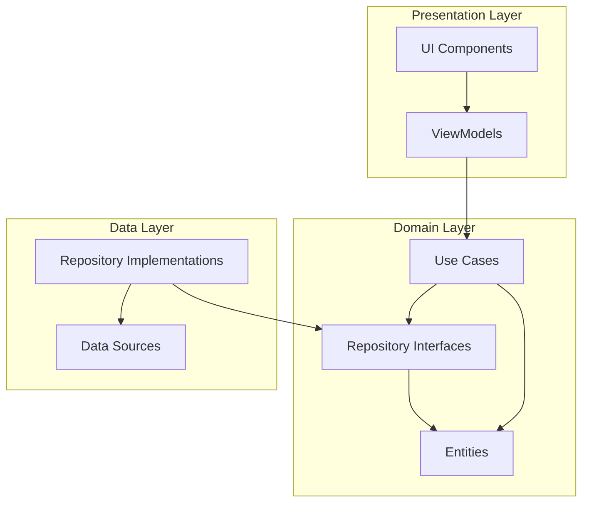

# Domain Layer

The Domain layer contains the core business logic and rules of the Genius Store application. It is independent of other layers and frameworks, making it the most stable and testable part of the application.

## Purpose

The Domain layer:

- Defines the core business logic and rules
- Contains business entities and value objects
- Defines repository interfaces for data access
- Implements use cases that orchestrate business operations
- Remains independent of UI and data source implementations
- Establishes a common language for the application domain

## Directory Structure

```text
domain/
├── entities/         # Business object models
├── repositories/     # Repository interfaces
└── usecases/         # Business operations
```

## Architecture Overview

The Domain layer follows the Clean Architecture pattern and implements the Use Case pattern:



## Key Components

### Entities

Entities in the `entities/` directory are the core business objects of the application:

```dart
class Product {
  final String id;
  final Map<String, String> nameLocalized;
  final Map<String, String> descriptionLocalized;
  final double basePrice;
  final String brand;
  final String categoryId;
  final bool isFeatured;
  final bool isActive;
  final DateTime createdAt;
  final List<String> tags;
  final double averageRating;
  
  const Product({
    required this.id,
    required this.nameLocalized,
    required this.descriptionLocalized,
    required this.basePrice,
    required this.brand,
    required this.categoryId,
    required this.isFeatured,
    required this.isActive,
    required this.createdAt,
    required this.tags,
    required this.averageRating,
  });
  
  // Pure business logic methods
  String getName(String languageCode) {
    return nameLocalized[languageCode] ?? nameLocalized['en'] ?? '';
  }
  
  String getDescription(String languageCode) {
    return descriptionLocalized[languageCode] ?? descriptionLocalized['en'] ?? '';
  }
  
  bool isOnSale(List<Promotion> activePromotions) {
    return activePromotions.any((promo) => 
      promo.appliesTo.contains(id) && promo.isActive);
  }
  
  double getSalePrice(List<Promotion> activePromotions) {
    if (!isOnSale(activePromotions)) return basePrice;
    
    final applicablePromotion = activePromotions.firstWhere(
      (promo) => promo.appliesTo.contains(id) && promo.isActive,
      orElse: () => Promotion.empty(),
    );
    
    return basePrice * (1 - applicablePromotion.discountPercentage / 100);
  }
}
```

### Repositories

Repository interfaces in the `repositories/` directory define how the domain layer accesses data:

```dart
abstract class ProductRepository {
  Future<Either<Failure, List<Product>>> getProducts({
    String? categoryId,
    Map<String, dynamic>? filters,
    int page = 1,
    int pageSize = 20,
  });
  
  Future<Either<Failure, Product>> getProductById(String id);
  
  Future<Either<Failure, List<Product>>> searchProducts(String query);
  
  Future<Either<Failure, List<Review>>> getProductReviews(String productId);
  
  Future<Either<Failure, List<Product>>> getRelatedProducts(String productId);
  
  Future<Either<Failure, void>> submitProductReview(Review review);
}
```

### Use Cases

Use cases in the `usecases/` directory encapsulate specific business operations:

```dart
class GetProducts {
  final ProductRepository repository;
  
  GetProducts(this.repository);
  
  Future<Either<Failure, List<Product>>> call({
    String? categoryId,
    Map<String, dynamic>? filters,
    int page = 1,
    int pageSize = 20,
  }) async {
    return await repository.getProducts(
      categoryId: categoryId,
      filters: filters,
      page: page,
      pageSize: pageSize,
    );
  }
}

class AddToCart {
  final CartRepository cartRepository;
  final ProductRepository productRepository;
  
  AddToCart({
    required this.cartRepository,
    required this.productRepository,
  });
  
  Future<Either<Failure, Cart>> call({
    required String cartId,
    required String productId,
    required String variantId,
    required int quantity,
  }) async {
    // Check product availability first
    final productResult = await productRepository.getProductById(productId);
    
    return productResult.fold(
      (failure) => Left(failure),
      (product) async {
        // Check if product is active
        if (!product.isActive) {
          return Left(BusinessFailure(
            message: 'This product is no longer available.'
          ));
        }
        
        // Find the selected variant
        final variant = product.variants?.firstWhere(
          (v) => v.id == variantId,
          orElse: () => null,
        );
        
        // Check if the variant exists and is in stock
        if (variant == null) {
          return Left(BusinessFailure(
            message: 'The selected product variant is not available.'
          ));
        }
        
        if (variant.stockQuantity < quantity) {
          return Left(BusinessFailure(
            message: 'Not enough items in stock. Only ${variant.stockQuantity} available.'
          ));
        }
        
        // If all checks pass, add to cart
        return await cartRepository.addItemToCart(
          cartId: cartId,
          productId: productId,
          variantId: variantId,
          quantity: quantity,
          price: variant.price,
        );
      },
    );
  }
}
```

## Error Handling

The Domain layer uses the `Either` type from the dartz package for error handling:

```dart
// Repository interface with Either return type
abstract class AuthRepository {
  Future<Either<Failure, User>> signIn(String email, String password);
  Future<Either<Failure, User>> signUp(String email, String password, String name);
  Future<Either<Failure, void>> forgotPassword(String email);
  Future<Either<Failure, void>> signOut();
  Future<Either<Failure, User>> getCurrentUser();
}

// Use case implementation with Either
class SignIn {
  final AuthRepository repository;
  
  SignIn(this.repository);
  
  Future<Either<Failure, User>> call(String email, String password) async {
    if (email.isEmpty) {
      return Left(ValidationFailure(message: 'Email cannot be empty'));
    }
    
    if (!EmailValidator.validate(email)) {
      return Left(ValidationFailure(message: 'Invalid email format'));
    }
    
    if (password.isEmpty) {
      return Left(ValidationFailure(message: 'Password cannot be empty'));
    }
    
    return await repository.signIn(email, password);
  }
}
```

## Value Objects

The Domain layer may also include value objects for domain-specific types:

```dart
class EmailAddress {
  final String value;
  
  factory EmailAddress(String input) {
    if (!EmailValidator.validate(input)) {
      throw InvalidEmailException();
    }
    return EmailAddress._(input);
  }
  
  const EmailAddress._(this.value);
  
  @override
  bool operator ==(Object other) =>
      identical(this, other) ||
      other is EmailAddress &&
          runtimeType == other.runtimeType &&
          value == other.value;
  
  @override
  int get hashCode => value.hashCode;
}

class Money {
  final double amount;
  final String currency;
  
  const Money({
    required this.amount,
    this.currency = 'USD',
  });
  
  Money operator +(Money other) {
    if (currency != other.currency) {
      throw DifferentCurrencyException();
    }
    return Money(
      amount: amount + other.amount,
      currency: currency,
    );
  }
  
  Money operator -(Money other) {
    if (currency != other.currency) {
      throw DifferentCurrencyException();
    }
    return Money(
      amount: amount - other.amount,
      currency: currency,
    );
  }
  
  Money applyDiscount(double discountPercentage) {
    return Money(
      amount: amount * (1 - discountPercentage / 100),
      currency: currency,
    );
  }
  
  String formatted() {
    return NumberFormat.currency(
      symbol: getCurrencySymbol(currency),
      decimalDigits: 2,
    ).format(amount);
  }
}
```

## Business Rules

The Domain layer enforces business rules through entities and use cases:

```dart
class PlaceOrder {
  final CartRepository cartRepository;
  final OrderRepository orderRepository;
  final PaymentRepository paymentRepository;
  
  PlaceOrder({
    required this.cartRepository,
    required this.orderRepository,
    required this.paymentRepository,
  });
  
  Future<Either<Failure, Order>> call({
    required String cartId,
    required Address shippingAddress,
    required ShippingMethod shippingMethod,
    required PaymentMethod paymentMethod,
  }) async {
    // Get cart with items
    final cartResult = await cartRepository.getCartById(cartId);
    
    return cartResult.fold(
      (failure) => Left(failure),
      (cart) async {
        // Business Rule: Cart must have items
        if (cart.items.isEmpty) {
          return Left(BusinessFailure(
            message: 'Cannot place an order with an empty cart'
          ));
        }
        
        // Business Rule: Shipping address must be valid
        if (!_isValidAddress(shippingAddress)) {
          return Left(ValidationFailure(
            message: 'Invalid shipping address'
          ));
        }
        
        // Business Rule: Payment method must be valid
        if (!_isValidPaymentMethod(paymentMethod)) {
          return Left(ValidationFailure(
            message: 'Invalid payment method'
          ));
        }
        
        // Calculate order totals
        final subtotal = cart.calculateSubtotal();
        final shippingCost = shippingMethod.calculateCost(cart);
        final taxes = _calculateTaxes(cart, shippingAddress);
        final total = subtotal + shippingCost + taxes;
        
        // Process payment
        final paymentResult = await paymentRepository.processPayment(
          amount: total,
          paymentMethod: paymentMethod,
        );
        
        return paymentResult.fold(
          (failure) => Left(failure),
          (paymentConfirmation) async {
            // Create order
            return orderRepository.createOrder(
              cart: cart,
              shippingAddress: shippingAddress,
              shippingMethod: shippingMethod,
              paymentConfirmation: paymentConfirmation,
              subtotal: subtotal,
              shippingCost: shippingCost,
              taxes: taxes,
              total: total,
            );
          },
        );
      },
    );
  }
  
  bool _isValidAddress(Address address) {
    return address.street.isNotEmpty &&
        address.city.isNotEmpty &&
        address.country.isNotEmpty &&
        address.postalCode.isNotEmpty;
  }
  
  bool _isValidPaymentMethod(PaymentMethod method) {
    // Payment method validation logic
    return true;
  }
  
  double _calculateTaxes(Cart cart, Address shippingAddress) {
    // Tax calculation logic based on address and items
    return cart.calculateSubtotal() * 0.08; // Example: 8% tax
  }
}
```

## Dependency Rule

The Domain layer follows the Dependency Rule of Clean Architecture:

- It has no dependencies on outer layers (UI, Data sources)
- It depends only on pure Dart and utility packages
- External concerns (data storage, UI, etc.) are represented as abstractions (interfaces)
- All dependencies point inward toward the Domain layer

## Testing

The Domain layer is highly testable due to its independence from frameworks and external dependencies:

```dart
void main() {
  late SignIn signIn;
  late MockAuthRepository mockAuthRepository;

  setUp(() {
    mockAuthRepository = MockAuthRepository();
    signIn = SignIn(mockAuthRepository);
  });

  test('should return validation failure when email is empty', () async {
    // arrange
    final String emptyEmail = '';
    final String password = 'password123';
    
    // act
    final result = await signIn(emptyEmail, password);
    
    // assert
    expect(result, Left(ValidationFailure(message: 'Email cannot be empty')));
    verifyZeroInteractions(mockAuthRepository);
  });

  test('should return validation failure when email format is invalid', () async {
    // arrange
    final String invalidEmail = 'not-an-email';
    final String password = 'password123';
    
    // act
    final result = await signIn(invalidEmail, password);
    
    // assert
    expect(result, Left(ValidationFailure(message: 'Invalid email format')));
    verifyZeroInteractions(mockAuthRepository);
  });

  test('should return validation failure when password is empty', () async {
    // arrange
    final String email = 'test@example.com';
    final String emptyPassword = '';
    
    // act
    final result = await signIn(email, emptyPassword);
    
    // assert
    expect(result, Left(ValidationFailure(message: 'Password cannot be empty')));
    verifyZeroInteractions(mockAuthRepository);
  });

  test('should call repository when inputs are valid', () async {
    // arrange
    final String email = 'test@example.com';
    final String password = 'password123';
    final User user = User(id: '1', email: email, name: 'Test User');
    
    when(mockAuthRepository.signIn(email, password))
        .thenAnswer((_) async => Right(user));
    
    // act
    final result = await signIn(email, password);
    
    // assert
    expect(result, Right(user));
    verify(mockAuthRepository.signIn(email, password));
  });
}
```

## Dependencies

The Domain layer has minimal dependencies:

- `dartz`: For Either type and functional programming utilities
- `equatable`: For simplified equality comparisons
- `meta`: For annotations like @required
- Core Dart libraries

## Usage Guidelines

When developing the Domain layer:

1. **Business First**: Focus on business rules and logic, not technical details
2. **Keep It Pure**: Avoid dependencies on UI or external frameworks
3. **Use Abstractions**: Define interfaces for external services
4. **Write Tests**: Use cases and entities should have comprehensive tests
5. **Use Value Objects**: For domain-specific types with validation
6. **Enforce Invariants**: Ensure business rules are enforced in entities and use cases
