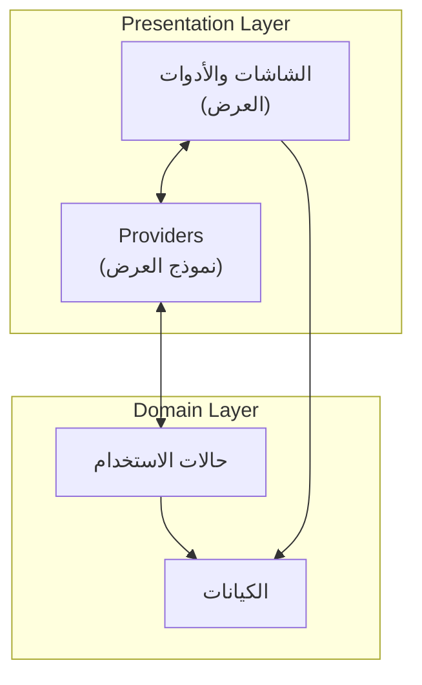
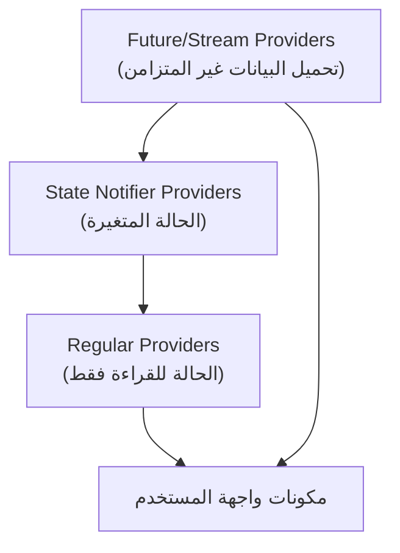

# طبقة العرض (Presentation Layer)

[](README.md)

تُنفّذ طبقة العرض واجهة المستخدم لتطبيق Genius Store. وهي تتبع نمط العمارة MVVM (النموذج-العرض-نموذج العرض) وتستخدم Riverpod لإدارة الحالة.

## الغرض

طبقة العرض:

- تعرض مكونات واجهة المستخدم والشاشات
- تتعامل مع تفاعلات المستخدم
- تدير حالة واجهة المستخدم من خلال ViewModels/Providers
- تتواصل مع طبقة المجال (Domain) من خلال حالات الاستخدام (Use Cases)
- تُنفّذ الجوانب المرئية للتطبيق بما في ذلك التخطيطات والرسوم المتحركة والتنقل

## هيكل الدليل

```text
presentation/
├── common_widgets/    # مكونات واجهة المستخدم القابلة لإعادة الاستخدام
├── screens/           # شاشات التطبيق منظمة حسب الميزة
│   ├── auth/          # شاشات المصادقة
│   ├── cart/          # شاشات سلة التسوق
│   ├── checkout/      # شاشات الدفع
│   ├── home/          # الشاشة الرئيسية
│   ├── product/       # شاشات المنتج
│   └── profile/       # شاشات الملف الشخصي
└── providers/         # إدارة الحالة باستخدام Riverpod
```

## نظرة عامة على العمارة

تتبع طبقة العرض نمط MVVM مع بعض التعديلات لـ Flutter و Riverpod:



### المكونات

#### العرض (الشاشات والأدوات)

- مكونات واجهة المستخدم التي تعرض المعلومات للمستخدم
- تعالج مدخلات المستخدم وتوجهها إلى نماذج العرض
- تراقب تغييرات الحالة من Providers وتعيد البناء وفقًا لذلك
- تنفذ منطق واجهة المستخدم (الرسوم المتحركة، الانتقالات، إلخ.)

#### نموذج العرض (Providers)

- تغلف حالة واجهة المستخدم ومنطق الأعمال
- تتواصل مع طبقة المجال من خلال حالات الاستخدام
- تعالج وتحول البيانات للعرض
- تتعامل مع إدارة الحالة باستخدام Riverpod
- تتوسط بين طبقات العرض والمجال

## إدارة الحالة مع Riverpod

يستخدم التطبيق Riverpod لإدارة الحالة نظرًا لمزاياه:

- حقن التبعية ونمط محدد موقع الخدمة
- إعادة البناء الفعالة مع تفاعلية دقيقة
- قابلية الاختبار من خلال استبدال Provider
- تكامل سلس مع العمليات غير المتزامنة

### هيكل Provider



### أنواع Provider

- **State Notifier Providers**: للحالة المتغيرة (مثل عناصر سلة التسوق)
- **Future/Stream Providers**: للعمليات غير المتزامنة (مثل جلب المنتجات)
- **Regular Providers**: للحالة البسيطة أو الحسابات (مثل القوائم المفلترة)

## التنقل

يستخدم التطبيق نظام التنقل بالمسارات المسماة لـ Flutter:

- يتم تعريف المسارات في فئة `AppRouter`
- يتم تنفيذ التنقل باستخدام `Navigator.pushNamed` والطرق ذات الصلة
- يتم تمرير وسيطات المسار إلى الشاشات عبر المعلمة `settings.arguments`

## نظام التصميم

تتبع طبقة العرض نظام تصميم متسق:

- تكوين السمة من `core/theme`
- المكونات القابلة لإعادة الاستخدام في `common_widgets`
- مسافات وطباعة وألوان متسقة

## أفضل الممارسات

يتبع التنفيذ أفضل الممارسات التالية:

1. **فصل المخاوف**: لا تحتوي مكونات واجهة المستخدم على منطق الأعمال
2. **المسؤولية الفردية**: لكل مكون غرض واضح ومركز
3. **إعادة الاستخدام**: يتم استخراج الأدوات الشائعة لإعادة استخدامها
4. **قابلية الاختبار**: يتم فصل المنطق عن واجهة المستخدم لتسهيل الاختبار
5. **الاتساق**: يتم تنفيذ أنماط واجهة المستخدم المماثلة بشكل متسق
6. **الاستجابة**: تتكيف واجهة المستخدم مع أحجام الشاشات المختلفة واتجاهاتها
