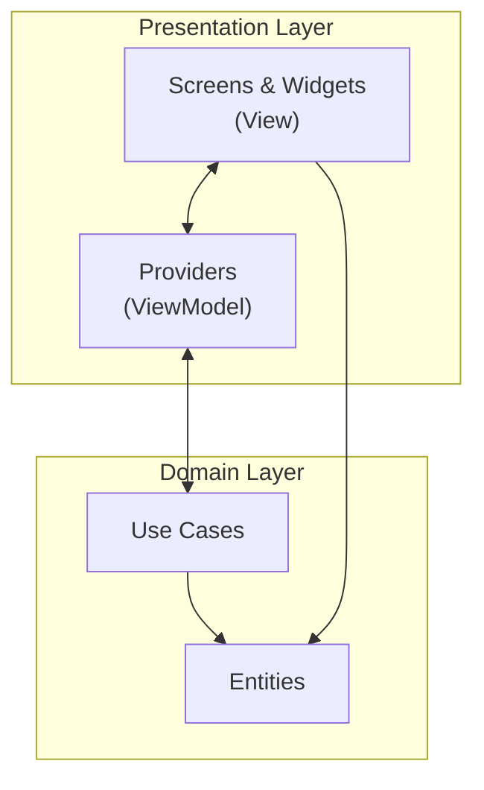
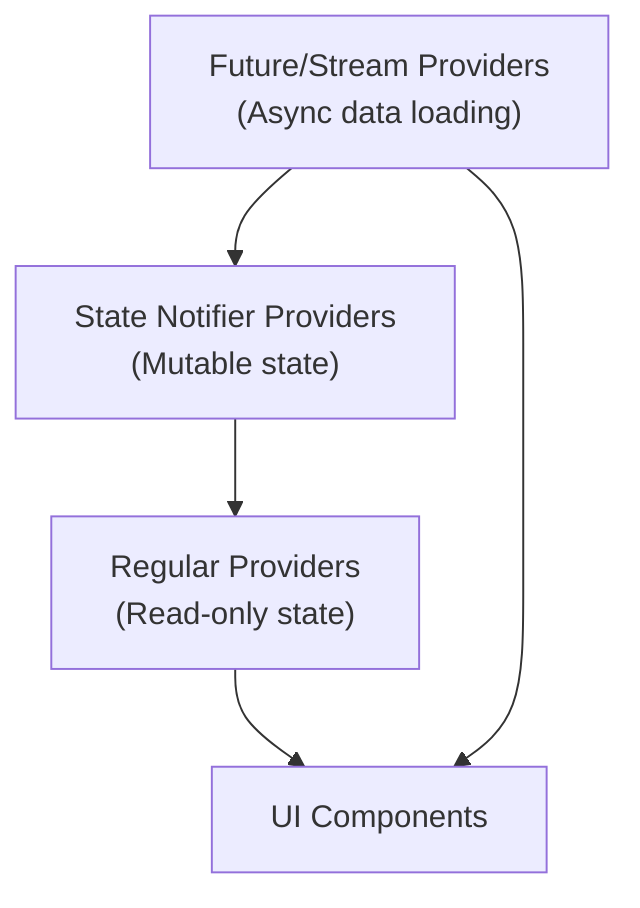

# Presentation Layer

The Presentation layer implements the user interface of the Genius Store application. It follows the MVVM (Model-View-ViewModel) architectural pattern and uses Riverpod for state management.

## Purpose

The Presentation layer:

- Renders UI components and screens
- Handles user interactions
- Manages UI state through ViewModels/Providers
- Communicates with the Domain layer through Use Cases
- Implements visual aspects of the application including layouts, animations, and navigation

## Directory Structure

```text
presentation/
├── common_widgets/    # Reusable UI components
├── screens/           # Application screens organized by feature
│   ├── auth/          # Authentication screens
│   ├── cart/          # Shopping cart screens
│   ├── checkout/      # Checkout screens
│   ├── home/          # Home screen
│   ├── product/       # Product screens
│   └── profile/       # Profile screens
└── providers/         # State management with Riverpod
```

## Architecture Overview

The Presentation layer follows the MVVM pattern with some adaptations for Flutter and Riverpod:



### Components

#### View (Screens & Widgets)

- UI components that display information to the user
- Handle user inputs and forward them to the ViewModels
- Observe state changes from Providers and rebuild accordingly
- Implement UI logic (animations, transitions, etc.)

#### ViewModel (Providers)

- Encapsulate UI state and business logic
- Communicate with the Domain layer through Use Cases
- Process and transform data for the View
- Handle state management with Riverpod
- Mediate between View and Domain layers

## State Management with Riverpod

The application uses Riverpod for state management due to its advantages:

- Dependency injection and service locator pattern
- Efficient rebuilds with fine-grained reactivity
- Testability through provider overrides
- Seamless integration with async operations

### Provider Structure



### Provider Types

- **State Notifier Providers**: For mutable state (e.g., cart items)
- **Future/Stream Providers**: For async operations (e.g., fetching products)
- **Regular Providers**: For simple state or computations (e.g., filtered lists)

## Navigation

The application uses Flutter's named route navigation system:

- Routes are defined in the `AppRouter` class
- Navigation is performed using `Navigator.pushNamed` and related methods
- Route arguments are passed to screens via the `settings.arguments` parameter

## Design System

The presentation layer follows a consistent design system:

- Theme configuration from `core/theme`
- Reusable components in `common_widgets`
- Consistent spacing, typography, and colors

## Best Practices

The implementation follows these best practices:

1. **Separation of Concerns**: UI components don't contain business logic
2. **Single Responsibility**: Each component has a clear, focused purpose
3. **Reusability**: Common widgets are extracted for reuse
4. **Testability**: Logic is separated from UI for easier testing
5. **Consistency**: Similar UI patterns are implemented consistently
6. **Responsiveness**: UI adapts to different screen sizes and orientations
