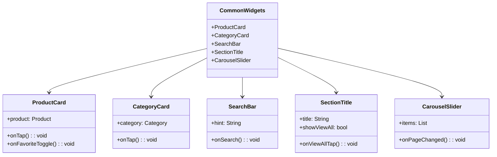

# المكونات المشتركة

[](README.md)

يحتوي هذا الدليل على مكونات واجهة المستخدم القابلة لإعادة الاستخدام والتي يتم مشاركتها عبر الشاشات المختلفة في تطبيق Genius Store. تتبع هذه المكونات لغة تصميم متسقة وتساعد في الحفاظ على اتساق واجهة المستخدم في جميع أنحاء التطبيق.

## الغرض

المكونات المشتركة:

- توفر مكونات واجهة مستخدم قابلة لإعادة الاستخدام للحفاظ على الاتساق
- تقلل من تكرار الكود عبر الشاشات المختلفة
- تنفذ أنماط وسلوكيات واجهة المستخدم المشتركة
- تغلف منطق واجهة المستخدم المعقد في مكونات فردية
- تدعم نظام التصميم الخاص بالتطبيق

## نظرة عامة على المكونات



## المكونات المتاحة

### بطاقة المنتج (ProductCard)

ينفذ ملف `product_card.dart` تخطيطًا متسقًا لبطاقة لعرض المنتجات.

**الميزات:**

- يعرض صورة المنتج، الاسم، السعر، والتقييم
- يظهر الخصم عند الاقتضاء
- يتضمن أزرار "إضافة إلى السلة" و"المفضلة"
- يتعامل مع حالات نفاد المخزون
- يدعم أحجام عرض مختلفة (مدمجة، عادية)

**الاستخدام:**

```dart
ProductCard(
  product: product,
  onTap: () => navigateToProductDetails(product),
  onAddToCart: () => addToCart(product),
  onFavoriteToggle: () => toggleFavorite(product),
)
```

### بطاقة الفئة (CategoryCard)

ينفذ ملف `category_card.dart` بطاقة لعرض فئات المنتجات.

**الميزات:**

- يعرض صورة واسم الفئة
- يدعم أسماء الفئات المترجمة
- يتكيف مع تخطيطات الشبكة المختلفة

**الاستخدام:**

```dart
CategoryCard(
  category: category,
  onTap: () => navigateToCategoryScreen(category),
)
```

### شريط البحث (SearchBar)

يوفر ملف `search_bar.dart` مكون إدخال بحث متسق.

**الميزات:**

- إدخال البحث مع نوع لوحة المفاتيح المناسب
- زر مسح لإعادة تعيين البحث
- زر بحث مع حالة التحميل
- خيار البحث الصوتي

**الاستخدام:**

```dart
SearchBar(
  hint: 'البحث عن منتجات...',
  onSearch: (query) => performSearch(query),
  onFilterTap: () => showFilterOptions(),
)
```

### عنوان القسم (SectionTitle)

يوفر ملف `section_title.dart` مكون عنوان متسق لأقسام المحتوى.

**الميزات:**

- عنوان القسم بنمط متسق
- زر "عرض الكل" اختياري
- تخصيص التباعد والمحاذاة

**الاستخدام:**

```dart
SectionTitle(
  title: 'المنتجات الشائعة',
  showViewAll: true,
  onViewAllTap: () => navigateToAllProducts(ProductFilter.popular),
)
```

### عارض الشرائح (CarouselSlider)

ينفذ ملف `carousel_slider.dart` عارض صور قابل للتخصيص.

**الميزات:**

- تمرير تلقائي مع فاصل زمني قابل للتكوين
- مؤشرات قابلة للتخصيص
- دعم لأنواع محتوى مختلفة
- دعم الإيماءات (السحب للتغيير)

**الاستخدام:**

```dart
CarouselSlider(
  items: promotions.map((promo) => PromoImage(promotion: promo)).toList(),
  autoPlay: true,
  onPageChanged: (index) => updateCurrentPromotion(index),
)
```

## مبادئ التصميم

تتبع هذه المكونات المشتركة مبادئ التصميم الرئيسية:

1. **التكوين بدلاً من الوراثة**: يتم تكوين المكونات من مكونات أصغر بدلاً من توسيعها
2. **التغليف**: تفاصيل التنفيذ مخفية خلف واجهات نظيفة
3. **القابلية للتكوين**: المكونات قابلة للتخصيص من خلال المعلمات
4. **الاتساق**: تحافظ المكونات على الاتساق المرئي مع نظام تصميم التطبيق
5. **إعادة الاستخدام**: المكونات مصممة لاستخدامها في سياقات متعددة

## إرشادات الاستخدام

عند استخدام أو إنشاء مكونات مشتركة:

1. اجعل المكونات تركز على اهتمامات واجهة المستخدم، وليس منطق الأعمال
2. اجعل المكونات قابلة لإعادة الاستخدام عن طريق قبول استدعاءات رد الاتصال بدلاً من تنفيذ المنطق مباشرة
3. اتبع اتفاقيات التسمية ومعايير التوثيق
4. تأكد من أن المكونات تعمل بشكل صحيح في أحجام واتجاهات الشاشة المختلفة
5. ضع في اعتبارك إمكانية الوصول عند تصميم تفاعلات المكونات
6. استخدم ألوان النص وأنماط النص من سمة التطبيق بدلاً من القيم المكودة
