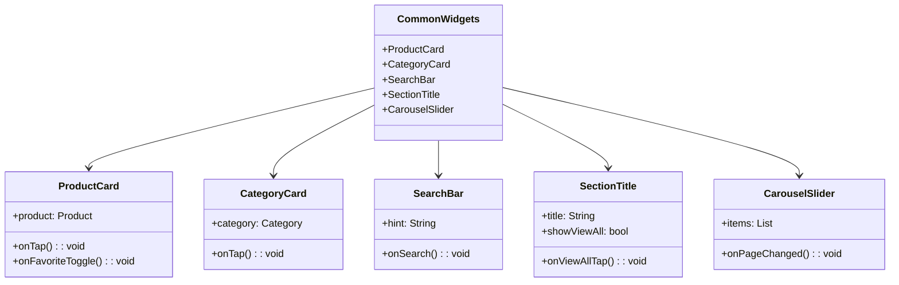

# الأدوات المشتركة (Common Widgets)

[](README.md)

يحتوي هذا الدليل على مكونات واجهة المستخدم القابلة لإعادة الاستخدام والمشتركة بين مختلف شاشات تطبيق متجر Genius. تتبع هذه الأدوات لغة تصميم متسقة وتساعد على الحفاظ على اتساق واجهة المستخدم في جميع أنحاء التطبيق.

## الغرض

الأدوات المشتركة:

- توفر مكونات واجهة مستخدم قابلة لإعادة الاستخدام للحفاظ على الاتساق
- تقلل من تكرار الكود عبر الشاشات
- تنفذ أنماط وسلوكيات واجهة المستخدم المشتركة
- تغلف منطق واجهة المستخدم المعقد في مكونات منفردة
- تدعم نظام تصميم التطبيق

## نظرة عامة على المكونات



## الأدوات المتاحة

### بطاقة المنتج (ProductCard)

ينفذ ملف `product_card.dart` تخطيط بطاقة متسق لعرض المنتجات.

**الميزات:**

- يعرض صورة المنتج واسمه وسعره وتقييمه
- يظهر الخصم عند الاقتضاء
- يتضمن أزرار "إضافة إلى السلة" و"المفضلة"
- يتعامل مع حالات نفاد المخزون
- يدعم أحجام عرض مختلفة (مضغوط، عادي)

**الاستخدام:**

```dart
ProductCard(
  product: product,
  onTap: () => navigateToProductDetails(product),
  onAddToCart: () => addToCart(product),
  onFavoriteToggle: () => toggleFavorite(product),
)
```

### بطاقة الفئة (CategoryCard)

ينفذ ملف `category_card.dart` بطاقة لعرض فئات المنتجات.

**الميزات:**

- يعرض صورة واسم الفئة
- يدعم أسماء الفئات المترجمة
- يتكيف مع تخطيطات الشبكة المختلفة

**الاستخدام:**

```dart
CategoryCard(
  category: category,
  onTap: () => navigateToCategoryScreen(category),
)
```

### شريط البحث (SearchBar)

يوفر ملف `search_bar.dart` مكون إدخال بحث متسق.

**الميزات:**

- إدخال البحث مع نوع لوحة المفاتيح المناسب
- زر مسح لإعادة تعيين البحث
- زر بحث مع حالة التحميل
- خيار البحث الصوتي

**الاستخدام:**

```dart
SearchBar(
  hint: 'البحث عن منتجات...',
  onSearch: (query) => performSearch(query),
  onFilterTap: () => showFilterOptions(),
)
```

### عنوان القسم (SectionTitle)

يوفر ملف `section_title.dart` مكون عنوان متسق لأقسام المحتوى.

**الميزات:**

- عنوان القسم بنمط متسق
- زر "عرض الكل" اختياري
- حشو ومحاذاة قابلة للتخصيص

**الاستخدام:**

```dart
SectionTitle(
  title: 'المنتجات الشائعة',
  showViewAll: true,
  onViewAllTap: () => navigateToAllProducts(ProductFilter.popular),
)
```

### معرض الصور الدوار (CarouselSlider)

ينفذ ملف `carousel_slider.dart` معرض صور دوار قابل للتخصيص.

**الميزات:**

- انزلاق تلقائي مع فاصل زمني قابل للتكوين
- مؤشرات قابلة للتخصيص
- دعم لأنواع محتوى مختلفة
- دعم الإيماءات (السحب للتغيير)

**الاستخدام:**

```dart
CarouselSlider(
  items: promotions.map((promo) => PromoImage(promotion: promo)).toList(),
  autoPlay: true,
  onPageChanged: (index) => updateCurrentPromotion(index),
)
```

## مبادئ التصميم

تتبع هذه الأدوات المشتركة مبادئ تصميم رئيسية:

1. **التكوين بدلاً من الوراثة**: يتم تكوين الأدوات من أدوات أصغر بدلاً من توسيعها
2. **التغليف**: تُخفى تفاصيل التنفيذ خلف واجهات نظيفة
3. **قابلية التكوين**: الأدوات قابلة للتخصيص من خلال المعلمات
4. **الاتساق**: تحافظ الأدوات على الاتساق المرئي مع نظام تصميم التطبيق
5. **إعادة الاستخدام**: تم تصميم الأدوات لاستخدامها في سياقات متعددة

## إرشادات الاستخدام

عند استخدام أو إنشاء أدوات مشتركة:

1. احتفظ بتركيز الأدوات على اهتمامات واجهة المستخدم، وليس منطق الأعمال
2. اجعل الأدوات قابلة لإعادة الاستخدام من خلال قبول استدعاءات رد الاتصال بدلاً من تنفيذ المنطق مباشرة
3. اتبع اتفاقيات التسمية ومعايير التوثيق
4. تأكد من أن الأدوات تعمل بشكل صحيح في أحجام واتجاهات شاشة مختلفة
5. فكر في إمكانية الوصول عند تصميم تفاعلات الأداة
6. استخدم ألوان السمة وأنماط النص من سمة التطبيق بدلاً من القيم المضمنة في الكود
