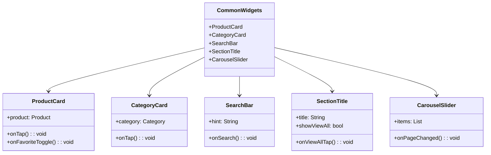

# Common Widgets

This directory contains reusable UI components that are shared across different screens in the Genius Store application. These widgets follow a consistent design language and help maintain UI consistency throughout the app.

## Purpose

The common widgets:

- Provide reusable UI components to maintain consistency
- Reduce code duplication across screens
- Implement shared UI patterns and behaviors
- Encapsulate complex UI logic in single components
- Support the application's design system

## Components Overview



## Available Widgets

### ProductCard

`product_card.dart` implements a consistent card layout for displaying products.

**Features:**

- Displays product image, name, price, and rating
- Shows discount when applicable
- Includes "Add to Cart" and "Favorite" buttons
- Handles out-of-stock states
- Supports different display sizes (compact, regular)

**Usage:**

```dart
ProductCard(
  product: product,
  onTap: () => navigateToProductDetails(product),
  onAddToCart: () => addToCart(product),
  onFavoriteToggle: () => toggleFavorite(product),
)
```

### CategoryCard

`category_card.dart` implements a card for displaying product categories.

**Features:**

- Displays category image and name
- Supports localized category names
- Adapts to different grid layouts

**Usage:**

```dart
CategoryCard(
  category: category,
  onTap: () => navigateToCategoryScreen(category),
)
```

### SearchBar

`search_bar.dart` provides a consistent search input component.

**Features:**

- Search input with appropriate keyboard type
- Clear button to reset search
- Search button with loading state
- Voice search option

**Usage:**

```dart
SearchBar(
  hint: 'Search products...',
  onSearch: (query) => performSearch(query),
  onFilterTap: () => showFilterOptions(),
)
```

### SectionTitle

`section_title.dart` provides a consistent heading component for content sections.

**Features:**

- Section title with consistent styling
- Optional "View All" button
- Customizable padding and alignment

**Usage:**

```dart
SectionTitle(
  title: 'Popular Products',
  showViewAll: true,
  onViewAllTap: () => navigateToAllProducts(ProductFilter.popular),
)
```

### CarouselSlider

`carousel_slider.dart` implements a customizable image carousel.

**Features:**

- Auto-sliding with configurable interval
- Customizable indicators
- Support for different content types
- Gesture support (swipe to change)

**Usage:**

```dart
CarouselSlider(
  items: promotions.map((promo) => PromoImage(promotion: promo)).toList(),
  autoPlay: true,
  onPageChanged: (index) => updateCurrentPromotion(index),
)
```

## Design Principles

These common widgets follow key design principles:

1. **Composition over inheritance**: Widgets are composed of smaller widgets rather than extending them
2. **Encapsulation**: Implementation details are hidden behind clean interfaces
3. **Configurability**: Widgets are customizable through parameters
4. **Consistency**: Widgets maintain visual consistency with the app's design system
5. **Reusability**: Widgets are designed to be used in multiple contexts

## Usage Guidelines

When using or creating common widgets:

1. Keep widgets focused on UI concerns, not business logic
2. Make widgets reusable by accepting callbacks instead of implementing logic directly
3. Follow naming conventions and documentation standards
4. Ensure widgets work correctly in different screen sizes and orientations
5. Consider accessibility when designing widget interactions
6. Use theme colors and text styles from the app's theme rather than hardcoded values
