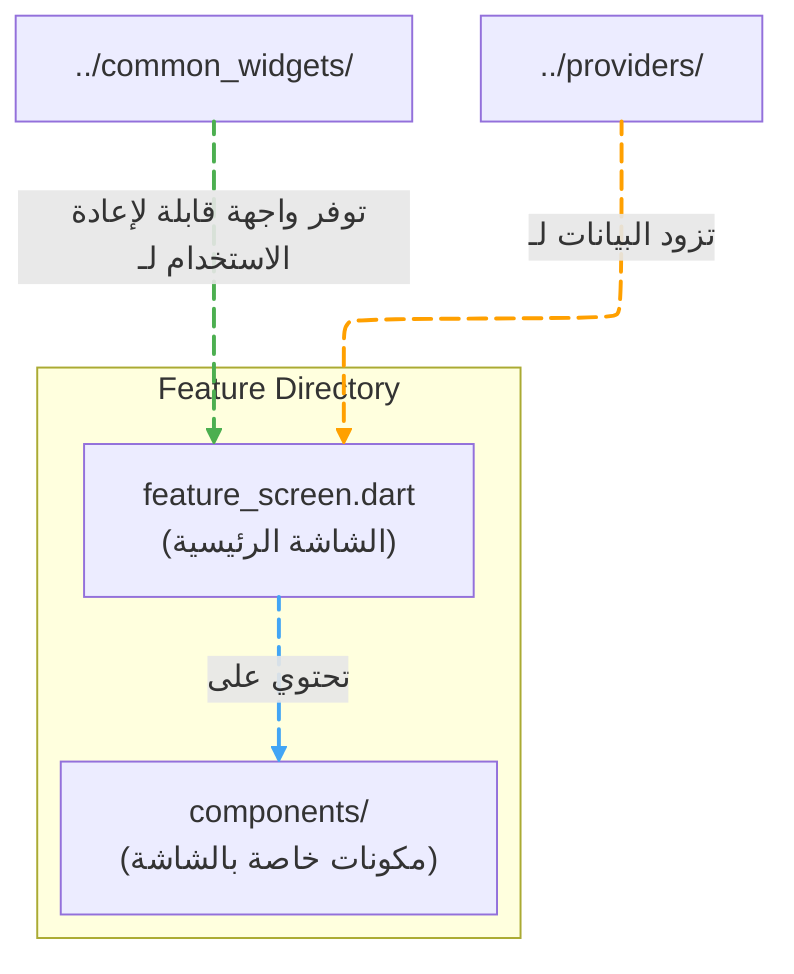
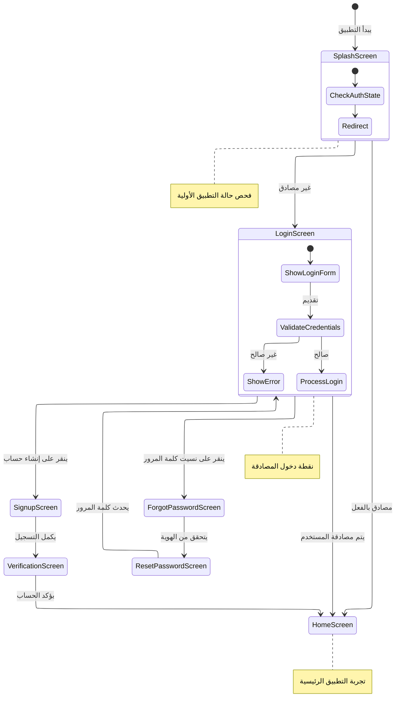
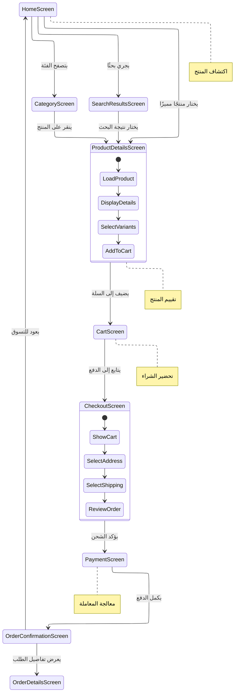
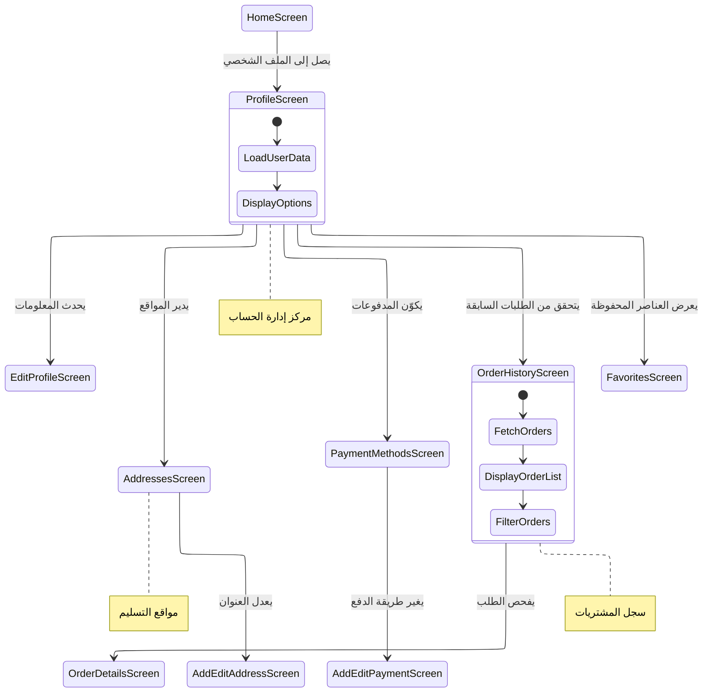

# الشاشات

[](README.md)

يحتوي هذا الدليل على جميع شاشات تطبيق Genius Store، منظمة حسب الميزة. تنفذ كل شاشة عرضًا متميزًا يتفاعل معه المستخدمون.

## الغرض

دليل الشاشات:

- ينظم شاشات واجهة المستخدم حسب الميزة/المجال
- ينفذ التخطيط المرئي لكل عرض تطبيق
- يتعامل مع تفاعلات المستخدم الخاصة بالشاشة
- يربط مكونات واجهة المستخدم بـ providers المناسبة
- يدير حالة ودورة حياة الشاشة

## هيكل الدليل

```text
screens/
├── auth/           # شاشات المصادقة (تسجيل الدخول، التسجيل، إعادة تعيين كلمة المرور)
├── cart/           # شاشات إدارة سلة التسوق
├── checkout/       # شاشات تدفق الدفع
├── home/           # الشاشة الرئيسية والعروض ذات الصلة
├── product/        # شاشات تصفح المنتجات والتفاصيل
└── profile/        # شاشات الملف الشخصي وإدارة الحساب
```

## نمط تنظيم الشاشة

تتبع كل شاشة نمط تنظيم متسق:



### نمط تنفيذ الشاشة

تتبع كل شاشة عادةً هذا الهيكل:

1. **StatelessWidget أو ConsumerWidget** - ودجت الشاشة الرئيسية
2. **مكونات خاصة بالشاشة** - ودجات أصغر تستخدم فقط في هذه الشاشة
3. **استهلاك Provider** - استخدام Riverpod للوصول إلى حالة التطبيق
4. **منطق التنقل** - معالجة التنقل من/إلى هذه الشاشة

## مخططات تدفق الشاشة

### تدفق المصادقة



### تدفق التسوق



### تدفق إدارة الملف الشخصي



## وصف الشاشات الرئيسية

### الشاشة الرئيسية

نقطة الدخول الرئيسية التي تعرض المنتجات المميزة والفئات والعروض الترويجية.

**الميزات:**

- معرض المنتجات
- التنقل بين الفئات
- وظيفة البحث
- لافتات ترويجية
- المنتجات التي تمت مشاهدتها مؤخرًا

### شاشة تفاصيل المنتج

تعرض معلومات مفصلة حول منتج معين.

**الميزات:**

- معرض صور المنتج
- معلومات المنتج (الاسم، السعر، الوصف)
- اختيار اللون والحجم
- وظيفة الإضافة إلى السلة
- المراجعات والتقييمات
- المنتجات ذات الصلة

### شاشة سلة التسوق

تدير سلة تسوق المستخدم.

**الميزات:**

- قائمة بعناصر السلة
- تعديل الكمية
- إزالة العناصر
- تطبيق القسائم
- ملخص السلة مع الإجماليات
- المتابعة إلى الدفع

### شاشة الدفع

تتعامل مع عملية الدفع.

**الميزات:**

- اختيار عنوان الشحن
- اختيار طريقة التسليم
- اختيار طريقة الدفع
- ملخص الطلب
- تطبيق القسيمة
- وضع الطلب

## إرشادات تطوير الشاشة

عند إضافة أو تعديل الشاشات:

1. **التنظيم**: ضع الشاشات في دليل الميزة المناسب
2. **التكوين**: قم بتكوين الشاشات من مكونات أصغر ومركزة
3. **إدارة الحالة**: استخدم providers في Riverpod لإدارة الحالة
4. **التصميم المتجاوب**: تأكد من أن الشاشات تتكيف مع أحجام الأجهزة المختلفة
5. **معالجة الأخطاء**: قم بتنفيذ حالات وإشعارات الخطأ المناسبة
6. **حالات التحميل**: عرض مؤشرات التحميل للعمليات غير المتزامنة
7. **التنقل**: اتبع أنماط التنقل المعتمدة
8. **سهولة الوصول**: نفذ ميزات الوصول المناسبة

## أفضل الممارسات

- الحفاظ على تركيز ودجات الشاشة على التخطيط وتفاعل المستخدم
- استخراج مكونات واجهة المستخدم المعقدة إلى فئات ودجات منفصلة
- استخدام الودجات المشتركة للاتساق
- التعامل مع جميع حالات الشاشة: التحميل، النجاح، الخطأ، الفارغة
- تنفيذ سلوك التمرير المناسب لأحجام الشاشات المختلفة
- استخدام المسارات المسماة للتنقل بين الشاشات
- اتباع نظام تصميم التطبيق
