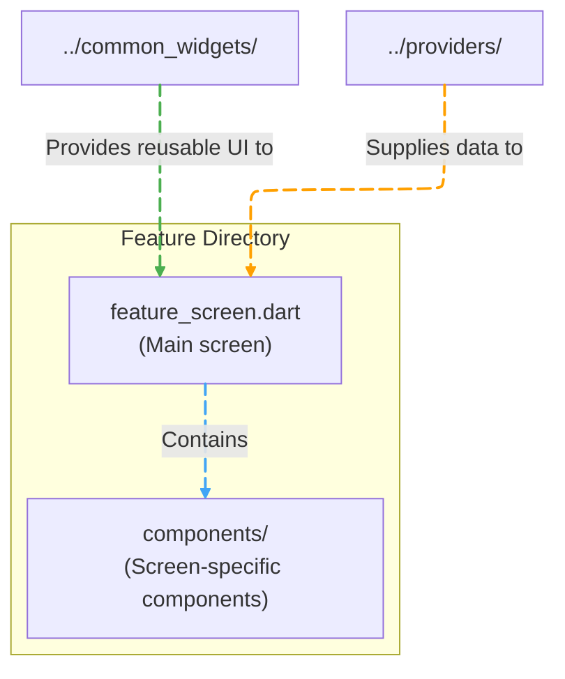
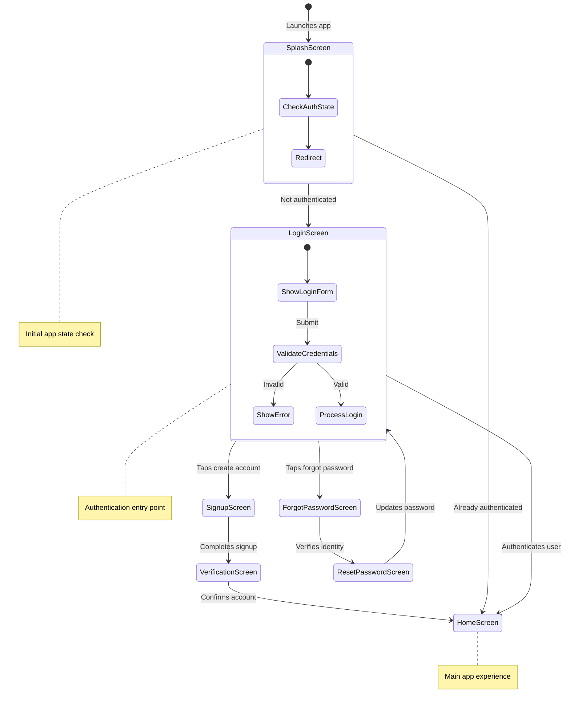
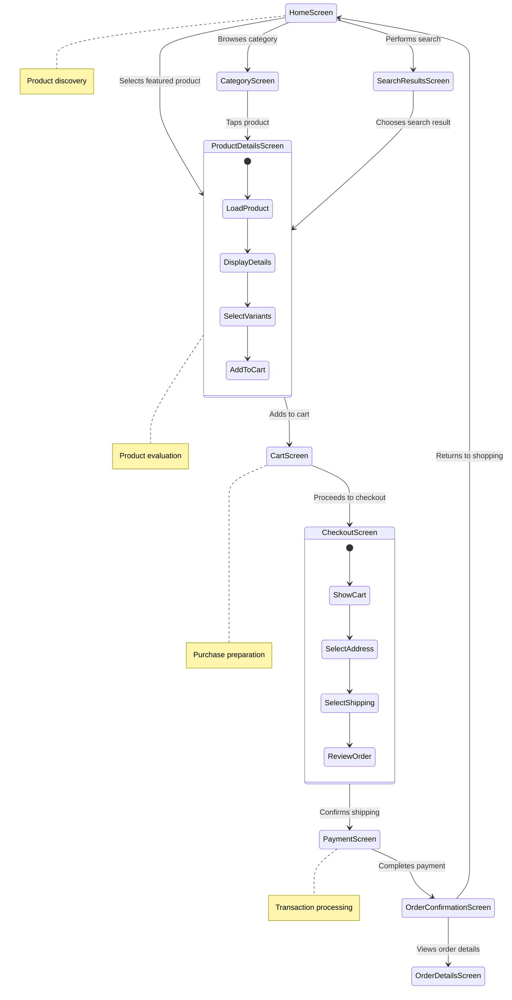
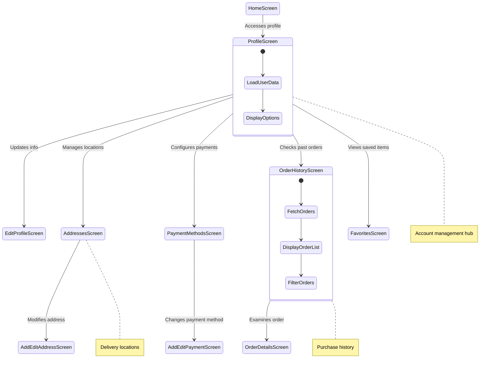

# Screens

[](README-ar.md)

This directory contains all the screens of the Genius Store application, organized by feature. Each screen implements a distinct view that users interact with.

## Purpose

The screens directory:

- Organizes UI screens by feature/domain
- Implements the visual layout of each application view
- Handles screen-specific user interactions
- Connects UI components with the appropriate providers
- Manages screen-level state and lifecycle

## Directory Structure

```text
screens/
├── auth/           # Authentication screens (login, signup, password reset)
├── cart/           # Cart management screens
├── checkout/       # Checkout flow screens
├── home/           # Main home screen and related views
├── product/        # Product browsing and details screens
└── profile/        # User profile and account management screens
```

## Screen Organization Pattern

Each screen follows a consistent organization pattern:



### Screen Implementation Pattern

Each screen typically follows this structure:

1. **StatelessWidget or ConsumerWidget** - The main screen widget
2. **Screen-specific components** - Smaller widgets used only in this screen
3. **Provider consumption** - Using Riverpod to access application state
4. **Navigation logic** - Handling navigation to/from this screen

## Screen Flow Diagrams

### Authentication Flow



### Shopping Flow



### Profile Management Flow



## Key Screen Descriptions

### Home Screen

The main entry point showing featured products, categories, and promotions.

**Features:**

- Product carousels
- Category navigation
- Search functionality
- Promotional banners
- Recently viewed products

### Product Details Screen

Displays detailed information about a specific product.

**Features:**

- Product images gallery
- Product information (name, price, description)
- Color and size selection
- Add to cart functionality
- Reviews and ratings
- Related products

### Cart Screen

Manages the user's shopping cart.

**Features:**

- List of cart items
- Quantity adjustment
- Remove items
- Apply coupons
- Cart summary with totals
- Proceed to checkout

### Checkout Screen

Handles the checkout process.

**Features:**

- Shipping address selection
- Delivery method selection
- Payment method selection
- Order summary
- Coupon application
- Order placement

## Screen Development Guidelines

When adding or modifying screens:

1. **Organization**: Place screens in the appropriate feature directory
2. **Composition**: Compose screens from smaller, focused components
3. **State Management**: Use Riverpod providers for state management
4. **Responsive Design**: Ensure screens adapt to different device sizes
5. **Error Handling**: Implement appropriate error states and messages
6. **Loading States**: Show loading indicators for async operations
7. **Navigation**: Follow the established navigation patterns
8. **Accessibility**: Implement proper accessibility features

## Best Practices

- Keep screen widgets focused on layout and user interaction
- Extract complex UI components into separate widget classes
- Use the common widgets for consistency
- Handle all screen states: loading, success, error, empty
- Implement proper scrolling behavior for various screen sizes
- Use named routes for navigation between screens
- Follow the application's design system
