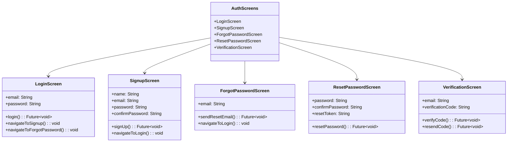
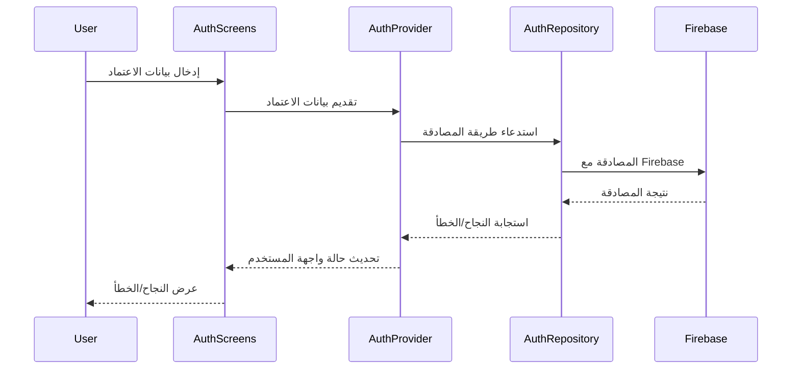

# شاشات المصادقة

[](README.md)

يحتوي هذا الدليل على الشاشات المتعلقة بمصادقة المستخدم في تطبيق Genius Store.

## الغرض

شاشات المصادقة:

- تعالج تسجيل دخول المستخدم، والتسجيل، واستعادة الحساب
- تتحقق من صحة مدخلات المستخدم
- تتواصل مع خدمات المصادقة
- تدير حالات واجهة المستخدم المتعلقة بالمصادقة
- توفر تدفق مصادقة آمن وسهل الاستخدام

## نظرة عامة على الشاشات



## تدفق المصادقة



## الشاشات الرئيسية

### شاشة تسجيل الدخول

ملف `login_screen.dart` يتعامل مع مصادقة المستخدمين باستخدام الحسابات الموجودة.

**الميزات:**

- حقول إدخال البريد الإلكتروني وكلمة المرور مع التحقق من الصحة
- تسجيل الدخول باستخدام البريد الإلكتروني/كلمة المرور
- خيارات تسجيل الدخول عبر وسائل التواصل الاجتماعي (جوجل، فيسبوك، آبل)
- وظيفة "تذكرني"
- التنقل إلى شاشات التسجيل ونسيان كلمة المرور
- التحقق من النموذج ومعالجة الأخطاء

### شاشة التسجيل

ملف `signup_screen.dart` يتعامل مع تسجيل المستخدمين الجدد.

**الميزات:**

- إدخال معلومات المستخدم (الاسم، البريد الإلكتروني، كلمة المرور)
- مؤشر قوة كلمة المرور
- قبول الشروط والأحكام
- بدء عملية التحقق من البريد الإلكتروني
- التحقق من النموذج ومعالجة الأخطاء

### شاشة نسيان كلمة المرور

ملف `forgot_password_screen.dart` يبدأ عملية استعادة كلمة المرور.

**الميزات:**

- إدخال البريد الإلكتروني لإعادة تعيين كلمة المرور
- إرسال بريد إلكتروني للتحقق
- تغذية راجعة للنجاح/الخطأ
- التنقل إلى شاشة تسجيل الدخول

### شاشة إعادة تعيين كلمة المرور

ملف `reset_password_screen.dart` يسمح للمستخدمين بتعيين كلمة مرور جديدة.

**الميزات:**

- إدخال كلمة المرور الجديدة وتأكيدها
- التحقق من صحة قوة كلمة المرور
- التحقق من صحة رمز إعادة التعيين
- تغذية راجعة للنجاح/الخطأ
- إعادة التوجيه إلى شاشة تسجيل الدخول بعد النجاح

### شاشة التحقق

ملف `verification_screen.dart` يتعامل مع التحقق من البريد الإلكتروني للحسابات الجديدة.

**الميزات:**

- إدخال رمز التحقق
- وظيفة إعادة إرسال الرمز مع العد التنازلي
- التحقق التلقائي عند الإمكان
- تغذية راجعة للنجاح/الخطأ
- التنقل إلى الشاشة الرئيسية بعد نجاح التحقق

## تفاصيل التنفيذ

### إدارة الحالة

تستخدم شاشات المصادقة AuthProvider لإدارة الحالة:

```dart
final authProvider = StateNotifierProvider<AuthNotifier, AuthState>((ref) {
  final authRepository = ref.watch(authRepositoryProvider);
  return AuthNotifier(authRepository);
});
```

### التحقق من صحة النموذج

تستخدم جميع نماذج المصادقة التحقق المناسب:

```dart
// مثال التحقق من البريد الإلكتروني
String? validateEmail(String? value) {
  if (value == null || value.isEmpty) {
    return 'البريد الإلكتروني مطلوب';
  }
  if (!RegExp(r'^[\w-\.]+@([\w-]+\.)+[\w-]{2,4}$').hasMatch(value)) {
    return 'يرجى إدخال عنوان بريد إلكتروني صالح';
  }
  return null;
}
```

### معالجة الأخطاء

تتم معالجة أخطاء المصادقة بشكل أنيق:

```dart
// مثال معالجة الخطأ
state.authResult.fold(
  (failure) {
    // عرض رسالة خطأ محددة بناءً على نوع الفشل
    if (failure is AuthenticationFailure) {
      showErrorSnackBar(context, 'بيانات اعتماد غير صالحة');
    } else if (failure is NetworkFailure) {
      showErrorSnackBar(context, 'خطأ في الشبكة. يرجى المحاولة مرة أخرى');
    } else {
      showErrorSnackBar(context, 'حدث خطأ. يرجى المحاولة مرة أخرى');
    }
  },
  (user) {
    // الانتقال إلى الشاشة الرئيسية عند النجاح
    Navigator.pushReplacementNamed(context, AppConstants.homeRoute);
  },
);
```

## اعتبارات الأمان

تنفذ شاشات المصادقة العديد من أفضل ممارسات الأمان:

1. **إدخال آمن**: حقول كلمة المرور تستخدم نصًا مخفيًا
2. **التحقق**: التحقق من جانب العميل للحصول على تغذية راجعة فورية
3. **الحد من المعدل**: تمنع واجهة المستخدم محاولات متكررة سريعة
4. **التخزين الآمن**: لا يتم تخزين بيانات الاعتماد بنص عادي
5. **إدارة الرموز**: يتم تخزين رموز المصادقة بشكل آمن

## التبعيات

تعتمد شاشات المصادقة على:

- `AuthProvider` لإدارة حالة المصادقة
- `AuthRepository` لعمليات المصادقة
- أدوات التحقق من صحة النماذج
- مكونات واجهة المستخدم المشتركة للتنسيق المتسق

## الاختبار

يتم اختبار شاشات المصادقة من خلال:

1. اختبارات الـ Widget للتحقق من سلوك واجهة المستخدم
2. اختبارات التكامل لتدفق المصادقة
3. موفري Mock لاختبار حالات المصادقة المختلفة
