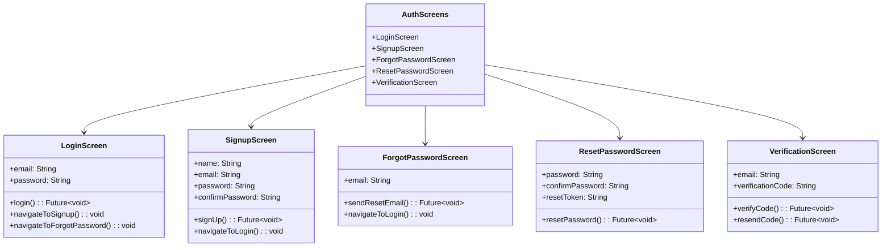

# Authentication Screens

This directory contains screens related to user authentication in the Genius Store application.

## Purpose

The authentication screens:

- Handle user login, registration, and account recovery
- Validate user inputs
- Communicate with authentication services
- Manage authentication-related UI states
- Provide a secure and user-friendly authentication flow

## Screens Overview



## Authentication Flow


## Key Screens

### Login Screen

`login_screen.dart` handles user authentication with existing accounts.

**Features:**

- Email and password input fields with validation
- Login with email/password
- Social media login options (Google, Facebook, Apple)
- Remember me functionality
- Navigation to signup and forgot password screens
- Form validation and error handling

### Signup Screen

`signup_screen.dart` handles new user registration.

**Features:**

- User information input (name, email, password)
- Password strength indicator
- Terms and conditions acceptance
- Email verification process initiation
- Form validation and error handling

### Forgot Password Screen

`forgot_password_screen.dart` initiates the password recovery process.

**Features:**

- Email input for password reset
- Verification email sending
- Success/error feedback
- Navigation back to login

### Reset Password Screen

`reset_password_screen.dart` allows users to set a new password.

**Features:**

- New password and confirmation input
- Password strength validation
- Reset token validation
- Success/error feedback
- Redirection to login after successful reset

### Verification Screen

`verification_screen.dart` handles email verification for new accounts.

**Features:**

- Verification code input
- Resend code functionality with countdown
- Auto-verification when possible
- Success/error feedback
- Navigation to home screen after successful verification

## Implementation Details

### State Management

Authentication screens use the AuthProvider for state management:

```dart
final authProvider = StateNotifierProvider<AuthNotifier, AuthState>((ref) {
  final authRepository = ref.watch(authRepositoryProvider);
  return AuthNotifier(authRepository);
});
```

### Form Validation

All authentication forms use proper validation:

```dart
// Email validation example
String? validateEmail(String? value) {
  if (value == null || value.isEmpty) {
    return 'Email is required';
  }
  if (!RegExp(r'^[\w-\.]+@([\w-]+\.)+[\w-]{2,4}$').hasMatch(value)) {
    return 'Please enter a valid email address';
  }
  return null;
}
```

### Error Handling

Authentication errors are handled gracefully:

```dart
// Error handling example
state.authResult.fold(
  (failure) {
    // Show specific error message based on failure type
    if (failure is AuthenticationFailure) {
      showErrorSnackBar(context, 'Invalid credentials');
    } else if (failure is NetworkFailure) {
      showErrorSnackBar(context, 'Network error. Please try again');
    } else {
      showErrorSnackBar(context, 'An error occurred. Please try again');
    }
  },
  (user) {
    // Navigate to home screen on success
    Navigator.pushReplacementNamed(context, AppConstants.homeRoute);
  },
);
```

## Security Considerations

Authentication screens implement several security best practices:

1. **Secure Input**: Password fields use obscured text
2. **Validation**: Client-side validation for immediate feedback
3. **Rate Limiting**: UI prevents rapid repeated attempts
4. **Secure Storage**: Credentials are not stored in plain text
5. **Token Management**: Authentication tokens are securely stored

## Dependencies

Authentication screens depend on:

- `AuthProvider` for authentication state management
- `AuthRepository` for authentication operations
- Form validation utilities
- Common UI components for consistent styling

## Testing

Authentication screens are tested through:

1. Widget tests verifying UI behavior
2. Integration tests for the authentication flow
3. Mock providers for testing different authentication states
