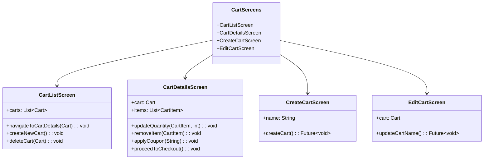
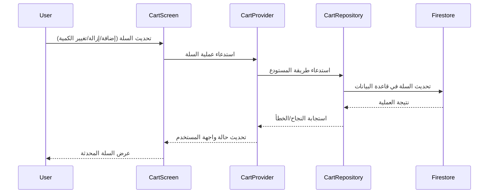

# شاشات سلة التسوق

[](README.md)

يحتوي هذا الدليل على الشاشات المتعلقة بإدارة سلة التسوق في تطبيق Genius Store.

## الغرض

شاشات سلة التسوق:

- تعرض محتويات سلة التسوق للمستخدم
- تسمح للمستخدمين بتعديل عناصر السلة (إضافة، إزالة، تغيير الكمية)
- تدعم سلال تسوق متعددة لأغراض مختلفة
- تحسب المجاميع الفرعية والخصومات والإجماليات
- توفر وظيفة الدفع
- تتعامل مع تطبيق القسائم والتحقق منها

## نظرة عامة على الشاشات



## تدفق إدارة سلة التسوق



## الشاشات الرئيسية

### شاشة قائمة السلال

ملف `cart_list_screen.dart` يعرض جميع سلال التسوق المتاحة للمستخدم.

**الميزات:**

- قائمة سلال التسوق للمستخدم
- وظيفة إنشاء سلة جديدة
- حذف السلة مع التأكيد
- اختيار السلة لعرض التفاصيل
- معالجة حالة السلة الفارغة
- معلومات ملخص السلة (عدد العناصر، الإجمالي)

### شاشة تفاصيل السلة

ملف `cart_details_screen.dart` يعرض محتويات سلة محددة.

**الميزات:**

- قائمة عناصر السلة مع الصور والأسماء والأسعار
- عناصر التحكم في تعديل الكمية
- وظيفة إزالة العنصر
- تفصيل السعر (المجموع الفرعي، الضريبة، الشحن، الخصم)
- إدخال رمز القسيمة والتحقق منه
- زر المتابعة للدفع
- معالجة حالة السلة الفارغة
- وظيفة الحفظ لوقت لاحق
- المنتجات التي تمت مشاهدتها مؤخرًا/المنتجات ذات الصلة

### شاشة إنشاء سلة جديدة

ملف `create_cart_screen.dart` يسمح للمستخدمين بإنشاء سلة تسوق جديدة محددة الاسم.

**الميزات:**

- إدخال اسم السلة
- اختيار الغرض (اختياري)
- زر الإنشاء
- التحقق من صحة النموذج

### شاشة تعديل السلة

ملف `edit_cart_screen.dart` يسمح للمستخدمين بتعديل خصائص سلة موجودة.

**الميزات:**

- تعديل اسم السلة
- خيار تعيين السلة كسلة افتراضية
- وظيفة حفظ التغييرات

## تفاصيل التنفيذ

### إدارة الحالة

تستخدم شاشات السلة CartProvider لإدارة الحالة:

```dart
final cartProvider = StateNotifierProvider<CartNotifier, CartState>((ref) {
  final cartRepository = ref.watch(cartRepositoryProvider);
  return CartNotifier(cartRepository);
});

final currentCartProvider = Provider<Cart?>((ref) {
  final cartState = ref.watch(cartProvider);
  return cartState.selectedCart;
});

final cartItemsProvider = Provider<List<CartItem>>((ref) {
  final cartState = ref.watch(cartProvider);
  return cartState.selectedCart?.items ?? [];
});
```

### واجهة عنصر السلة

يتم عرض عناصر السلة باستخدام واجهة مخصصة:

```dart
class CartItemCard extends StatelessWidget {
  final CartItem item;
  final Function(int) onQuantityChanged;
  final VoidCallback onRemove;
  
  // تنفيذ الواجهة...
  
  // التحكم في الكمية
  Row _buildQuantityControl() {
    return Row(
      children: [
        IconButton(
          icon: Icon(Icons.remove),
          onPressed: item.quantity > 1 
              ? () => onQuantityChanged(item.quantity - 1)
              : null,
        ),
        Text('${item.quantity}'),
        IconButton(
          icon: Icon(Icons.add),
          onPressed: () => onQuantityChanged(item.quantity + 1),
        ),
      ],
    );
  }
}
```

### حسابات السعر

تتم معالجة حسابات إجمالي السلة في كيان السلة وعرضها في واجهة المستخدم:

```dart
// كيان السلة
double get subtotal => items.fold(
    0, (sum, item) => sum + (item.price * item.quantity));
    
double get tax => subtotal * taxRate;

double get shipping => calculateShipping();

double get discount => coupon != null ? calculateDiscount() : 0;

double get total => subtotal + tax + shipping - discount;

// عرض واجهة المستخدم
Text('الإجمالي: ${CurrencyFormatter.format(cart.total)}'),
```

### القسائم

تتم معالجة تطبيق القسيمة من خلال CartProvider:

```dart
Future<void> applyCoupon(String code) async {
  state = state.copyWith(isLoading: true);
  
  final result = await cartRepository.applyCoupon(
    state.selectedCart!.id, 
    code
  );
  
  result.fold(
    (failure) => state = state.copyWith(
      isLoading: false,
      couponError: _mapFailureToMessage(failure),
    ),
    (updatedCart) => state = state.copyWith(
      isLoading: false,
      selectedCart: updatedCart,
      couponError: null,
    ),
  );
}
```

## قواعد العمل

تنفذ وظيفة السلة العديد من قواعد العمل:

1. **حدود الكمية**: للعناصر حدود كمية دنيا (1) وقصوى
2. **التحقق من المخزون**: لا يمكن أن تتجاوز الكمية المخزون المتاح
3. **تحديثات الأسعار**: يتم تحديث أسعار العناصر إذا تغيرت أثناء وجودها في السلة
4. **تسمية السلة**: يجب أن يكون لكل سلة اسم فريد
5. **التحقق من القسيمة**: يتم التحقق من القسائم للتأكد من الأهلية وتاريخ انتهاء الصلاحية
6. **انتهاء صلاحية السلة**: تنتهي صلاحية السلال بعد فترة معينة من عدم النشاط

## التبعيات

تعتمد شاشات السلة على:

- `CartProvider` لإدارة حالة السلة
- `CartRepository` لعمليات السلة
- `ProductRepository` لمعلومات المنتج
- مكونات واجهة المستخدم المشتركة للتنسيق المتسق

## الاختبار

يتم اختبار شاشات السلة من خلال:

1. اختبارات الواجهة لمكونات واجهة المستخدم
2. اختبارات التكامل لعمليات السلة
3. اختبارات منطق العمل لحسابات الأسعار والتحقق
4. موفري Mock لاختبار حالات السلة المختلفة
