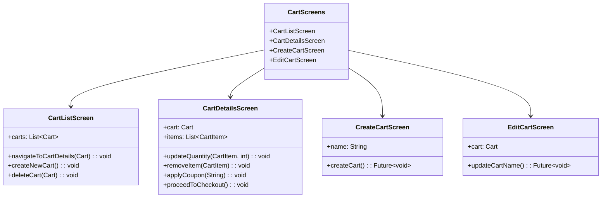
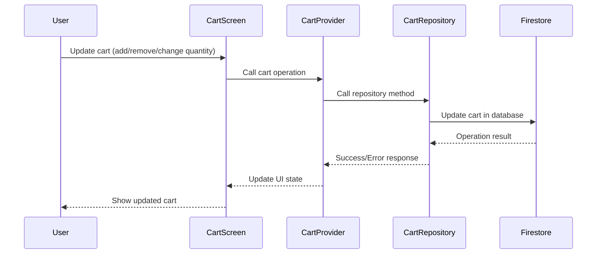

# Cart Screens

This directory contains screens related to shopping cart management in the Genius Store application.

## Purpose

The cart screens:

- Display the user's shopping cart contents
- Allow users to modify cart items (add, remove, change quantity)
- Support multiple carts for different purposes
- Calculate subtotals, discounts, and totals
- Provide checkout functionality
- Handle coupon application and validation

## Screens Overview



## Cart Management Flow



## Key Screens

### Cart List Screen

`cart_list_screen.dart` displays all available shopping carts for the user.

**Features:**

- List of user's shopping carts
- Cart creation functionality
- Cart deletion with confirmation
- Cart selection for viewing details
- Empty state handling
- Cart summary information (items count, total)

### Cart Details Screen

`cart_details_screen.dart` shows the contents of a specific cart.

**Features:**

- List of cart items with images, names, and prices
- Quantity adjustment controls
- Remove item functionality
- Price breakdown (subtotal, tax, shipping, discount)
- Coupon code input and validation
- Proceed to checkout button
- Empty cart state handling
- Save for later functionality
- Recently viewed/related products

### Create Cart Screen

`create_cart_screen.dart` allows users to create a new named shopping cart.

**Features:**

- Cart name input
- Purpose selection (optional)
- Create button
- Form validation

### Edit Cart Screen

`edit_cart_screen.dart` allows users to modify an existing cart's properties.

**Features:**

- Cart name editing
- Option to set as default cart
- Save changes functionality

## Implementation Details

### State Management

Cart screens use CartProvider for state management:

```dart
final cartProvider = StateNotifierProvider<CartNotifier, CartState>((ref) {
  final cartRepository = ref.watch(cartRepositoryProvider);
  return CartNotifier(cartRepository);
});

final currentCartProvider = Provider<Cart?>((ref) {
  final cartState = ref.watch(cartProvider);
  return cartState.selectedCart;
});

final cartItemsProvider = Provider<List<CartItem>>((ref) {
  final cartState = ref.watch(cartProvider);
  return cartState.selectedCart?.items ?? [];
});
```

### Cart Item Widget

Cart items are displayed using a dedicated widget:

```dart
class CartItemCard extends StatelessWidget {
  final CartItem item;
  final Function(int) onQuantityChanged;
  final VoidCallback onRemove;
  
  // Widget implementation...
  
  // Quantity control
  Row _buildQuantityControl() {
    return Row(
      children: [
        IconButton(
          icon: Icon(Icons.remove),
          onPressed: item.quantity > 1 
              ? () => onQuantityChanged(item.quantity - 1)
              : null,
        ),
        Text('${item.quantity}'),
        IconButton(
          icon: Icon(Icons.add),
          onPressed: () => onQuantityChanged(item.quantity + 1),
        ),
      ],
    );
  }
}
```

### Price Calculations

Cart total calculations are handled in the Cart entity and displayed in the UI:

```dart
// Cart entity
double get subtotal => items.fold(
    0, (sum, item) => sum + (item.price * item.quantity));
    
double get tax => subtotal * taxRate;

double get shipping => calculateShipping();

double get discount => coupon != null ? calculateDiscount() : 0;

double get total => subtotal + tax + shipping - discount;

// UI display
Text('Total: ${CurrencyFormatter.format(cart.total)}'),
```

### Coupons

Coupon application is handled through the CartProvider:

```dart
Future<void> applyCoupon(String code) async {
  state = state.copyWith(isLoading: true);
  
  final result = await cartRepository.applyCoupon(
    state.selectedCart!.id, 
    code
  );
  
  result.fold(
    (failure) => state = state.copyWith(
      isLoading: false,
      couponError: _mapFailureToMessage(failure),
    ),
    (updatedCart) => state = state.copyWith(
      isLoading: false,
      selectedCart: updatedCart,
      couponError: null,
    ),
  );
}
```

## Business Rules

Cart functionality implements several business rules:

1. **Quantity Limits**: Items have minimum (1) and maximum quantity limits
2. **Stock Checking**: Quantity cannot exceed available stock
3. **Price Updates**: Item prices are updated if they change while in cart
4. **Cart Naming**: Each cart must have a unique name
5. **Coupon Validation**: Coupons are validated for eligibility and expiration
6. **Cart Expiry**: Carts expire after a certain period of inactivity

## Dependencies

Cart screens depend on:

- `CartProvider` for cart state management
- `CartRepository` for cart operations
- `ProductRepository` for product information
- Common UI components for consistent styling

## Testing

Cart screens are tested through:

1. Widget tests for UI components
2. Integration tests for cart operations
3. Business logic tests for price calculations and validation
4. Mock providers for testing different cart states
