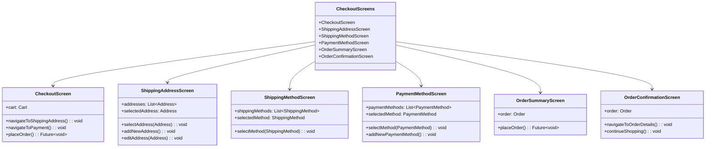
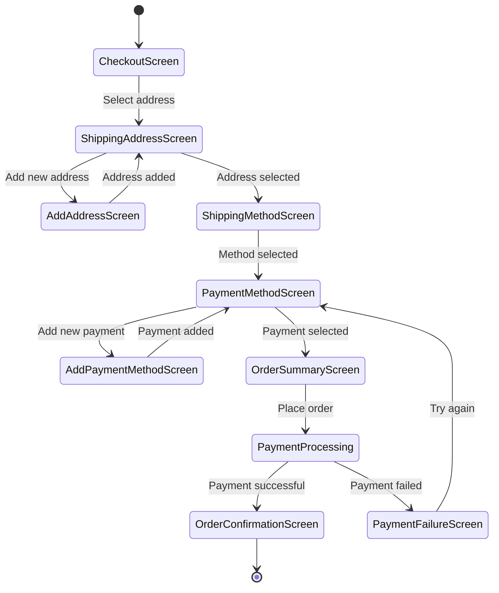

# Checkout Screens

This directory contains screens related to the checkout process in the Genius Store application.

## Purpose

The checkout screens:

- Guide users through the purchase completion process
- Collect shipping address information
- Manage shipping method selection
- Handle payment method selection and processing
- Display order summary and confirmation
- Process order submission

## Screens Overview



## Checkout Flow



## Key Screens

### Checkout Screen

`checkout_screen.dart` is the main entry point for the checkout flow.

**Features:**

- Step indicator showing progress through checkout
- Address selection or entry
- Shipping method selection
- Payment method selection
- Order summary
- Place order button
- Coupon application

### Shipping Address Screen

`shipping_address_screen.dart` manages shipping address selection.

**Features:**

- List of saved addresses
- Address selection
- Add new address button
- Edit existing address
- Delete address
- Set as default option

### Shipping Method Screen

`shipping_method_screen.dart` handles shipping method selection.

**Features:**

- Available shipping methods list
- Shipping method details (price, estimated delivery)
- Method selection
- Price and time display

### Payment Method Screen

`payment_method_screen.dart` manages payment method selection.

**Features:**

- Saved payment methods list
- Payment method selection
- Add new payment method button
- Security features (CVV verification)
- Set as default option

### Order Summary Screen

`order_summary_screen.dart` shows the complete order before submission.

**Features:**

- Order items summary
- Price breakdown (subtotal, shipping, tax, discount)
- Final total
- Order notes input
- Terms and conditions acceptance
- Place order button

### Order Confirmation Screen

`order_confirmation_screen.dart` displays successful order completion.

**Features:**

- Order confirmation message
- Order number and details
- Estimated delivery date
- Track order button
- Continue shopping button
- Email receipt information

## Implementation Details

### State Management

Checkout screens use CheckoutProvider for state management:

```dart
final checkoutProvider = StateNotifierProvider<CheckoutNotifier, CheckoutState>((ref) {
  final cartRepository = ref.watch(cartRepositoryProvider);
  final orderRepository = ref.watch(orderRepositoryProvider);
  final paymentRepository = ref.watch(paymentRepositoryProvider);
  
  return CheckoutNotifier(
    cartRepository: cartRepository,
    orderRepository: orderRepository,
    paymentRepository: paymentRepository,
  );
});
```

### Checkout Process

The order placement process is handled through multiple steps:

```dart
Future<void> placeOrder() async {
  state = state.copyWith(status: CheckoutStatus.processing);
  
  // 1. Validate the order
  if (!_validateOrder()) {
    state = state.copyWith(
      status: CheckoutStatus.error,
      errorMessage: 'Please complete all required information'
    );
    return;
  }
  
  // 2. Process payment
  final paymentResult = await paymentRepository.processPayment(
    state.paymentMethod!,
    state.order!.total
  );
  
  // 3. Handle payment result
  final orderResult = await paymentResult.fold(
    (failure) {
      state = state.copyWith(
        status: CheckoutStatus.paymentFailed,
        errorMessage: _mapFailureToMessage(failure)
      );
      return Left(failure);
    },
    (paymentConfirmation) async {
      // 4. Create order in database
      return orderRepository.createOrder(
        state.cart!,
        state.shippingAddress!,
        state.shippingMethod!,
        paymentConfirmation,
      );
    },
  );
  
  // 5. Handle order creation result
  orderResult.fold(
    (failure) {
      state = state.copyWith(
        status: CheckoutStatus.error,
        errorMessage: _mapFailureToMessage(failure)
      );
    },
    (order) {
      state = state.copyWith(
        status: CheckoutStatus.success,
        order: order,
      );
    },
  );
}
```

### Address Management

Shipping address management includes validation:

```dart
bool validateAddress(Address address) {
  if (address.name.isEmpty) return false;
  if (address.street.isEmpty) return false;
  if (address.city.isEmpty) return false;
  if (address.country.isEmpty) return false;
  if (address.postalCode.isEmpty) return false;
  if (address.phone.isEmpty) return false;
  return true;
}
```

### Payment Processing

Payment processing includes security measures:

```dart
Future<Either<Failure, PaymentConfirmation>> processPayment({
  required PaymentMethod paymentMethod,
  required double amount,
  required String currency,
}) async {
  try {
    // Securely collect payment details
    final paymentIntent = await _createPaymentIntent(amount, currency);
    
    // Process through payment gateway
    final result = await _confirmPayment(paymentIntent, paymentMethod);
    
    // Return confirmation
    return Right(PaymentConfirmation(
      id: result.id,
      amount: amount,
      currency: currency,
      timestamp: DateTime.now(),
    ));
  } catch (e) {
    return Left(_handlePaymentError(e));
  }
}
```

## Business Rules

Checkout functionality implements several business rules:

1. **Address Validation**: All required address fields must be completed
2. **Payment Validation**: Payment details must be valid
3. **Inventory Check**: Product availability is verified before order completion
4. **Price Verification**: Prices are verified against current product prices
5. **Coupon Validation**: Coupons are validated for eligibility before checkout
6. **Order Confirmation**: Orders are confirmed and receipts are sent via email

## Security Considerations

The checkout process implements several security measures:

1. **Secure Input**: Sensitive data is handled securely
2. **PCI Compliance**: Payment processing follows industry standards
3. **Data Validation**: All inputs are validated before processing
4. **Error Handling**: Sensitive error details are not exposed to users
5. **Tokenization**: Payment details are tokenized rather than stored directly

## Dependencies

Checkout screens depend on:

- `CheckoutProvider` for checkout state management
- `CartProvider` for cart information
- `OrderRepository` for order creation
- `PaymentRepository` for payment processing
- `AddressRepository` for address management
- Common UI components for consistent styling

## Testing

Checkout screens are tested through:

1. Widget tests for UI components
2. Integration tests for the checkout flow
3. Business logic tests for validation and calculations
4. Mock providers for testing different checkout states
