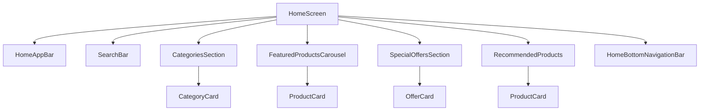

# شاشات الصفحة الرئيسية

[](README.md)

توفر شاشات الصفحة الرئيسية تجربة مستخدم سلسة وبديهية لمتجر جينيوس، حيث تعرض المنتجات والفئات والعروض الخاصة.

## الغرض

الغرض من شاشات الصفحة الرئيسية هو:

- عرض الفئات والمنتجات الشائعة للمستخدمين
- تقديم شريط بحث للعثور على المنتجات بسرعة
- عرض العروض الخاصة والخصومات الحالية
- توفير تصفح سهل للمستخدمين لاكتشاف المنتجات
- عرض المنتجات الموصى بها بناءً على سلوك المستخدم وتفضيلاته
- تمكين الوصول السريع إلى وظائف التطبيق الأساسية

## نظرة عامة على المكونات

توفر شاشات الصفحة الرئيسية للمستخدمين عرضًا منظمًا ومخصصًا لمحتوى المتجر.



## المكونات الرئيسية

### الشاشة الرئيسية (HomeScreen)

يتم تعريف الشاشة الرئيسية في ملف `home_screen.dart` وهي الواجهة الأساسية التي يراها المستخدمون عند فتح التطبيق.

**الميزات:**

- تخطيط متداول يتضمن أقسامًا مختلفة
- تكامل مع خدمات الواجهة الخلفية لجلب البيانات
- عرض تلقائي للمحتوى المخصص بناءً على ملف تعريف المستخدم
- نمط الهيكل المرن للتكيف مع أحجام الشاشات المختلفة
- تحميل المحتوى المكثف والتمرير السلس

**تدفق المستخدم:**

1. يفتح المستخدم التطبيق ويتم توجيهه إلى الشاشة الرئيسية
2. يرى المستخدم أقسامًا من المنتجات والفئات
3. يمكن للمستخدم التمرير لاستعراض المحتوى
4. يمكن للمستخدم النقر على أي منتج أو فئة للتنقل إلى صفحات التفاصيل

**الاستخدام:**

```dart
@override
Widget build(BuildContext context) {
  return Scaffold(
    appBar: HomeAppBar(),
    body: RefreshIndicator(
      onRefresh: _refreshHomeData,
      child: SingleChildScrollView(
        child: Column(
          children: [
            SearchBar(),
            CategoriesSection(categories: categories),
            FeaturedProductsCarousel(products: featuredProducts),
            SpecialOffersSection(offers: specialOffers),
            RecommendedProducts(products: recommendedProducts),
          ],
        ),
      ),
    ),
    bottomNavigationBar: HomeBottomNavigationBar(
      currentIndex: 0,
      onTap: (index) => _navigateToSection(index),
    ),
  );
}
```

### شريط التطبيق الرئيسي (HomeAppBar)

يوفر ملف `home_app_bar.dart` شريط تطبيق مخصص للشاشة الرئيسية.

**الميزات:**

- عرض شعار المتجر
- عداد للإشعارات مع زر للوصول إلى الإشعارات
- زر للوصول إلى سلة التسوق مع عداد للعناصر
- خيارات عرض إضافية للمستخدمين المسجلين
- تصميم متسق مع موضوع التطبيق

**الاستخدام:**

```dart
@override
Widget build(BuildContext context) {
  return AppBar(
    title: Image.asset('assets/images/logo.png', height: 40),
    actions: [
      IconButton(
        icon: Badge(
          badgeContent: Text('$notificationCount'),
          child: Icon(Icons.notifications),
        ),
        onPressed: () => _navigateToNotifications(),
      ),
      IconButton(
        icon: Badge(
          badgeContent: Text('$cartItemCount'),
          child: Icon(Icons.shopping_cart),
        ),
        onPressed: () => _navigateToCart(),
      ),
    ],
  );
}
```

### شريط البحث (SearchBar)

يوفر ملف `search_bar.dart` واجهة بحث قوية للعثور على المنتجات بسرعة.

**الميزات:**

- حقل بحث نصي بتنسيق جذاب
- زر تصفية إضافي لتطبيق مرشحات متقدمة
- اقتراحات في الوقت الفعلي أثناء الكتابة
- تاريخ البحث للعمليات الحديثة
- بحث صوتي (اختياري)

**الاستخدام:**

```dart
SearchBar(
  onSearch: (query) => _searchProducts(query),
  onFilterTap: () => _showFilterOptions(),
  recentSearches: recentSearches,
),
```

### قسم الفئات (CategoriesSection)

يعرض ملف `categories_section.dart` قائمة بفئات المنتجات.

**الميزات:**

- عرض أفقي قابل للتمرير للفئات
- بطاقات فئات جذابة مع أيقونات/صور
- تمييز للفئات الشائعة أو المفضلة
- تخصيص لتفضيلات المستخدم

**الاستخدام:**

```dart
CategoriesSection(
  categories: categories,
  onCategoryTap: (category) => _navigateToCategoryProducts(category),
),
```

### قسم المنتجات المميزة (FeaturedProductsCarousel)

يعرض ملف `featured_products_carousel.dart` شريط تمرير جذاب للمنتجات المميزة.

**الميزات:**

- عرض شريط تمرير صور للمنتجات المميزة
- تبديل تلقائي مع إمكانية التمرير اليدوي
- مؤشرات النقاط لإظهار الموضع الحالي
- عرض معلومات موجزة عن المنتج
- زر للتنقل السريع إلى تفاصيل المنتج

**الاستخدام:**

```dart
FeaturedProductsCarousel(
  products: featuredProducts,
  onProductTap: (product) => _navigateToProductDetails(product),
  autoPlay: true,
  interval: Duration(seconds: 5),
),
```

### قسم العروض الخاصة (SpecialOffersSection)

يوفر ملف `special_offers_section.dart` قسمًا يعرض العروض الخاصة والخصومات الحالية.

**الميزات:**

- عرض جذاب للعروض الخاصة والخصومات
- عرض تنازلي للعروض محدودة الوقت
- إمكانية النقر على كل عرض للوصول إلى التفاصيل
- معلومات موجزة عن كل خصم

**الاستخدام:**

```dart
SpecialOffersSection(
  offers: specialOffers,
  onOfferTap: (offer) => _navigateToOfferDetails(offer),
),
```

### قسم المنتجات الموصى بها (RecommendedProducts)

يعرض ملف `recommended_products.dart` المنتجات المخصصة بناءً على سلوك المستخدم وتفضيلاته.

**الميزات:**

- عرض شبكي للمنتجات الموصى بها
- خوارزمية توصية ذكية
- خيار لتحميل المزيد من المنتجات
- عرض علامات السعر والخصم

**الاستخدام:**

```dart
RecommendedProducts(
  products: recommendedProducts,
  onProductTap: (product) => _navigateToProductDetails(product),
  onLoadMore: () => _loadMoreRecommendedProducts(),
),
```

### شريط التنقل السفلي (HomeBottomNavigationBar)

يوفر ملف `home_bottom_navigation_bar.dart` شريط تنقل سفلي للتنقل بين الأقسام الرئيسية للتطبيق.

**الميزات:**

- أيقونات وتسميات واضحة لكل قسم
- مؤشر مرئي للقسم النشط
- تأثيرات نقر مرتدة
- تكامل مع نمط التنقل العام للتطبيق

**الاستخدام:**

```dart
HomeBottomNavigationBar(
  currentIndex: currentIndex,
  onTap: (index) => _navigateToSection(index),
),
```

## نماذج البيانات

### نموذج الفئة (Category)

```dart
class Category {
  final String id;
  final String name;
  final String imageUrl;
  final int productCount;
  
  Category({
    required this.id,
    required this.name,
    required this.imageUrl,
    required this.productCount,
  });
}
```

### نموذج المنتج (Product)

```dart
class Product {
  final String id;
  final String name;
  final String description;
  final double price;
  final double? discountPrice;
  final String imageUrl;
  final String categoryId;
  final double rating;
  final bool isFeatured;
  
  Product({
    required this.id,
    required this.name,
    required this.description,
    required this.price,
    this.discountPrice,
    required this.imageUrl,
    required this.categoryId,
    required this.rating,
    required this.isFeatured,
  });
  
  bool get isOnSale => discountPrice != null && discountPrice! < price;
  double get discountPercentage => isOnSale 
      ? ((price - discountPrice!) / price) * 100 
      : 0;
}
```

### نموذج العرض الخاص (SpecialOffer)

```dart
class SpecialOffer {
  final String id;
  final String title;
  final String description;
  final String imageUrl;
  final DateTime validUntil;
  final double discountPercentage;
  final String? couponCode;
  
  SpecialOffer({
    required this.id,
    required this.title,
    required this.description,
    required this.imageUrl,
    required this.validUntil,
    required this.discountPercentage,
    this.couponCode,
  });
  
  bool get isValid => validUntil.isAfter(DateTime.now());
}
```

## حالات الاستخدام

1. **استعراض الفئات**: يمكن للمستخدم التمرير عبر فئات المنتجات المتاحة والنقر على فئة للاطلاع على جميع المنتجات ضمن تلك الفئة.

2. **البحث عن المنتجات**: يمكن للمستخدم استخدام شريط البحث للعثور على منتجات محددة باستخدام الكلمات الرئيسية.

3. **استعراض المنتجات المميزة**: يمكن للمستخدم التمرير عبر شريط تمرير المنتجات المميزة لمشاهدة العناصر المميزة.

4. **استكشاف العروض الخاصة**: يمكن للمستخدم عرض العروض الخاصة الحالية والنقر عليها للحصول على مزيد من المعلومات أو استرداد الخصومات.

5. **استعراض المنتجات الموصى بها**: يمكن للمستخدم التمرير لأسفل لعرض المنتجات الموصى بها بناءً على سجل التصفح أو التفضيلات.

6. **الوصول إلى الإشعارات**: يمكن للمستخدم النقر على أيقونة الإشعارات في شريط التطبيق لعرض الإشعارات الأخيرة.

7. **الوصول إلى سلة التسوق**: يمكن للمستخدم النقر على أيقونة سلة التسوق للانتقال إلى سلة التسوق الخاصة به.

8. **التنقل بين الأقسام**: يمكن للمستخدم استخدام شريط التنقل السفلي للتنقل بين الأقسام الرئيسية للتطبيق.

## إرشادات التنفيذ

عند تنفيذ شاشات الصفحة الرئيسية، يجب اتباع هذه الإرشادات:

1. استخدم `ListView.builder` أو `GridView.builder` للقوائم الطويلة لضمان الأداء الأمثل.

2. استخدم التحميل البطيء للصور باستخدام مكتبة مثل `cached_network_image` لتحسين تجربة المستخدم.

3. استخدم `FutureBuilder` أو `StreamBuilder` لتحميل البيانات من مصادر البيانات بشكل غير متزامن.

4. نفذ تحديثًا قابلًا للسحب للسماح للمستخدمين بتحديث المحتوى يدويًا.

5. استخدم حالات التحميل والخطأ المناسبة لكل مكون يحمل بيانات عن بُعد.

6. نفذ تخزينًا مؤقتًا مناسبًا للبيانات لتقليل طلبات الشبكة وتحسين الأداء.

7. تأكد من أن جميع المكونات تدعم وضع الظلام والموضوعات المخصصة.

8. نفذ تصميمًا متجاوبًا يعمل جيدًا على مختلف أحجام الشاشات والاتجاهات.

9. ضع في اعتبارك إمكانية الوصول، مع ضمان دعم قارئات الشاشة وأحجام الخطوط القابلة للتغيير.

10. قم بتنفيذ المكونات الموضحة في الرسم التخطيطي أعلاه كملفات منفصلة لقابلية التوسع والصيانة.
