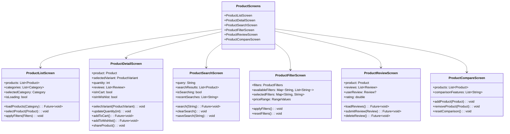
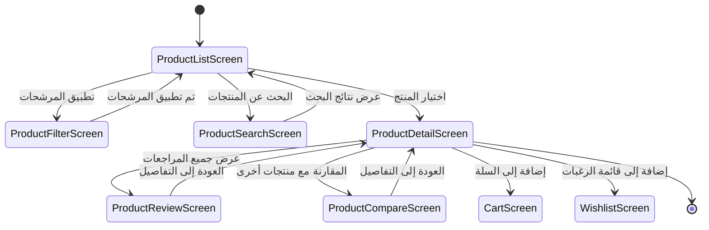

# شاشات المنتجات

[](README.md)

يحتوي هذا الدليل على الشاشات المتعلقة بتصفح المنتجات وعرضها والتفاعل معها في تطبيق Genius Store.

## الغرض

شاشات المنتجات:

- عرض قوائم المنتجات والفئات
- عرض معلومات مفصلة عن المنتج
- تمكين البحث عن المنتجات وتصفيتها
- إدارة مراجعات المنتجات وتقييماتها
- دعم وظيفة مشاركة المنتج
- معالجة ميزات مقارنة المنتجات

## نظرة عامة على الشاشات



## تدفق المستخدم



## الشاشات الرئيسية

### شاشة قائمة المنتجات

ملف `product_list_screen.dart` يعرض شبكة أو قائمة من المنتجات.

**الميزات:**

- شبكة/قائمة المنتجات مع الصور والأسماء والأسعار
- اختيار الفئة والتصفية
- خيارات الفرز (السعر، الشعبية، الأحدث)
- وظيفة الإضافة إلى السلة
- وظيفة الإضافة إلى قائمة الرغبات
- السحب للتحديث للحصول على بيانات محدثة
- التمرير اللانهائي للصفحات
- خيار العرض السريع

### شاشة تفاصيل المنتج

ملف `product_detail_screen.dart` يعرض معلومات شاملة عن منتج واحد.

**الميزات:**

- معرض صور مع إمكانية التكبير
- اسم المنتج والسعر والتوفر
- وصف المنتج والمواصفات
- اختيار المتغيرات (الحجم، اللون، إلخ)
- أداة اختيار الكمية
- زر الإضافة إلى السلة
- زر الإضافة إلى قائمة الرغبات
- زر مشاركة المنتج
- قسم المنتجات ذات الصلة
- ملخص المراجعات ورابط لجميع المراجعات
- زر العودة إلى التسوق

### شاشة البحث عن المنتجات

ملف `product_search_screen.dart` يتعامل مع وظيفة البحث عن المنتجات.

**الميزات:**

- حقل إدخال البحث مع اقتراحات
- سجل عمليات البحث الأخيرة
- عرض نتائج البحث
- إمكانية البحث الصوتي
- تصفية نتائج البحث
- البحث حسب الفئة
- إكمال البحث تلقائيًا
- معالجة عدم العثور على نتائج

### شاشة تصفية المنتجات

ملف `product_filter_screen.dart` يدير خيارات تصفية المنتجات.

**الميزات:**

- شريط تمرير نطاق السعر
- مرشحات الفئات
- مرشحات العلامات التجارية
- مرشحات التقييم
- مرشحات الحجم/المتغيرات
- مرشح العروض الخاصة (التخفيضات، المنتجات الجديدة)
- زر تطبيق المرشحات
- زر إعادة تعيين المرشحات
- مؤشر عدد المرشحات

### شاشة مراجعة المنتج

ملف `product_review_screen.dart` يعرض ويدير مراجعات المنتجات.

**الميزات:**

- عرض التقييم العام
- تفصيل التقييم حسب النجوم
- قائمة المراجعات مع تفاصيل المستخدم
- فرز المراجعات حسب التاريخ، التقييم
- تصفية المراجعات حسب التقييم
- وظيفة إضافة/تعديل المراجعة
- الإبلاغ عن مراجعة غير مناسبة
- التصويت مفيد/غير مفيد

### شاشة مقارنة المنتجات

ملف `product_compare_screen.dart` يتيح المقارنة بين منتجات متعددة.

**الميزات:**

- مقارنة المنتجات جنبًا إلى جنب
- جدول مقارنة الميزات
- إضافة/إزالة منتجات للمقارنة
- إبراز الاختلافات
- إضافة سريعة إلى السلة لأي منتج تمت مقارنته
- مشاركة المقارنة

## تفاصيل التنفيذ

### إدارة الحالة

تستخدم شاشات المنتجات ProductProvider لإدارة الحالة:

```dart
final productProvider = StateNotifierProvider<ProductNotifier, ProductState>((ref) {
  final productRepository = ref.watch(productRepositoryProvider);
  final authRepository = ref.watch(authRepositoryProvider);
  
  return ProductNotifier(
    productRepository: productRepository,
    authRepository: authRepository,
  );
});
```

### قائمة المنتجات

تستخدم قوائم المنتجات الصفحات لتحسين الأداء:

```dart
Future<void> loadProducts({
  String? categoryId,
  Map<String, dynamic>? filters,
  int page = 1,
  int pageSize = 20,
}) async {
  if (page == 1) {
    state = state.copyWith(isLoading: true, hasError: false);
  } else {
    state = state.copyWith(isLoadingMore: true);
  }
  
  final result = await productRepository.getProducts(
    categoryId: categoryId,
    filters: filters,
    page: page,
    pageSize: pageSize,
  );
  
  result.fold(
    (failure) {
      state = state.copyWith(
        isLoading: false,
        isLoadingMore: false,
        hasError: true,
        errorMessage: _mapFailureToMessage(failure),
      );
    },
    (productsPage) {
      final newProducts = page == 1
          ? productsPage.items
          : [...state.products, ...productsPage.items];
          
      state = state.copyWith(
        isLoading: false,
        isLoadingMore: false,
        hasError: false,
        products: newProducts,
        currentPage: page,
        hasMorePages: productsPage.totalPages > page,
      );
    },
  );
}
```

### تفاصيل المنتج

يتم تحميل تفاصيل المنتج مع المعلومات ذات الصلة:

```dart
Future<void> loadProductDetail(String productId) async {
  state = state.copyWith(
    isLoadingDetail: true,
    hasDetailError: false,
  );
  
  // تحميل تفاصيل المنتج
  final productResult = await productRepository.getProductById(productId);
  
  await productResult.fold(
    (failure) {
      state = state.copyWith(
        isLoadingDetail: false,
        hasDetailError: true,
        detailErrorMessage: _mapFailureToMessage(failure),
      );
    },
    (product) async {
      // تحميل المراجعات للمنتج
      final reviewsResult = await productRepository.getProductReviews(productId);
      
      // تحميل المنتجات ذات الصلة
      final relatedResult = await productRepository.getRelatedProducts(productId);
      
      state = state.copyWith(
        isLoadingDetail: false,
        hasDetailError: false,
        selectedProduct: product,
        selectedVariant: product.defaultVariant,
        quantity: 1,
        reviews: reviewsResult.getOrElse(() => []),
        relatedProducts: relatedResult.getOrElse(() => []),
      );
    },
  );
}
```

### البحث عن المنتجات

تنفيذ البحث مع التأخير:

```dart
Future<void> searchProducts(String query) async {
  // إلغاء التأخير السابق إذا وجد
  _debouncer?.cancel();
  
  // تأخير البحث لتجنب مكالمات API المفرطة
  _debouncer = Timer(const Duration(milliseconds: 500), () async {
    if (query.isEmpty) {
      state = state.copyWith(
        searchResults: [],
        isSearching: false,
        searchQuery: '',
      );
      return;
    }
    
    state = state.copyWith(
      isSearching: true,
      searchQuery: query,
    );
    
    final result = await productRepository.searchProducts(query);
    
    result.fold(
      (failure) {
        state = state.copyWith(
          isSearching: false,
          hasSearchError: true,
          searchErrorMessage: _mapFailureToMessage(failure),
        );
      },
      (products) {
        // الحفظ في عمليات البحث الأخيرة إذا لم تكن موجودة بالفعل
        final updatedRecentSearches = [...state.recentSearches];
        if (!updatedRecentSearches.contains(query) && query.isNotEmpty) {
          updatedRecentSearches.insert(0, query);
          if (updatedRecentSearches.length > 10) {
            updatedRecentSearches.removeLast();
          }
        }
        
        state = state.copyWith(
          isSearching: false,
          hasSearchError: false,
          searchResults: products,
          recentSearches: updatedRecentSearches,
        );
      },
    );
  });
}
```

## قواعد العمل

تنفذ وظائف المنتجات عدة قواعد عمل:

1. **إدارة المخزون**: يتم التحقق من توفر المنتج قبل إضافته إلى السلة
2. **قواعد الأسعار**: يتم تطبيق قواعد التسعير الخاصة (التخفيضات، الخصومات)
3. **سياسات المراجعة**: يمكن للمستخدمين فقط مراجعة المنتجات التي اشتروها
4. **حدود قائمة الرغبات**: قد يكون هناك حد أقصى للمنتجات في قائمة الرغبات
5. **شوهدت مؤخرًا**: يتم تتبع المنتجات التي تمت مشاهدتها للتخصيص
6. **حد المقارنة**: يمكن مقارنة 4 منتجات كحد أقصى في وقت واحد

## تحسين الأداء

تنفذ شاشات المنتجات تحسينات الأداء:

1. **تحسين الصور**: تستخدم صور المنتجات التحميل التدريجي والتخزين المؤقت
2. **الصفحات**: يتم تحميل قوائم المنتجات في صفحات لتقليل وقت التحميل الأولي
3. **التحميل الكسول**: يتم تحميل الصور خارج الشاشة فقط عند ظهورها
4. **البحث المؤجل**: يتم تأخير طلبات البحث لتقليل مكالمات API
5. **البيانات المخزنة مؤقتًا**: يتم تخزين بيانات المنتج مؤقتًا لتقليل طلبات الشبكة المتكررة

## التبعيات

تعتمد شاشات المنتجات على:

- `ProductProvider` لإدارة حالة المنتج
- `CartProvider` لعمليات السلة
- `WishlistProvider` لعمليات قائمة الرغبات
- `AuthProvider` لحالة مصادقة المستخدم
- `ProductRepository` لعمليات بيانات المنتج
- مكونات واجهة المستخدم المشتركة للتنسيق المتسق

## الاختبار

يتم اختبار شاشات المنتجات من خلال:

1. اختبارات الـ Widget لمكونات واجهة المستخدم
2. اختبارات التكامل لتدفقات المستخدم
3. اختبارات منطق الأعمال لعمليات المنتج
4. اختبارات الأداء للتمرير وتحميل الصور
5. موفرات Mock لاختبار حالات المنتج المختلفة
