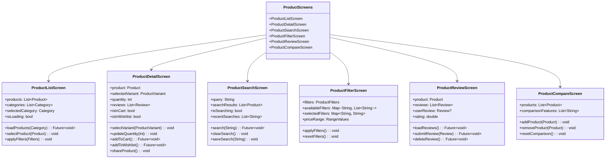
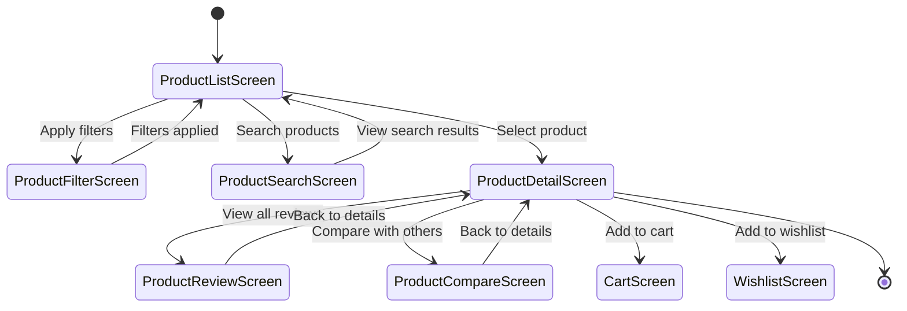

# Product Screens

This directory contains screens related to product browsing, viewing, and interaction in the Genius Store application.

## Purpose

The product screens:

- Display product listings and categories
- Show detailed product information
- Enable product search and filtering
- Manage product reviews and ratings
- Support product sharing functionality
- Handle product comparison features

## Screens Overview



## User Flow



## Key Screens

### Product List Screen

`product_list_screen.dart` displays a grid or list of products.

**Features:**

- Product grid/list with images, names, and prices
- Category selection and filtering
- Sort options (price, popularity, newest)
- Add to cart functionality
- Add to wishlist functionality
- Pull-to-refresh for updated data
- Infinite scroll for pagination
- Quick view option

### Product Detail Screen

`product_detail_screen.dart` shows comprehensive information about a single product.

**Features:**

- Image gallery with zoom capability
- Product name, price, and availability
- Product description and specifications
- Variant selection (size, color, etc.)
- Quantity selector
- Add to cart button
- Add to wishlist button
- Share product button
- Related products section
- Reviews summary and link to all reviews
- Back to shopping button

### Product Search Screen

`product_search_screen.dart` handles product search functionality.

**Features:**

- Search input field with suggestions
- Recent searches history
- Search results display
- Voice search capability
- Filter search results
- Search by category
- Search autocomplete
- No results found handling

### Product Filter Screen

`product_filter_screen.dart` manages product filtering options.

**Features:**

- Price range slider
- Category filters
- Brand filters
- Rating filters
- Size/variant filters
- Special offers filter (sale, new arrivals)
- Apply filters button
- Reset filters button
- Filter count indicator

### Product Review Screen

`product_review_screen.dart` displays and manages product reviews.

**Features:**

- Overall rating display
- Rating breakdown by stars
- Reviews list with user details
- Sort reviews by date, rating
- Filter reviews by rating
- Add/edit review functionality
- Report inappropriate review
- Helpful/not helpful voting

### Product Compare Screen

`product_compare_screen.dart` allows comparison between multiple products.

**Features:**

- Side-by-side product comparison
- Feature comparison table
- Add/remove products to compare
- Highlight differences
- Quick add to cart for any compared product
- Share comparison

## Implementation Details

### State Management

Product screens use ProductProvider for state management:

```dart
final productProvider = StateNotifierProvider<ProductNotifier, ProductState>((ref) {
  final productRepository = ref.watch(productRepositoryProvider);
  final authRepository = ref.watch(authRepositoryProvider);
  
  return ProductNotifier(
    productRepository: productRepository,
    authRepository: authRepository,
  );
});
```

### Product Listing

Product listings use pagination for better performance:

```dart
Future<void> loadProducts({
  String? categoryId,
  Map<String, dynamic>? filters,
  int page = 1,
  int pageSize = 20,
}) async {
  if (page == 1) {
    state = state.copyWith(isLoading: true, hasError: false);
  } else {
    state = state.copyWith(isLoadingMore: true);
  }
  
  final result = await productRepository.getProducts(
    categoryId: categoryId,
    filters: filters,
    page: page,
    pageSize: pageSize,
  );
  
  result.fold(
    (failure) {
      state = state.copyWith(
        isLoading: false,
        isLoadingMore: false,
        hasError: true,
        errorMessage: _mapFailureToMessage(failure),
      );
    },
    (productsPage) {
      final newProducts = page == 1
          ? productsPage.items
          : [...state.products, ...productsPage.items];
          
      state = state.copyWith(
        isLoading: false,
        isLoadingMore: false,
        hasError: false,
        products: newProducts,
        currentPage: page,
        hasMorePages: productsPage.totalPages > page,
      );
    },
  );
}
```

### Product Detail

Product details are loaded with related information:

```dart
Future<void> loadProductDetail(String productId) async {
  state = state.copyWith(
    isLoadingDetail: true,
    hasDetailError: false,
  );
  
  // Load product details
  final productResult = await productRepository.getProductById(productId);
  
  await productResult.fold(
    (failure) {
      state = state.copyWith(
        isLoadingDetail: false,
        hasDetailError: true,
        detailErrorMessage: _mapFailureToMessage(failure),
      );
    },
    (product) async {
      // Load reviews for the product
      final reviewsResult = await productRepository.getProductReviews(productId);
      
      // Load related products
      final relatedResult = await productRepository.getRelatedProducts(productId);
      
      state = state.copyWith(
        isLoadingDetail: false,
        hasDetailError: false,
        selectedProduct: product,
        selectedVariant: product.defaultVariant,
        quantity: 1,
        reviews: reviewsResult.getOrElse(() => []),
        relatedProducts: relatedResult.getOrElse(() => []),
      );
    },
  );
}
```

### Product Search

Search implementation with debouncing:

```dart
Future<void> searchProducts(String query) async {
  // Cancel previous debounce if exists
  _debouncer?.cancel();
  
  // Debounce search to avoid excessive API calls
  _debouncer = Timer(const Duration(milliseconds: 500), () async {
    if (query.isEmpty) {
      state = state.copyWith(
        searchResults: [],
        isSearching: false,
        searchQuery: '',
      );
      return;
    }
    
    state = state.copyWith(
      isSearching: true,
      searchQuery: query,
    );
    
    final result = await productRepository.searchProducts(query);
    
    result.fold(
      (failure) {
        state = state.copyWith(
          isSearching: false,
          hasSearchError: true,
          searchErrorMessage: _mapFailureToMessage(failure),
        );
      },
      (products) {
        // Save to recent searches if not already there
        final updatedRecentSearches = [...state.recentSearches];
        if (!updatedRecentSearches.contains(query) && query.isNotEmpty) {
          updatedRecentSearches.insert(0, query);
          if (updatedRecentSearches.length > 10) {
            updatedRecentSearches.removeLast();
          }
        }
        
        state = state.copyWith(
          isSearching: false,
          hasSearchError: false,
          searchResults: products,
          recentSearches: updatedRecentSearches,
        );
      },
    );
  });
}
```

## Business Rules

Product functionality implements several business rules:

1. **Inventory Management**: Product availability is checked before adding to cart
2. **Price Rules**: Special pricing rules (sales, discounts) are applied
3. **Review Policies**: Users can only review products they've purchased
4. **Wishlist Limits**: Maximum products in wishlist may be limited
5. **Recently Viewed**: Products viewed are tracked for personalization
6. **Compare Limit**: Maximum of 4 products can be compared at once

## Performance Optimization

The product screens implement performance optimizations:

1. **Image Optimization**: Product images use progressive loading and caching
2. **Pagination**: Product lists are loaded in pages to reduce initial load time
3. **Lazy Loading**: Off-screen images are loaded only when visible
4. **Debounced Search**: Search requests are debounced to minimize API calls
5. **Cached Data**: Product data is cached to reduce redundant network requests

## Dependencies

Product screens depend on:

- `ProductProvider` for product state management
- `CartProvider` for cart operations
- `WishlistProvider` for wishlist operations
- `AuthProvider` for user authentication status
- `ProductRepository` for product data operations
- Common UI components for consistent styling

## Testing

Product screens are tested through:

1. Widget tests for UI components
2. Integration tests for user flows
3. Business logic tests for product operations
4. Performance tests for scrolling and image loading
5. Mock providers for testing different product states
