# شاشات الملف الشخصي

[](README.md)

يحتوي هذا الدليل على الشاشات المتعلقة بإدارة الملف الشخصي للمستخدم وإعدادات الحساب في تطبيق Genius Store.

## الغرض

تمكن شاشات الملف الشخصي المستخدمين من:

- عرض وتحرير معلوماتهم الشخصية
- إدارة إعدادات وتفضيلات الحساب
- عرض سجل الطلبات وتتبع الطلبات الحالية
- إدارة طرق الدفع المحفوظة
- التعامل مع العناوين المحفوظة للشحن والفواتير
- تكوين تفضيلات الإشعارات
- الوصول إلى ميزات المساعدة والدعم

## نظرة عامة على الشاشات

```mermaid
classDiagram
    class ProfileScreens {
        +ProfileMainScreen
        +EditProfileScreen
        +OrderHistoryScreen
        +OrderDetailsScreen
        +AddressBookScreen
        +PaymentMethodsScreen
        +NotificationSettingsScreen
        +HelpSupportScreen
    }
    
    class ProfileMainScreen {
        +user: UserModel
        +isLoading: bool
        +loadUserProfile(): Future~void~
        +navigateToEditProfile(): void
        +navigateToOrderHistory(): void
        +navigateToAddressBook(): void
        +navigateToPaymentMethods(): void
        +navigateToSettings(): void
        +navigateToHelpSupport(): void
        +signOut(): Future~void~
    }
    
    class EditProfileScreen {
        +user: UserModel
        +isUpdating: bool
        +formKey: GlobalKey~FormState~
        +updateProfile(UserModel): Future~void~
        +uploadProfilePhoto(): Future~void~
        +validateForm(): bool
    }
    
    class OrderHistoryScreen {
        +orders: List~OrderModel~
        +isLoading: bool
        +filterOptions: OrderFilterOptions
        +loadOrders(): Future~void~
        +filterOrders(OrderFilterOptions): void
        +navigateToOrderDetails(OrderModel): void
        +refreshOrders(): Future~void~
    }
    
    class OrderDetailsScreen {
        +order: OrderModel
        +isLoading: bool
        +loadOrderDetails(String): Future~void~
        +trackOrder(): Future~void~
        +cancelOrder(): Future~void~
        +reportIssue(): void
        +downloadInvoice(): Future~void~
        +reorder(): Future~void~
    }
    
    class AddressBookScreen {
        +addresses: List~AddressModel~
        +isLoading: bool
        +loadAddresses(): Future~void~
        +addNewAddress(): void
        +editAddress(AddressModel): void
        +deleteAddress(String): Future~void~
        +setDefaultAddress(String): Future~void~
    }
    
    class PaymentMethodsScreen {
        +paymentMethods: List~PaymentMethodModel~
        +isLoading: bool
        +loadPaymentMethods(): Future~void~
        +addNewPaymentMethod(): void
        +editPaymentMethod(PaymentMethodModel): void
        +deletePaymentMethod(String): Future~void~
        +setDefaultPaymentMethod(String): Future~void~
    }
    
    class NotificationSettingsScreen {
        +settings: NotificationSettings
        +isLoading: bool
        +loadSettings(): Future~void~
        +updateSettings(NotificationSettings): Future~void~
        +togglePushNotifications(bool): void
        +toggleEmailNotifications(bool): void
        +toggleSMSNotifications(bool): void
    }
    
    class HelpSupportScreen {
        +faqCategories: List~FAQCategory~
        +supportOptions: List~SupportOption~
        +isLoading: bool
        +loadFAQs(): Future~void~
        +searchFAQs(String): Future~void~
        +contactSupport(): void
        +submitFeedback(): void
        +reportProblem(): void
    }
    
    ProfileScreens --> ProfileMainScreen
    ProfileScreens --> EditProfileScreen
    ProfileScreens --> OrderHistoryScreen
    ProfileScreens --> OrderDetailsScreen
    ProfileScreens --> AddressBookScreen
    ProfileScreens --> PaymentMethodsScreen
    ProfileScreens --> NotificationSettingsScreen
    ProfileScreens --> HelpSupportScreen
```



## تدفق المستخدم


## الشاشات الرئيسية

### شاشة الملف الشخصي الرئيسية

ملف `profile_main_screen.dart` يعمل كمركز رئيسي لجميع وظائف الملف الشخصي.

**الميزات:**

- ملخص الملف الشخصي للمستخدم مع الصورة والمعلومات الأساسية
- إحصائيات سريعة (الطلبات، عناصر قائمة الرغبات، المراجعات)
- قائمة التنقل إلى جميع أقسام الملف الشخصي الفرعية
- الوصول إلى إعدادات الحساب
- وظيفة تسجيل الخروج
- معلومات إصدار التطبيق

### شاشة تعديل الملف الشخصي

ملف `edit_profile_screen.dart` يسمح للمستخدمين بتحديث معلوماتهم الشخصية.

**الميزات:**

- تحميل/تغيير صورة الملف الشخصي
- تحرير المعلومات الشخصية (الاسم، البريد الإلكتروني، الهاتف)
- خيار تغيير كلمة المرور
- حالة التحقق من البريد الإلكتروني
- التحقق من صحة النموذج
- إجراءات الحفظ/الإلغاء

### شاشة سجل الطلبات

ملف `order_history_screen.dart` يعرض الطلبات السابقة والحالية للمستخدم.

**الميزات:**

- قائمة الطلبات مع مؤشرات الحالة
- التصفية حسب حالة الطلب (قيد المعالجة، تم الشحن، تم التسليم، إلخ)
- البحث عن الطلبات حسب المعرف أو المنتج
- تصفية نطاق التاريخ
- خيارات فرز الطلبات (التاريخ، المبلغ)
- وظيفة السحب للتحديث
- الصفحات لسجل الطلبات الكبير

### شاشة تفاصيل الطلب

ملف `order_details_screen.dart` يعرض معلومات شاملة عن طلب محدد.

**الميزات:**

- الجدول الزمني لحالة الطلب
- قائمة المنتجات مع الصور والأسعار
- معلومات الشحن
- تفاصيل الدفع
- ملخص الطلب (المجموع الفرعي، الضرائب، الشحن، الإجمالي)
- أزرار الإجراءات (تتبع، إلغاء، إعادة الطلب)
- تنزيل الفاتورة
- وظيفة الإبلاغ عن مشكلة

### شاشة دفتر العناوين

ملف `address_book_screen.dart` يدير العناوين المحفوظة للمستخدم.

**الميزات:**

- قائمة العناوين المحفوظة
- مؤشر العنوان الافتراضي
- زر إضافة عنوان جديد
- خيارات تحرير/حذف العنوان
- خيار التعيين كافتراضي
- تسمية نوع العنوان (المنزل، العمل، إلخ)

### شاشة طرق الدفع

ملف `payment_methods_screen.dart` يتعامل مع معلومات الدفع المحفوظة.

**الميزات:**

- قائمة طرق الدفع المحفوظة
- مؤشر طريقة الدفع الافتراضية
- إضافة طريقة دفع جديدة
- خيارات تحرير/حذف طريقة الدفع
- خيار التعيين كافتراضي
- عرض آمن لمعلومات الدفع
- تحديد نوع البطاقة

### شاشة إعدادات الإشعارات

ملف `notification_settings_screen.dart` يدير تفضيلات اتصال المستخدم.

**الميزات:**

- مفاتيح تبديل إشعارات الدفع
- مفاتيح تبديل إشعارات البريد الإلكتروني
- مفاتيح تبديل إشعارات الرسائل القصيرة
- تفضيلات الإشعارات على أساس الفئة
  - تحديثات الطلب
  - العروض الترويجية والعروض
  - توصيات المنتج
  - تنبيهات انخفاض الأسعار
  - إشعارات إعادة التوفر

### شاشة المساعدة والدعم

ملف `help_support_screen.dart` يوفر موارد مساعدة المستخدم.

**الميزات:**

- فئات الأسئلة الشائعة والبحث
- خيارات الاتصال بالدعم
- الوصول إلى الدردشة المباشرة
- نموذج تقديم التعليقات
- أداة الإبلاغ عن المشكلات
- روابط أدلة المستخدم والوثائق

## تفاصيل التنفيذ

### إدارة حالة المصادقة

تصل شاشات الملف الشخصي إلى المستخدم المصادق عليه عبر AuthProvider:

```dart
final profileProvider = Provider<ProfileService>((ref) {
  final authState = ref.watch(authProvider);
  final userRepository = ref.watch(userRepositoryProvider);
  
  return ProfileService(
    authState: authState,
    userRepository: userRepository,
  );
});
```

### إدارة الملف الشخصي للمستخدم

معالجة بيانات الملف الشخصي مع التحقق من الصحة:

```dart
Future<Either<Failure, UserModel>> updateProfile(UserUpdateDto updateDto) async {
  try {
    // التحقق من صحة بيانات الإدخال
    if (!_validateProfileData(updateDto)) {
      return Left(ValidationFailure(
        message: 'تم توفير بيانات ملف شخصي غير صالحة',
      ));
    }
    
    // محاولة تحديث الملف الشخصي
    final result = await userRepository.updateUserProfile(
      userId: authState.user!.id,
      updateDto: updateDto,
    );
    
    // معالجة النتيجة
    return result.fold(
      (failure) => Left(failure),
      (updatedUser) {
        // تحديث حالة المصادقة المحلية ببيانات المستخدم الجديدة
        _updateAuthState(updatedUser);
        return Right(updatedUser);
      },
    );
  } catch (e) {
    return Left(UnexpectedFailure(
      message: 'حدث خطأ غير متوقع أثناء تحديث الملف الشخصي',
    ));
  }
}
```

### تقسيم سجل الطلبات إلى صفحات

يتم تحميل الطلبات مع تقسيمها إلى صفحات لتحسين الأداء:

```dart
Future<void> loadOrders({
  OrderFilterOptions? filterOptions,
  int page = 1,
  int pageSize = 10,
  bool refresh = false,
}) async {
  if (refresh || page == 1) {
    state = state.copyWith(isLoading: true, hasError: false);
  } else {
    state = state.copyWith(isLoadingMore: true);
  }
  
  final result = await orderRepository.getUserOrders(
    userId: authState.user!.id,
    filterOptions: filterOptions ?? state.filterOptions,
    page: page,
    pageSize: pageSize,
  );
  
  result.fold(
    (failure) {
      state = state.copyWith(
        isLoading: false,
        isLoadingMore: false,
        hasError: true,
        errorMessage: _mapFailureToMessage(failure),
      );
    },
    (ordersPage) {
      final newOrders = page == 1
          ? ordersPage.items
          : [...state.orders, ...ordersPage.items];
          
      state = state.copyWith(
        isLoading: false,
        isLoadingMore: false,
        hasError: false,
        orders: newOrders,
        filterOptions: filterOptions ?? state.filterOptions,
        currentPage: page,
        hasMorePages: ordersPage.totalPages > page,
      );
    },
  );
}
```

### إدارة العناوين

التحقق من صحة العنوان وإدارته:

```dart
Future<Either<Failure, List<AddressModel>>> addAddress(AddressModel address) async {
  try {
    // التحقق من صحة العنوان
    if (!_validateAddress(address)) {
      return Left(ValidationFailure(
        message: 'تم توفير بيانات عنوان غير صالحة',
      ));
    }
    
    final result = await addressRepository.addUserAddress(
      userId: authState.user!.id,
      address: address,
    );
    
    return result;
  } catch (e) {
    return Left(UnexpectedFailure(
      message: 'حدث خطأ غير متوقع أثناء إضافة العنوان',
    ));
  }
}
```

## اعتبارات الأمان

تنفذ شاشات الملف الشخصي العديد من تدابير الأمان:

1. **عرض المعلومات الحساسة**: المعلومات الشخصية مخفية جزئيًا (مثل أرقام بطاقات الائتمان وعناوين البريد الإلكتروني)
2. **إدارة الجلسة**: تسجيل الخروج التلقائي بعد فترة طويلة من عدم النشاط
3. **التحقق الآمن من النموذج**: التحقق من صحة الإدخال لمنع هجمات الحقن
4. **إدارة الأذونات**: التحقق قبل العمليات الحساسة (حذف الحساب، تغيير البريد الإلكتروني)
5. **اتصالات API الآمنة**: يتم نقل جميع بيانات الملف الشخصي عبر قنوات آمنة
6. **معلومات الدفع المرمزة**: يتم ترميز تفاصيل الدفع للأمان

## قواعد العمل

تتبع وظائف الملف الشخصي قواعد العمل التالية:

1. **التحقق من المستخدم**: مطلوب التحقق من البريد الإلكتروني قبل إجراءات معينة
2. **سياسة إلغاء الطلب**: يمكن إلغاء الطلبات فقط خلال إطار زمني محدد
3. **حدود العناوين**: الحد الأقصى لعدد العناوين المحفوظة لكل مستخدم
4. **حدود طرق الدفع**: الحد الأقصى لعدد طرق الدفع المحفوظة لكل مستخدم
5. **اكتمال الملف الشخصي**: تتطلب بعض العمليات معلومات كاملة للملف الشخصي
6. **حذف الحساب**: يجب استيفاء شروط محددة قبل حذف الحساب

## التبعيات

تعتمد شاشات الملف الشخصي على:

- `AuthProvider` لحالة المصادقة
- `UserRepository` لعمليات بيانات المستخدم
- `OrderRepository` لسجل الطلبات
- `AddressRepository` لإدارة العناوين
- `PaymentRepository` لطرق الدفع
- `NotificationRepository` لتفضيلات الإشعارات
- مكونات واجهة المستخدم المشتركة للتنسيق المتسق

## الاختبار

يتم اختبار شاشات الملف الشخصي من خلال:

1. اختبارات الواجهة لمكونات واجهة المستخدم
2. اختبارات التكامل لتدفقات المستخدم
3. اختبارات الأمان لحماية البيانات
4. موفرات مزيفة لاختبار حالات الملف الشخصي المختلفة
5. اختبارات الأداء لتقسيم سجل الطلبات إلى صفحات
