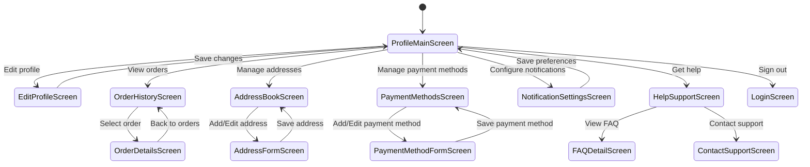

# Profile Screens

This directory contains screens related to user profile management and account settings in the Genius Store application.

## Purpose

The profile screens enable users to:

- View and edit their personal information
- Manage account settings and preferences
- View order history and track current orders
- Manage saved payment methods
- Handle saved addresses for shipping and billing
- Configure notification preferences
- Access help and support features

## Screens Overview

```mermaid
classDiagram
    class ProfileScreens {
        +ProfileMainScreen
        +EditProfileScreen
        +OrderHistoryScreen
        +OrderDetailsScreen
        +AddressBookScreen
        +PaymentMethodsScreen
        +NotificationSettingsScreen
        +HelpSupportScreen
    }
    
    class ProfileMainScreen {
        +user: UserModel
        +isLoading: bool
        +loadUserProfile(): Future~void~
        +navigateToEditProfile(): void
        +navigateToOrderHistory(): void
        +navigateToAddressBook(): void
        +navigateToPaymentMethods(): void
        +navigateToSettings(): void
        +navigateToHelpSupport(): void
        +signOut(): Future~void~
    }
    
    class EditProfileScreen {
        +user: UserModel
        +isUpdating: bool
        +formKey: GlobalKey~FormState~
        +updateProfile(UserModel): Future~void~
        +uploadProfilePhoto(): Future~void~
        +validateForm(): bool
    }
    
    class OrderHistoryScreen {
        +orders: List~OrderModel~
        +isLoading: bool
        +filterOptions: OrderFilterOptions
        +loadOrders(): Future~void~
        +filterOrders(OrderFilterOptions): void
        +navigateToOrderDetails(OrderModel): void
        +refreshOrders(): Future~void~
    }
    
    class OrderDetailsScreen {
        +order: OrderModel
        +isLoading: bool
        +loadOrderDetails(String): Future~void~
        +trackOrder(): Future~void~
        +cancelOrder(): Future~void~
        +reportIssue(): void
        +downloadInvoice(): Future~void~
        +reorder(): Future~void~
    }
    
    class AddressBookScreen {
        +addresses: List~AddressModel~
        +isLoading: bool
        +loadAddresses(): Future~void~
        +addNewAddress(): void
        +editAddress(AddressModel): void
        +deleteAddress(String): Future~void~
        +setDefaultAddress(String): Future~void~
    }
    
    class PaymentMethodsScreen {
        +paymentMethods: List~PaymentMethodModel~
        +isLoading: bool
        +loadPaymentMethods(): Future~void~
        +addNewPaymentMethod(): void
        +editPaymentMethod(PaymentMethodModel): void
        +deletePaymentMethod(String): Future~void~
        +setDefaultPaymentMethod(String): Future~void~
    }
    
    class NotificationSettingsScreen {
        +settings: NotificationSettings
        +isLoading: bool
        +loadSettings(): Future~void~
        +updateSettings(NotificationSettings): Future~void~
        +togglePushNotifications(bool): void
        +toggleEmailNotifications(bool): void
        +toggleSMSNotifications(bool): void
    }
    
    class HelpSupportScreen {
        +faqCategories: List~FAQCategory~
        +supportOptions: List~SupportOption~
        +isLoading: bool
        +loadFAQs(): Future~void~
        +searchFAQs(String): Future~void~
        +contactSupport(): void
        +submitFeedback(): void
        +reportProblem(): void
    }
    
    ProfileScreens --> ProfileMainScreen
    ProfileScreens --> EditProfileScreen
    ProfileScreens --> OrderHistoryScreen
    ProfileScreens --> OrderDetailsScreen
    ProfileScreens --> AddressBookScreen
    ProfileScreens --> PaymentMethodsScreen
    ProfileScreens --> NotificationSettingsScreen
    ProfileScreens --> HelpSupportScreen
```



## User Flow



## Key Screens

### Profile Main Screen

`profile_main_screen.dart` serves as the central hub for all profile-related functionality.

**Features:**

- User profile summary with photo and basic info
- Quick stats (orders, wishlist items, reviews)
- Navigation menu to all profile subsections
- Account settings access
- Sign out functionality
- App version information

### Edit Profile Screen

`edit_profile_screen.dart` allows users to update their personal information.

**Features:**

- Profile photo upload/change
- Personal information editing (name, email, phone)
- Password change option
- Email verification status
- Form validation
- Save/cancel actions

### Order History Screen

`order_history_screen.dart` displays the user's past and current orders.

**Features:**

- Order list with status indicators
- Filter by order status (processing, shipped, delivered, etc.)
- Search orders by ID or product
- Date range filter
- Order sort options (date, amount)
- Pull-to-refresh functionality
- Pagination for large order history

### Order Details Screen

`order_details_screen.dart` shows comprehensive information about a specific order.

**Features:**

- Order status timeline
- Product list with images and prices
- Shipping information
- Payment details
- Order summary (subtotal, taxes, shipping, total)
- Action buttons (track, cancel, reorder)
- Invoice download
- Report issue functionality

### Address Book Screen

`address_book_screen.dart` manages the user's saved addresses.

**Features:**

- List of saved addresses
- Default address indicator
- Add new address button
- Edit/delete address options
- Set as default option
- Address type labeling (home, work, etc.)

### Payment Methods Screen

`payment_methods_screen.dart` handles saved payment information.

**Features:**

- List of saved payment methods
- Default payment method indicator
- Add new payment method
- Edit/delete payment method options
- Set as default option
- Secure display of payment information
- Card type identification

### Notification Settings Screen

`notification_settings_screen.dart` manages user communication preferences.

**Features:**

- Push notification toggles
- Email notification toggles
- SMS notification toggles
- Category-based notification preferences
  - Order updates
  - Promotions and offers
  - Product recommendations
  - Price drop alerts
  - Back-in-stock notifications

### Help & Support Screen

`help_support_screen.dart` provides user assistance resources.

**Features:**

- FAQ categories and search
- Contact support options
- Live chat access
- Feedback submission form
- Problem reporting tool
- User guides and documentation links

## Implementation Details

### Authentication State Management

Profile screens access the authenticated user via AuthProvider:

```dart
final profileProvider = Provider<ProfileService>((ref) {
  final authState = ref.watch(authProvider);
  final userRepository = ref.watch(userRepositoryProvider);
  
  return ProfileService(
    authState: authState,
    userRepository: userRepository,
  );
});
```

### User Profile Management

Profile data handling with validation:

```dart
Future<Either<Failure, UserModel>> updateProfile(UserUpdateDto updateDto) async {
  try {
    // Validate input data
    if (!_validateProfileData(updateDto)) {
      return Left(ValidationFailure(
        message: 'Invalid profile data provided',
      ));
    }
    
    // Attempt to update profile
    final result = await userRepository.updateUserProfile(
      userId: authState.user!.id,
      updateDto: updateDto,
    );
    
    // Handle result
    return result.fold(
      (failure) => Left(failure),
      (updatedUser) {
        // Update local auth state with new user data
        _updateAuthState(updatedUser);
        return Right(updatedUser);
      },
    );
  } catch (e) {
    return Left(UnexpectedFailure(
      message: 'An unexpected error occurred while updating profile',
    ));
  }
}
```

### Order History Pagination

Orders are loaded with pagination for better performance:

```dart
Future<void> loadOrders({
  OrderFilterOptions? filterOptions,
  int page = 1,
  int pageSize = 10,
  bool refresh = false,
}) async {
  if (refresh || page == 1) {
    state = state.copyWith(isLoading: true, hasError: false);
  } else {
    state = state.copyWith(isLoadingMore: true);
  }
  
  final result = await orderRepository.getUserOrders(
    userId: authState.user!.id,
    filterOptions: filterOptions ?? state.filterOptions,
    page: page,
    pageSize: pageSize,
  );
  
  result.fold(
    (failure) {
      state = state.copyWith(
        isLoading: false,
        isLoadingMore: false,
        hasError: true,
        errorMessage: _mapFailureToMessage(failure),
      );
    },
    (ordersPage) {
      final newOrders = page == 1
          ? ordersPage.items
          : [...state.orders, ...ordersPage.items];
          
      state = state.copyWith(
        isLoading: false,
        isLoadingMore: false,
        hasError: false,
        orders: newOrders,
        filterOptions: filterOptions ?? state.filterOptions,
        currentPage: page,
        hasMorePages: ordersPage.totalPages > page,
      );
    },
  );
}
```

### Address Management

Address validation and management:

```dart
Future<Either<Failure, List<AddressModel>>> addAddress(AddressModel address) async {
  try {
    // Validate address
    if (!_validateAddress(address)) {
      return Left(ValidationFailure(
        message: 'Invalid address data provided',
      ));
    }
    
    final result = await addressRepository.addUserAddress(
      userId: authState.user!.id,
      address: address,
    );
    
    return result;
  } catch (e) {
    return Left(UnexpectedFailure(
      message: 'An unexpected error occurred while adding address',
    ));
  }
}
```

## Security Considerations

The profile screens implement several security measures:

1. **Sensitive Information Display**: Personal information is partially masked (e.g., credit card numbers, email addresses)
2. **Session Management**: Automatic sign-out after prolonged inactivity
3. **Secure Form Validation**: Input validation to prevent injection attacks
4. **Permission Management**: Verification before critical operations (delete account, change email)
5. **Secure API Communications**: All profile data is transmitted over secure channels
6. **Tokenized Payment Information**: Payment details are tokenized for security

## Business Rules

Profile functionality follows these business rules:

1. **User Verification**: Email verification required before certain actions
2. **Order Cancellation Policy**: Orders can only be cancelled within a specific timeframe
3. **Address Limits**: Maximum number of saved addresses per user
4. **Payment Method Limits**: Maximum number of saved payment methods per user
5. **Profile Completeness**: Certain operations require complete profile information
6. **Account Deletion**: Specific conditions must be met before account deletion

## Dependencies

Profile screens depend on:

- `AuthProvider` for authentication state
- `UserRepository` for user data operations
- `OrderRepository` for order history
- `AddressRepository` for address management
- `PaymentRepository` for payment methods
- `NotificationRepository` for notification preferences
- Common UI components for consistent styling

## Testing

Profile screens are tested through:

1. Widget tests for UI components
2. Integration tests for user flows
3. Security tests for data protection
4. Mocked providers for testing different profile states
5. Performance tests for order history pagination
