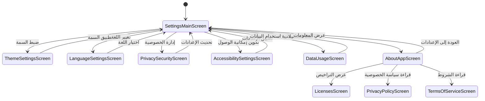

# شاشات الإعدادات

[](README.md)

يحتوي هذا الدليل على الشاشات المتعلقة بإعدادات وتكوين التطبيق في تطبيق متجر Genius.

## الغرض

تمكّن شاشات الإعدادات المستخدمين من:

- تكوين تفضيلات التطبيق
- إدارة إعدادات اللغة والترجمة
- التحكم في إعدادات السمة والمظهر
- ضبط تفضيلات الخصوصية والأمان
- تكوين خيارات إمكانية الوصول
- إدارة إعدادات استخدام البيانات والتخزين
- عرض معلومات التطبيق

## نظرة عامة على الشاشات

```mermaid
classDiagram
    class SettingsScreens {
        +SettingsMainScreen
        +ThemeSettingsScreen
        +LanguageSettingsScreen
        +PrivacySecurityScreen
        +AccessibilitySettingsScreen
        +DataUsageScreen
        +AboutAppScreen
    }
    
    class SettingsMainScreen {
        +settings: AppSettings
        +isLoading: bool
        +loadSettings(): Future~void~
        +navigateToThemeSettings(): void
        +navigateToLanguageSettings(): void
        +navigateToPrivacySecurity(): void
        +navigateToAccessibilitySettings(): void
        +navigateToDataUsage(): void
        +navigateToAboutApp(): void
    }
    
    class ThemeSettingsScreen {
        +currentTheme: ThemeMode
        +isDarkMode: bool
        +accentColor: Color
        +isSystemDefault: bool
        +updateTheme(ThemeMode): Future~void~
        +toggleDarkMode(bool): Future~void~
        +updateAccentColor(Color): Future~void~
        +resetToSystemDefault(): Future~void~
    }
    
    class LanguageSettingsScreen {
        +currentLocale: Locale
        +availableLocales: List~Locale~
        +isLoading: bool
        +updateLanguage(Locale): Future~void~
        +detectSystemLanguage(): Locale
        +resetToSystemLanguage(): Future~void~
    }
    
    class PrivacySecurityScreen {
        +privacySettings: PrivacySettings
        +isLoading: bool
        +isBiometricEnabled: bool
        +isLocationTrackingEnabled: bool
        +isAnalyticsEnabled: bool
        +loadPrivacySettings(): Future~void~
        +toggleBiometric(bool): Future~void~
        +toggleLocationTracking(bool): Future~void~
        +toggleAnalytics(bool): Future~void~
        +clearBrowsingData(): Future~void~
        +deleteSearchHistory(): Future~void~
    }
    
    class AccessibilitySettingsScreen {
        +accessibilitySettings: AccessibilitySettings
        +isLoading: bool
        +textScaleFactor: double
        +isHighContrastEnabled: bool
        +isReducedMotionEnabled: bool
        +loadAccessibilitySettings(): Future~void~
        +updateTextScale(double): Future~void~
        +toggleHighContrast(bool): Future~void~
        +toggleReducedMotion(bool): Future~void~
    }
    
    class DataUsageScreen {
        +dataSavingMode: bool
        +cacheSize: int
        +imageQualitySetting: ImageQuality
        +isWifiOnlyDownloads: bool
        +loadDataSettings(): Future~void~
        +toggleDataSavingMode(bool): Future~void~
        +clearCache(): Future~void~
        +updateImageQuality(ImageQuality): Future~void~
        +toggleWifiOnlyDownloads(bool): Future~void~
        +calculateCacheSize(): Future~int~
    }
    
    class AboutAppScreen {
        +appVersion: String
        +buildNumber: String
        +legalInfo: LegalInfo
        +isLoading: bool
        +loadAppInfo(): Future~void~
        +checkForUpdates(): Future~UpdateInfo~
        +viewLicenses(): void
        +viewPrivacyPolicy(): void
        +viewTermsOfService(): void
    }
    
    SettingsScreens --> SettingsMainScreen
    SettingsScreens --> ThemeSettingsScreen
    SettingsScreens --> LanguageSettingsScreen
    SettingsScreens --> PrivacySecurityScreen
    SettingsScreens --> AccessibilitySettingsScreen
    SettingsScreens --> DataUsageScreen
    SettingsScreens --> AboutAppScreen
```



## تدفق المستخدم



## الشاشات الرئيسية

### شاشة الإعدادات الرئيسية

يعمل ملف `settings_main_screen.dart` كنقطة دخول لجميع فئات الإعدادات.

**الميزات:**

- قائمة منظمة لفئات الإعدادات
- ملخص تفضيلات المستخدم
- مفاتيح تبديل سريعة للإعدادات الشائعة
- تسليط الضوء على الإعدادات التي تم تغييرها مؤخرًا
- مؤشرات مرئية لحالة الإعدادات الحالية

### شاشة إعدادات السمة

يسمح ملف `theme_settings_screen.dart` للمستخدمين بتخصيص مظهر التطبيق.

**الميزات:**

- تبديل السمة الفاتحة/الداكنة
- خيار اتباع سمة النظام
- اختيار مخطط الألوان
- تعديلات حجم الخط
- منتقي لون التمييز المخصص
- لوحة معاينة لتغييرات السمة

### شاشة إعدادات اللغة

يدير ملف `language_settings_screen.dart` إعدادات ترجمة التطبيق.

**الميزات:**

- اختيار اللغة من الخيارات المتاحة
- اكتشاف لغة النظام
- خيارات تنسيق خاصة بالمنطقة
- وظيفة البحث عن اللغات
- معاينة تغييرات اللغة
- تنزيل اللغة للاستخدام دون اتصال

### شاشة الخصوصية والأمان

يتحكم ملف `privacy_security_screen.dart` في تفضيلات خصوصية المستخدم.

**الميزات:**

- تبديل المصادقة البيومترية
- أذونات تتبع الموقع
- خيارات التحليلات وجمع البيانات
- إدارة بيانات التصفح
- عناصر التحكم في سجل البحث
- الوصول إلى سياسة الخصوصية
- خيارات تصدير البيانات

### شاشة إعدادات إمكانية الوصول

يوفر ملف `accessibility_settings_screen.dart` ميزات للمستخدمين ذوي القدرات المختلفة.

**الميزات:**

- ضبط حجم النص
- وضع التباين العالي
- خيارات توافق قارئ الشاشة
- إعدادات الحركة المخفضة
- تفضيلات التسميات التوضيحية والترجمة
- أوضاع تصحيح الألوان
- تحسينات التنقل باستخدام لوحة المفاتيح

### شاشة استخدام البيانات

يساعد ملف `data_usage_screen.dart` المستخدمين على إدارة استهلاك البيانات.

**الميزات:**

- تبديل وضع توفير البيانات
- إعدادات جودة الصورة
- إدارة ذاكرة التخزين المؤقت وعرض الحجم
- خيار التنزيل عبر Wi-Fi فقط
- عناصر التحكم في استخدام البيانات في الخلفية
- إحصائيات استخدام عرض النطاق الترددي
- إدارة مساحة التخزين

### شاشة حول التطبيق

يعرض ملف `about_app_screen.dart` معلومات التطبيق.

**الميزات:**

- إصدار التطبيق ورقم البناء
- التحقق من التحديثات
- معلومات المطور
- تراخيص المصادر المفتوحة
- الوصول إلى المعلومات القانونية
- شروط الخدمة
- سياسة الخصوصية
- خيار إرسال التعليقات

## تفاصيل التنفيذ

### إدارة حالة الإعدادات

يستخدم التطبيق مزود إعدادات مركزي لإدارة الحالة:

```dart
final settingsProvider = StateNotifierProvider<SettingsNotifier, AppSettings>((ref) {
  final storageService = ref.watch(storageServiceProvider);
  return SettingsNotifier(storageService);
});

class SettingsNotifier extends StateNotifier<AppSettings> {
  final StorageService _storageService;
  
  SettingsNotifier(this._storageService) : super(AppSettings.defaults()) {
    _loadSettings();
  }
  
  Future<void> _loadSettings() async {
    final settings = await _storageService.getSettings();
    if (settings != null) {
      state = settings;
    }
  }
  
  Future<void> updateTheme(ThemeMode themeMode) async {
    final newSettings = state.copyWith(themeMode: themeMode);
    await _storageService.saveSettings(newSettings);
    state = newSettings;
  }
  
  Future<void> updateLocale(Locale locale) async {
    final newSettings = state.copyWith(locale: locale);
    await _storageService.saveSettings(newSettings);
    state = newSettings;
  }
  
  // طرق تحديث الإعدادات الأخرى...
}
```

### تنفيذ السمة

يتم تطبيق تغييرات السمة من خلال خدمة سمة مخصصة:

```dart
class ThemeService {
  final AppSettings settings;
  
  ThemeService(this.settings);
  
  ThemeData getTheme() {
    final baseTheme = settings.themeMode == ThemeMode.dark
        ? _getDarkTheme()
        : _getLightTheme();
        
    return baseTheme.copyWith(
      colorScheme: baseTheme.colorScheme.copyWith(
        primary: settings.accentColor,
      ),
      textTheme: _getAdjustedTextTheme(baseTheme.textTheme),
    );
  }
  
  TextTheme _getAdjustedTextTheme(TextTheme base) {
    final textScaleFactor = settings.textScaleFactor;
    
    return base.copyWith(
      headline1: base.headline1?.copyWith(
        fontSize: (base.headline1?.fontSize ?? 24) * textScaleFactor,
      ),
      // ضبط أنماط النص الأخرى...
    );
  }
  
  ThemeData _getLightTheme() {
    // تنفيذ السمة الفاتحة
  }
  
  ThemeData _getDarkTheme() {
    // تنفيذ السمة الداكنة
  }
}
```

### إدارة الترجمة المحلية

تستخدم إعدادات اللغة نظام الترجمة المحلية في Flutter:

```dart
class LocalizationService {
  final List<Locale> supportedLocales = [
    const Locale('en', 'US'),
    const Locale('es', 'ES'),
    const Locale('fr', 'FR'),
    const Locale('de', 'DE'),
    const Locale('ja', 'JP'),
    // لغات محلية مدعومة أخرى
  ];
  
  Locale? getDeviceLocale() {
    final deviceLocale = WidgetsBinding.instance.window.locale;
    
    // التحقق مما إذا كانت اللغة المحلية للجهاز مدعومة
    for (final locale in supportedLocales) {
      if (locale.languageCode == deviceLocale.languageCode) {
        return locale;
      }
    }
    
    // إرجاع الافتراضية إذا لم تكن مدعومة
    return supportedLocales.first;
  }
  
  String getLanguageName(Locale locale) {
    // ربط اللغة المحلية بالاسم المقروء للإنسان
    final Map<String, String> languageNames = {
      'en': 'English',
      'es': 'Español',
      'fr': 'Français',
      'de': 'Deutsch',
      'ja': '日本語',
      // أسماء لغات أخرى
    };
    
    return languageNames[locale.languageCode] ?? 'غير معروف';
  }
}
```

### تنفيذ إمكانية الوصول

تطبق إعدادات إمكانية الوصول التغييرات في جميع أنحاء التطبيق:

```dart
class AccessibilityService {
  final AccessibilitySettings settings;
  
  AccessibilityService(this.settings);
  
  void applyAccessibilitySettings(BuildContext context) {
    // تطبيق تحجيم النص
    MediaQuery.of(context).copyWith(
      textScaleFactor: settings.textScaleFactor,
    );
    
    // تطبيق الحركة المخفضة إذا كانت ممكّنة
    if (settings.reducedMotionEnabled) {
      _applyReducedMotion(context);
    }
    
    // تطبيق التباين العالي إذا كان ممكّنًا
    if (settings.highContrastEnabled) {
      _applyHighContrast(context);
    }
  }
  
  void _applyReducedMotion(BuildContext context) {
    // تكوين مدة الرسوم المتحركة لتكون الحد الأدنى أو صفر
    // تعطيل بعض الرسوم المتحركة
  }
  
  void _applyHighContrast(BuildContext context) {
    // تطبيق تعديلات سمة التباين العالي
  }
}
```

## استمرارية تفضيلات المستخدم

يتم الاحتفاظ بالإعدادات بين جلسات التطبيق باستخدام التخزين الآمن:

```dart
class SettingsStorage {
  final FlutterSecureStorage _secureStorage;
  final SharedPreferences _preferences;
  
  SettingsStorage(this._secureStorage, this._preferences);
  
  Future<void> saveSettings(AppSettings settings) async {
    // تخزين الإعدادات غير الحساسة في SharedPreferences
    await _preferences.setString('theme_mode', settings.themeMode.toString());
    await _preferences.setString('locale', settings.locale.toString());
    await _preferences.setDouble('text_scale_factor', settings.textScaleFactor);
    
    // تخزين الإعدادات الحساسة في التخزين الآمن
    await _secureStorage.write(
      key: 'biometric_enabled',
      value: settings.biometricEnabled.toString(),
    );
  }
  
  Future<AppSettings> getSettings() async {
    try {
      // استرجاع الإعدادات مع الإعدادات الافتراضية كملاذ أخير
      final themeMode = _getThemeMode(
        _preferences.getString('theme_mode') ?? ThemeMode.system.toString(),
      );
      
      final localeString = _preferences.getString('locale');
      final locale = localeString != null
          ? _parseLocale(localeString)
          : const Locale('en', 'US');
          
      final textScaleFactor = _preferences.getDouble('text_scale_factor') ?? 1.0;
      
      final biometricEnabledString = await _secureStorage.read(
        key: 'biometric_enabled',
      );
      final biometricEnabled = biometricEnabledString == 'true';
      
      // بناء كائن الإعدادات
      return AppSettings(
        themeMode: themeMode,
        locale: locale,
        textScaleFactor: textScaleFactor,
        biometricEnabled: biometricEnabled,
        // إعدادات أخرى...
      );
    } catch (e) {
      // إرجاع الإعدادات الافتراضية عند حدوث خطأ
      return AppSettings.defaults();
    }
  }
  
  ThemeMode _getThemeMode(String value) {
    switch (value) {
      case 'ThemeMode.light':
        return ThemeMode.light;
      case 'ThemeMode.dark':
        return ThemeMode.dark;
      default:
        return ThemeMode.system;
    }
  }
  
  Locale _parseLocale(String localeString) {
    final parts = localeString.split('_');
    return parts.length > 1
        ? Locale(parts[0], parts[1])
        : Locale(parts[0]);
  }
}
```

## قواعد الأعمال

تتبع وظائف الإعدادات قواعد الأعمال التالية:

1. **الإعدادات الافتراضية**: تستخدم التثبيتات الجديدة الإعدادات الافتراضية للنظام حيثما كانت متاحة
2. **تبديل السمة**: يتم تطبيق تغييرات السمة فورًا دون إعادة تشغيل التطبيق
3. **تغييرات اللغة**: تتطلب تغييرات اللغة إعادة تشغيل التطبيق لأخذ التأثير الكامل
4. **أولويات إمكانية الوصول**: تتجاوز إعدادات إمكانية الوصول تفضيلات السمة
5. **حدود ذاكرة التخزين المؤقت**: حجم ذاكرة التخزين المؤقت له حدود قابلة للتكوين بناءً على تخزين الجهاز
6. **عناصر التحكم في الخصوصية**: يمكن حماية إعدادات الخصوصية بكلمة مرور أو بيومتريًا
7. **توفير البيانات**: يقلل وضع توفير البيانات من جودة الصورة ويعطل الوسائط التي تعمل تلقائيًا

## التبعيات

تعتمد شاشات الإعدادات على:

- `SettingsRepository` لتخزين واسترجاع الإعدادات
- `ThemeService` لإدارة السمة
- `LocalizationService` للتعامل مع اللغة
- `AccessibilityService` لميزات إمكانية الوصول
- `StorageService` لإدارة ذاكرة التخزين المؤقت والبيانات
- `PackageInfo` لمعلومات إصدار التطبيق
- مكونات واجهة المستخدم المشتركة للتصميم المتسق

## الاختبار

يتم اختبار شاشات الإعدادات من خلال:

1. اختبارات الأدوات لمكونات واجهة المستخدم
2. اختبارات التكامل لاستمرارية الإعدادات
3. اختبارات إمكانية الوصول للامتثال
4. اختبارات الأداء لتطبيق الإعدادات
5. اختبارات تعتمد على الخصائص لمجموعات الإعدادات
