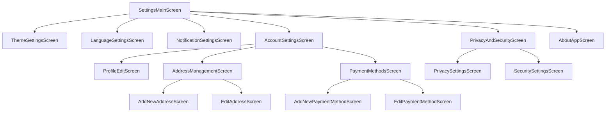

# شاشات الإعدادات

[](README.md)

يوفر دليل `settings` مكونات واجهة المستخدم وشاشات تسمح للمستخدمين بتكوين تفضيلات التطبيق، وتغيير إعدادات اللغة، وتخصيص مظهر التطبيق.

## الغرض

توفر شاشات الإعدادات الوظائف التالية:

- تمكن المستخدمين من تخصيص التطبيق وفقًا لتفضيلاتهم
- تسمح بتكوين إعدادات اللغة والسمة ووحدات القياس
- توفر طرقًا لإدارة حسابات المستخدمين والإخطارات والأذونات
- تقدم معلومات حول التطبيق، وسياسة الخصوصية، وشروط الاستخدام
- تتيح تسجيل الخروج وإدارة بيانات المستخدم

## نظرة عامة على الشاشات



## الشاشات الرئيسية

### شاشة الإعدادات الرئيسية (SettingsMainScreen)

يوجد في ملف `settings_main_screen.dart` الشاشة الرئيسية التي توفر القائمة الرئيسية للإعدادات.

**الميزات:**

- عرض كافة فئات الإعدادات المتاحة
- خلاصة موجزة لكل إعداد
- دعم الحالات المختلفة للمستخدم (تسجيل الدخول/عدم تسجيل الدخول)
- خيار لمسح ذاكرة التخزين المؤقت وبيانات التطبيق
- خيار لتسجيل الخروج

**تدفق المستخدم:**

1. ينتقل المستخدم إلى شاشة الإعدادات من القائمة السفلية
2. يرى المستخدم قائمة بخيارات الإعدادات المختلفة
3. ينقر المستخدم على أي فئة للانتقال إلى شاشة إعدادات محددة

**الاستخدام:**

```dart
Navigator.of(context).push(MaterialPageRoute(
  builder: (context) => SettingsMainScreen(),
));
```

**نموذج البيانات:**

```dart
class SettingsItem {
  final String title;
  final String subtitle;
  final IconData icon;
  final VoidCallback onTap;
  
  SettingsItem({
    required this.title,
    required this.subtitle,
    required this.icon,
    required this.onTap,
  });
}
```

### شاشة إعدادات السمة (ThemeSettingsScreen)

يحتوي ملف `theme_settings_screen.dart` على شاشة لإدارة إعدادات السمة المرئية للتطبيق.

**الميزات:**

- اختيار بين السمة الفاتحة والداكنة والنظام
- معاينة مباشرة لخيارات السمة
- حفظ إعدادات السمة المفضلة
- خيار لتطبيق سمات ألوان مخصصة

**تدفق المستخدم:**

1. ينتقل المستخدم إلى شاشة إعدادات السمة من شاشة الإعدادات الرئيسية
2. يختار المستخدم من بين خيارات السمة المتاحة
3. يرى المستخدم معاينة للسمة المحددة
4. ينقر المستخدم على حفظ لتطبيق التغييرات

**الاستخدام:**

```dart
Navigator.of(context).push(MaterialPageRoute(
  builder: (context) => ThemeSettingsScreen(),
));
```

### شاشة إعدادات اللغة (LanguageSettingsScreen)

يحتوي ملف `language_settings_screen.dart` على شاشة لإدارة إعدادات اللغة في التطبيق.

**الميزات:**

- اختيار من بين اللغات المدعومة المتعددة
- تطبيق التغييرات على اللغة في الوقت الفعلي
- إعدادات منطقة زمنية إضافية
- إعدادات تنسيق الرقم والتاريخ

**تدفق المستخدم:**

1. ينتقل المستخدم إلى شاشة إعدادات اللغة من شاشة الإعدادات الرئيسية
2. يختار المستخدم من بين خيارات اللغة المتاحة
3. يتم تطبيق تغييرات اللغة وتحديث واجهة المستخدم

**الاستخدام:**

```dart
Navigator.of(context).push(MaterialPageRoute(
  builder: (context) => LanguageSettingsScreen(),
));
```

### شاشة إعدادات الإخطارات (NotificationSettingsScreen)

يحتوي ملف `notification_settings_screen.dart` على شاشة لإدارة إعدادات الإخطارات.

**الميزات:**

- تفعيل/تعطيل الإخطارات الفردية حسب النوع
- تخصيص أصوات الإخطارات
- إعدادات عدم الإزعاج
- تكوين تكرار الإخطارات

**تدفق المستخدم:**

1. ينتقل المستخدم إلى شاشة إعدادات الإخطارات من شاشة الإعدادات الرئيسية
2. يرى المستخدم قائمة بأنواع الإخطارات المختلفة
3. يقوم المستخدم بتبديل خيارات الإخطارات حسب الرغبة
4. يتم حفظ التغييرات تلقائيًا

**الاستخدام:**

```dart
Navigator.of(context).push(MaterialPageRoute(
  builder: (context) => NotificationSettingsScreen(),
));
```

**نموذج البيانات:**

```dart
class NotificationSetting {
  final String title;
  final String description;
  final bool isEnabled;
  
  NotificationSetting({
    required this.title,
    required this.description,
    required this.isEnabled,
  });
}
```

### شاشة إعدادات الحساب (AccountSettingsScreen)

يحتوي ملف `account_settings_screen.dart` على شاشة لإدارة إعدادات الحساب.

**الميزات:**

- عرض وتحرير معلومات الملف الشخصي
- إدارة عناوين التوصيل
- إدارة طرق الدفع
- خيارات تغيير كلمة المرور
- خيار حذف الحساب

**تدفق المستخدم:**

1. ينتقل المستخدم إلى شاشة إعدادات الحساب من شاشة الإعدادات الرئيسية
2. يرى المستخدم خيارات لإدارة جوانب مختلفة من حسابه
3. ينقر المستخدم على خيار مثل "تحرير الملف الشخصي" للانتقال إلى شاشة محددة

**الاستخدام:**

```dart
Navigator.of(context).push(MaterialPageRoute(
  builder: (context) => AccountSettingsScreen(
    userProfile: currentUserProfile,
  ),
));
```

### شاشة تحرير الملف الشخصي (ProfileEditScreen)

يحتوي ملف `profile_edit_screen.dart` على شاشة للمستخدمين لتحرير معلومات ملفهم الشخصي.

**الميزات:**

- تحرير الاسم، والبريد الإلكتروني، ورقم الهاتف
- تحميل وتحرير صورة الملف الشخصي
- تحديث المعلومات الشخصية
- التحقق من صحة الإدخال

**تدفق المستخدم:**

1. ينتقل المستخدم إلى شاشة تحرير الملف الشخصي من شاشة إعدادات الحساب
2. يقوم المستخدم بتحديث المعلومات المطلوبة
3. ينقر المستخدم على حفظ لتطبيق التغييرات

**الاستخدام:**

```dart
Navigator.of(context).push(MaterialPageRoute(
  builder: (context) => ProfileEditScreen(
    userProfile: currentUserProfile,
    onProfileUpdated: (updatedProfile) {
      // حفظ الملف الشخصي المحدث
    },
  ),
));
```

### شاشة إدارة العناوين (AddressManagementScreen)

يحتوي ملف `address_management_screen.dart` على شاشة لإدارة عناوين التوصيل.

**الميزات:**

- عرض قائمة بالعناوين المحفوظة
- إضافة، تحرير، وحذف العناوين
- ضبط عنوان افتراضي
- تحديد الأنواع المختلفة للعناوين (المنزل، العمل)

**تدفق المستخدم:**

1. ينتقل المستخدم إلى شاشة إدارة العناوين من شاشة إعدادات الحساب
2. يرى المستخدم قائمة بعناوينه المحفوظة
3. يستطيع المستخدم النقر على "إضافة عنوان جديد" أو تحرير أو حذف العناوين الموجودة

**الاستخدام:**

```dart
Navigator.of(context).push(MaterialPageRoute(
  builder: (context) => AddressManagementScreen(
    addresses: userAddresses,
    onAddressesUpdated: (updatedAddresses) {
      // حفظ العناوين المحدثة
    },
  ),
));
```

### شاشة إضافة/تحرير العنوان (AddNewAddressScreen/EditAddressScreen)

توفر ملفات `add_new_address_screen.dart` و `edit_address_screen.dart` شاشات لإضافة أو تحرير عناوين التوصيل.

**الميزات:**

- حقول لإدخال معلومات العنوان الكاملة
- اختيار موقع من الخريطة
- التحقق من صحة جميع المدخلات
- جلب عنوان من الموقع الحالي (اختياري)

**تدفق المستخدم:**

1. ينتقل المستخدم إلى شاشة إضافة/تحرير العنوان
2. يُدخل المستخدم معلومات العنوان أو يختار موقعًا على الخريطة
3. ينقر المستخدم على حفظ لإضافة/تحديث العنوان

**الاستخدام:**

```dart
// لإضافة عنوان جديد
Navigator.of(context).push(MaterialPageRoute(
  builder: (context) => AddNewAddressScreen(
    onAddressAdded: (newAddress) {
      // إضافة العنوان الجديد إلى القائمة
    },
  ),
));

// لتحرير عنوان موجود
Navigator.of(context).push(MaterialPageRoute(
  builder: (context) => EditAddressScreen(
    address: selectedAddress,
    onAddressUpdated: (updatedAddress) {
      // تحديث العنوان في القائمة
    },
  ),
));
```

### شاشة طرق الدفع (PaymentMethodsScreen)

يحتوي ملف `payment_methods_screen.dart` على شاشة لإدارة طرق الدفع.

**الميزات:**

- عرض طرق الدفع المحفوظة
- إضافة بطاقات ائتمان/خصم جديدة
- تحرير وحذف طرق الدفع
- ضبط طريقة دفع افتراضية

**تدفق المستخدم:**

1. ينتقل المستخدم إلى شاشة طرق الدفع من شاشة إعدادات الحساب
2. يرى المستخدم قائمة بطرق الدفع المحفوظة
3. يستطيع المستخدم إضافة طريقة دفع جديدة أو تحرير أو حذف طرق موجودة

**الاستخدام:**

```dart
Navigator.of(context).push(MaterialPageRoute(
  builder: (context) => PaymentMethodsScreen(
    paymentMethods: userPaymentMethods,
    onPaymentMethodsUpdated: (updatedMethods) {
      // حفظ طرق الدفع المحدثة
    },
  ),
));
```

### شاشة الخصوصية والأمان (PrivacyAndSecurityScreen)

يحتوي ملف `privacy_and_security_screen.dart` على شاشة لإدارة إعدادات الخصوصية والأمان.

**الميزات:**

- خيارات لإعدادات الخصوصية مثل مشاركة البيانات
- خيارات أمان مثل المصادقة الثنائية
- روابط إلى سياسة الخصوصية وشروط الاستخدام
- إعدادات إذن الوصول إلى البيانات

**تدفق المستخدم:**

1. ينتقل المستخدم إلى شاشة الخصوصية والأمان من شاشة الإعدادات الرئيسية
2. يرى المستخدم الخيارات المختلفة لإعدادات الخصوصية والأمان
3. يقوم المستخدم بضبط الإعدادات حسب تفضيلاته

**الاستخدام:**

```dart
Navigator.of(context).push(MaterialPageRoute(
  builder: (context) => PrivacyAndSecurityScreen(),
));
```

### شاشة حول التطبيق (AboutAppScreen)

يحتوي ملف `about_app_screen.dart` على شاشة تعرض معلومات حول التطبيق.

**الميزات:**

- عرض إصدار وبناء التطبيق
- معلومات المطور
- روابط إلى الموقع الإلكتروني للشركة ووسائل التواصل الاجتماعي
- سياسة الخصوصية وشروط الاستخدام

**تدفق المستخدم:**

1. ينتقل المستخدم إلى شاشة حول التطبيق من شاشة الإعدادات الرئيسية
2. يرى المستخدم معلومات حول التطبيق ومطوريه

**الاستخدام:**

```dart
Navigator.of(context).push(MaterialPageRoute(
  builder: (context) => AboutAppScreen(),
));
```

## المكونات المساعدة

### مكون عنصر الإعدادات (SettingsItemWidget)

يوفر ملف `settings_item_widget.dart` مكون قابل لإعادة الاستخدام لعرض عناصر الإعدادات.

**الميزات:**

- تخطيط متسق لعناصر الإعدادات
- دعم للأيقونات والنص والنص الفرعي
- تخصيص إجراءات النقر
- دعم التبديلات وعناصر التحكم الأخرى

**الاستخدام:**

```dart
SettingsItemWidget(
  icon: Icons.language,
  title: 'اللغة',
  subtitle: 'العربية',
  onTap: () => navigateToLanguageSettings(),
);
```

### مكون شريط الإعدادات (SettingsAppBar)

يوفر ملف `settings_app_bar.dart` مكون شريط تطبيق متسق لشاشات الإعدادات.

**الميزات:**

- تخطيط متسق للعنوان والإجراءات
- دعم للزر الرجوع
- دعم إجراءات إضافية
- تكوين قابل للتخصيص

**الاستخدام:**

```dart
SettingsAppBar(
  title: 'إعدادات اللغة',
  actions: [
    IconButton(
      icon: Icon(Icons.help_outline),
      onPressed: () => showLanguageHelp(),
    ),
  ],
);
```

## حالات الاستخدام

1. **تغيير السمة**: يمكن للمستخدم تغيير سمة التطبيق من فاتحة إلى داكنة أو اتباع إعدادات النظام
2. **تغيير اللغة**: يمكن للمستخدم تبديل لغة التطبيق إلى أي لغة مدعومة
3. **إدارة الملف الشخصي**: يمكن للمستخدم تحديث معلومات ملفه الشخصي مثل الاسم والصورة
4. **إدارة العناوين**: يمكن للمستخدم إضافة/تحرير/حذف عناوين التوصيل
5. **إدارة طرق الدفع**: يمكن للمستخدم إضافة/تحرير/حذف طرق الدفع
6. **تكوين الإخطارات**: يمكن للمستخدم تخصيص إعدادات الإخطارات حسب النوع
7. **إعدادات الخصوصية**: يمكن للمستخدم تكوين خيارات مشاركة البيانات والخصوصية
8. **تسجيل الخروج**: يمكن للمستخدم تسجيل الخروج من حسابه

## إرشادات التنفيذ

عند العمل على شاشات الإعدادات:

1. استخدم مكونات متسقة عبر جميع شاشات الإعدادات
2. اتبع إرشادات واجهة المستخدم الخاصة بالمنصة (Material/Cupertino)
3. احفظ تفضيلات المستخدم بشكل آمن باستخدام `SharedPreferences` أو حلول أكثر أمانًا
4. قم بتنفيذ توافق قوي مع حالات نفاد الاتصال
5. التأكد من سهولة الوصول إلى جميع شاشات الإعدادات
6. تنظيم الإعدادات في فئات منطقية
7. ضمان أن جميع التغييرات يتم حفظها بشكل صحيح وتنعكس على الفور في التطبيق
