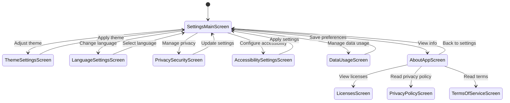

# Settings Screens

This directory contains screens related to application settings and configuration in the Genius Store application.

## Purpose

The settings screens enable users to:

- Configure application preferences
- Manage language and localization settings
- Control theme and appearance settings
- Adjust privacy and security preferences
- Configure accessibility options
- Manage data usage and storage settings
- View application information

## Screens Overview

```mermaid
classDiagram
    class SettingsScreens {
        +SettingsMainScreen
        +ThemeSettingsScreen
        +LanguageSettingsScreen
        +PrivacySecurityScreen
        +AccessibilitySettingsScreen
        +DataUsageScreen
        +AboutAppScreen
    }
    
    class SettingsMainScreen {
        +settings: AppSettings
        +isLoading: bool
        +loadSettings(): Future~void~
        +navigateToThemeSettings(): void
        +navigateToLanguageSettings(): void
        +navigateToPrivacySecurity(): void
        +navigateToAccessibilitySettings(): void
        +navigateToDataUsage(): void
        +navigateToAboutApp(): void
    }
    
    class ThemeSettingsScreen {
        +currentTheme: ThemeMode
        +isDarkMode: bool
        +accentColor: Color
        +isSystemDefault: bool
        +updateTheme(ThemeMode): Future~void~
        +toggleDarkMode(bool): Future~void~
        +updateAccentColor(Color): Future~void~
        +resetToSystemDefault(): Future~void~
    }
    
    class LanguageSettingsScreen {
        +currentLocale: Locale
        +availableLocales: List~Locale~
        +isLoading: bool
        +updateLanguage(Locale): Future~void~
        +detectSystemLanguage(): Locale
        +resetToSystemLanguage(): Future~void~
    }
    
    class PrivacySecurityScreen {
        +privacySettings: PrivacySettings
        +isLoading: bool
        +isBiometricEnabled: bool
        +isLocationTrackingEnabled: bool
        +isAnalyticsEnabled: bool
        +loadPrivacySettings(): Future~void~
        +toggleBiometric(bool): Future~void~
        +toggleLocationTracking(bool): Future~void~
        +toggleAnalytics(bool): Future~void~
        +clearBrowsingData(): Future~void~
        +deleteSearchHistory(): Future~void~
    }
    
    class AccessibilitySettingsScreen {
        +accessibilitySettings: AccessibilitySettings
        +isLoading: bool
        +textScaleFactor: double
        +isHighContrastEnabled: bool
        +isReducedMotionEnabled: bool
        +loadAccessibilitySettings(): Future~void~
        +updateTextScale(double): Future~void~
        +toggleHighContrast(bool): Future~void~
        +toggleReducedMotion(bool): Future~void~
    }
    
    class DataUsageScreen {
        +dataSavingMode: bool
        +cacheSize: int
        +imageQualitySetting: ImageQuality
        +isWifiOnlyDownloads: bool
        +loadDataSettings(): Future~void~
        +toggleDataSavingMode(bool): Future~void~
        +clearCache(): Future~void~
        +updateImageQuality(ImageQuality): Future~void~
        +toggleWifiOnlyDownloads(bool): Future~void~
        +calculateCacheSize(): Future~int~
    }
    
    class AboutAppScreen {
        +appVersion: String
        +buildNumber: String
        +legalInfo: LegalInfo
        +isLoading: bool
        +loadAppInfo(): Future~void~
        +checkForUpdates(): Future~UpdateInfo~
        +viewLicenses(): void
        +viewPrivacyPolicy(): void
        +viewTermsOfService(): void
    }
    
    SettingsScreens --> SettingsMainScreen
    SettingsScreens --> ThemeSettingsScreen
    SettingsScreens --> LanguageSettingsScreen
    SettingsScreens --> PrivacySecurityScreen
    SettingsScreens --> AccessibilitySettingsScreen
    SettingsScreens --> DataUsageScreen
    SettingsScreens --> AboutAppScreen
```



## User Flow



## Key Screens

### Settings Main Screen

`settings_main_screen.dart` serves as the entry point to all settings categories.

**Features:**

- Organized list of settings categories
- User preference summary
- Quick toggles for common settings
- Recently changed settings highlight
- Visual indicators for current settings state

### Theme Settings Screen

`theme_settings_screen.dart` allows users to customize the app's appearance.

**Features:**

- Light/dark theme toggle
- System theme followings option
- Color scheme selection
- Font size adjustments
- Custom accent color picker
- Preview panel for theme changes

### Language Settings Screen

`language_settings_screen.dart` manages the app's localization settings.

**Features:**

- Language selection from available options
- System language detection
- Region-specific formatting options
- Search functionality for languages
- Preview of language changes
- Language download for offline use

### Privacy & Security Screen

`privacy_security_screen.dart` controls user privacy preferences.

**Features:**

- Biometric authentication toggle
- Location tracking permissions
- Analytics and data collection options
- Browsing data management
- Search history controls
- Privacy policy access
- Data export options

### Accessibility Settings Screen

`accessibility_settings_screen.dart` provides features for users with different abilities.

**Features:**

- Text size adjustment
- High contrast mode
- Screen reader compatibility options
- Reduced motion settings
- Caption and subtitle preferences
- Color correction modes
- Keyboard navigation enhancements

### Data Usage Screen

`data_usage_screen.dart` helps users manage their data consumption.

**Features:**

- Data saving mode toggle
- Image quality settings
- Cache management and size display
- Wi-Fi only download option
- Background data usage controls
- Bandwidth usage statistics
- Storage space management

### About App Screen

`about_app_screen.dart` displays application information.

**Features:**

- App version and build number
- Update checker
- Developer information
- Open source licenses
- Legal information access
- Terms of service
- Privacy policy
- Feedback submission option

## Implementation Details

### Settings State Management

The application uses a centralized settings provider for state management:

```dart
final settingsProvider = StateNotifierProvider<SettingsNotifier, AppSettings>((ref) {
  final storageService = ref.watch(storageServiceProvider);
  return SettingsNotifier(storageService);
});

class SettingsNotifier extends StateNotifier<AppSettings> {
  final StorageService _storageService;
  
  SettingsNotifier(this._storageService) : super(AppSettings.defaults()) {
    _loadSettings();
  }
  
  Future<void> _loadSettings() async {
    final settings = await _storageService.getSettings();
    if (settings != null) {
      state = settings;
    }
  }
  
  Future<void> updateTheme(ThemeMode themeMode) async {
    final newSettings = state.copyWith(themeMode: themeMode);
    await _storageService.saveSettings(newSettings);
    state = newSettings;
  }
  
  Future<void> updateLocale(Locale locale) async {
    final newSettings = state.copyWith(locale: locale);
    await _storageService.saveSettings(newSettings);
    state = newSettings;
  }
  
  // Other settings update methods...
}
```

### Theme Implementation

Theme changes are applied through a custom theme service:

```dart
class ThemeService {
  final AppSettings settings;
  
  ThemeService(this.settings);
  
  ThemeData getTheme() {
    final baseTheme = settings.themeMode == ThemeMode.dark
        ? _getDarkTheme()
        : _getLightTheme();
        
    return baseTheme.copyWith(
      colorScheme: baseTheme.colorScheme.copyWith(
        primary: settings.accentColor,
      ),
      textTheme: _getAdjustedTextTheme(baseTheme.textTheme),
    );
  }
  
  TextTheme _getAdjustedTextTheme(TextTheme base) {
    final textScaleFactor = settings.textScaleFactor;
    
    return base.copyWith(
      headline1: base.headline1?.copyWith(
        fontSize: (base.headline1?.fontSize ?? 24) * textScaleFactor,
      ),
      // Adjust other text styles...
    );
  }
  
  ThemeData _getLightTheme() {
    // Light theme implementation
  }
  
  ThemeData _getDarkTheme() {
    // Dark theme implementation
  }
}
```

### Localization Management

Language settings utilize Flutter's localization system:

```dart
class LocalizationService {
  final List<Locale> supportedLocales = [
    const Locale('en', 'US'),
    const Locale('es', 'ES'),
    const Locale('fr', 'FR'),
    const Locale('de', 'DE'),
    const Locale('ja', 'JP'),
    // Other supported locales
  ];
  
  Locale? getDeviceLocale() {
    final deviceLocale = WidgetsBinding.instance.window.locale;
    
    // Check if device locale is supported
    for (final locale in supportedLocales) {
      if (locale.languageCode == deviceLocale.languageCode) {
        return locale;
      }
    }
    
    // Return default if not supported
    return supportedLocales.first;
  }
  
  String getLanguageName(Locale locale) {
    // Map locale to human-readable name
    final Map<String, String> languageNames = {
      'en': 'English',
      'es': 'Español',
      'fr': 'Français',
      'de': 'Deutsch',
      'ja': '日本語',
      // Other language names
    };
    
    return languageNames[locale.languageCode] ?? 'Unknown';
  }
}
```

### Accessibility Implementation

Accessibility settings apply changes throughout the app:

```dart
class AccessibilityService {
  final AccessibilitySettings settings;
  
  AccessibilityService(this.settings);
  
  void applyAccessibilitySettings(BuildContext context) {
    // Apply text scaling
    MediaQuery.of(context).copyWith(
      textScaleFactor: settings.textScaleFactor,
    );
    
    // Apply reduced motion if enabled
    if (settings.reducedMotionEnabled) {
      _applyReducedMotion(context);
    }
    
    // Apply high contrast if enabled
    if (settings.highContrastEnabled) {
      _applyHighContrast(context);
    }
  }
  
  void _applyReducedMotion(BuildContext context) {
    // Configure animation durations to be minimal or zero
    // Disable certain animations
  }
  
  void _applyHighContrast(BuildContext context) {
    // Apply high contrast theme modifications
  }
}
```

## User Preferences Persistence

Settings are persisted between app sessions using secure storage:

```dart
class SettingsStorage {
  final FlutterSecureStorage _secureStorage;
  final SharedPreferences _preferences;
  
  SettingsStorage(this._secureStorage, this._preferences);
  
  Future<void> saveSettings(AppSettings settings) async {
    // Store non-sensitive settings in SharedPreferences
    await _preferences.setString('theme_mode', settings.themeMode.toString());
    await _preferences.setString('locale', settings.locale.toString());
    await _preferences.setDouble('text_scale_factor', settings.textScaleFactor);
    
    // Store sensitive settings in secure storage
    await _secureStorage.write(
      key: 'biometric_enabled',
      value: settings.biometricEnabled.toString(),
    );
  }
  
  Future<AppSettings> getSettings() async {
    try {
      // Retrieve settings with defaults as fallback
      final themeMode = _getThemeMode(
        _preferences.getString('theme_mode') ?? ThemeMode.system.toString(),
      );
      
      final localeString = _preferences.getString('locale');
      final locale = localeString != null
          ? _parseLocale(localeString)
          : const Locale('en', 'US');
          
      final textScaleFactor = _preferences.getDouble('text_scale_factor') ?? 1.0;
      
      final biometricEnabledString = await _secureStorage.read(
        key: 'biometric_enabled',
      );
      final biometricEnabled = biometricEnabledString == 'true';
      
      // Construct settings object
      return AppSettings(
        themeMode: themeMode,
        locale: locale,
        textScaleFactor: textScaleFactor,
        biometricEnabled: biometricEnabled,
        // Other settings...
      );
    } catch (e) {
      // Return defaults on error
      return AppSettings.defaults();
    }
  }
  
  ThemeMode _getThemeMode(String value) {
    switch (value) {
      case 'ThemeMode.light':
        return ThemeMode.light;
      case 'ThemeMode.dark':
        return ThemeMode.dark;
      default:
        return ThemeMode.system;
    }
  }
  
  Locale _parseLocale(String localeString) {
    final parts = localeString.split('_');
    return parts.length > 1
        ? Locale(parts[0], parts[1])
        : Locale(parts[0]);
  }
}
```

## Business Rules

Setting functionality follows these business rules:

1. **Default Settings**: New installations use system defaults where available
2. **Theme Switching**: Theme changes are applied immediately without app restart
3. **Language Changes**: Language changes require app restart to take full effect
4. **Accessibility Priorities**: Accessibility settings override theme preferences
5. **Cache Limits**: Cache size has configurable limits based on device storage
6. **Privacy Controls**: Privacy settings can be password or biometrically protected
7. **Data Saving**: Data saving mode reduces image quality and disables auto-play media

## Dependencies

Settings screens depend on:

- `SettingsRepository` for settings storage and retrieval
- `ThemeService` for theme management
- `LocalizationService` for language handling
- `AccessibilityService` for accessibility features
- `StorageService` for cache and data management
- `PackageInfo` for app version information
- Common UI components for consistent styling

## Testing

Settings screens are tested through:

1. Widget tests for UI components
2. Integration tests for settings persistence
3. Accessibility tests for compliance
4. Performance tests for settings application
5. Property-based tests for settings combinations
